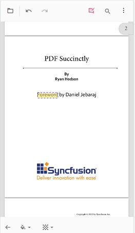
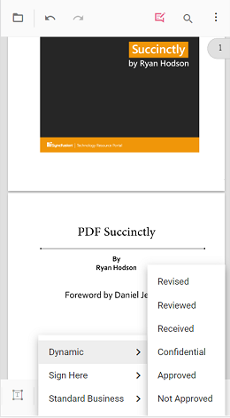
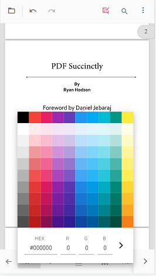
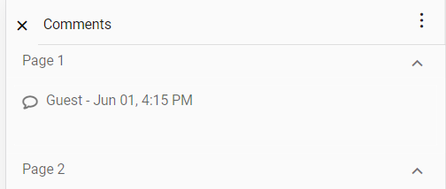

# Mobile Annotations in ASP.NET Core PDF Viewer

Comprehensive guide for adding and managing annotations using the touch-optimized mobile interface. The PDF Viewer provides intuitive annotation tools designed specifically for mobile devices with streamlined workflows and accessible touch gestures.

## Annotation toolbar in mobile view

The annotation toolbar provides access to all annotation tools on mobile devices. Enabling it displays the full range of annotation options in an optimized touch interface.

### Opening the toolbar

1. **Tap the Edit Annotation button** in the main toolbar at the top of the PDF Viewer
2. The annotation toolbar appears below with all available annotation tools
3. Each icon represents a different annotation type

**Step 1:** Tap the Edit Annotation toolbar button to enable annotations

**Step 2:** Annotation toolbar is now active with all annotation options visible

### Annotation toolbar icons

The toolbar displays icon buttons for quick access to each annotation type. Tap any icon to activate that annotation mode.

## To add sticky notes annotation

Sticky notes provide quick annotation markers with optional comment text.

### Adding sticky notes on mobile

**Step 1:** Tap the sticky note icon to activate sticky note mode

**Step 2:** Tap on the page location to add the sticky note annotation

## To add text markup annotation

Text markup annotations highlight, underline, or strikethrough important text content.

**Step 1:** Tap a text markup icon, then select text on the page to mark

**Step 2:** Text markup annotation is applied to the selected text.

## To add shape and measure annotations

Shape and measurement annotations provide visual drawing and dimensional analysis tools. They are useful for highlighting regions, measurements, and geometric markups.

**Step 1:** Tap the shape/measure icon to display available shape and measurement types

**Step 2:** Select a measurement type from the toolbar options

**Step 3:** Draw the annotation on the PDF page with touch gestures

## To add the stamp annotation

Stamp annotations display predefined visual marks indicating document status or approval. They communicate document state without requiring text.

**Step 1:** Tap the stamp icon and select the desired stamp type from menu

**Step 2:** Stamp annotation is added to the PDF page

## To add signature

Digital signatures provide authentication and approval marks on PDF documents. They are captured through freehand drawing on a dedicated canvas.

**Step 1:** Tap the signature icon to open the signature drawing canvas

**Step 2:** Signature annotation is added to the PDF page

## To add ink annotation

Ink annotations allow freehand drawing directly on PDF pages. They capture handwritten notes, sketches, and artistic marks.

**Step 1:** Tap the ink icon tool to activate freehand drawing mode

**Step 2:** Ink annotation is added to the PDF page via freehand drawing

## Change annotation properties

Mobile PDF Viewer provides two approaches for customizing annotation appearance: before creation or after placement.

### Change properties before adding

Customize annotation appearance before placing it on the page:

**Method 1:** Access the property toolbar to customize annotation before adding

### Change properties after adding

Modify an annotation after it has been placed on the page:

**Method 2:** Tap annotation to select and modify its properties

## Delete annotation

Remove unwanted annotations from the PDF page using the delete tool:

**Step 1:** Select annotation and tap the delete icon in the property toolbar

## Open comment panel

The comment panel allows adding notes, discussions, and threaded comments to annotations:

**Step 1:** Tap the comment icon to open the comment panel

**Step 2:** Comment panel is now open and ready for text input

## Close the comment panel

Close the comment panel when finished adding notes:

**Step 1:** Tap the close button to hide the comment panel

