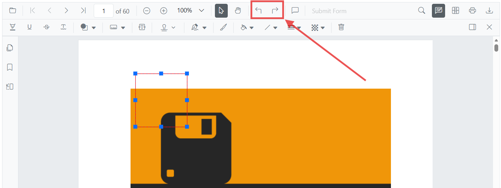

# Undo and Redo Annotations in ASP.NET Core PDF Viewer

The ASP.NET Core PDF Viewer supports undo and redo operations for annotations.

Undo and redo actions can be performed by using either of the following methods:

1. Using keyboard shortcuts (desktop):
    After performing an annotation action, press `Ctrl+Z` to undo and `Ctrl+Y` to redo on Windows and Linux. On macOS, use `Command+Z` to undo and `Command+Shift+Z` to redo.
2. Using the toolbar:
    Use the **Undo** and **Redo** tools in the toolbar.

Refer to the following code snippet to call undo and redo actions from the client side.




    <ejs-pdfviewer id="pdfviewer"
                   style="height:600px"
                   documentPath="https://cdn.syncfusion.com/content/pdf/pdf-succinctly.pdf"
                   resourceUrl="https://cdn.syncfusion.com/ej2/31.2.2/dist/ej2-pdfviewer-lib">
    </ejs-pdfviewer>




## See also

- [Annotation Overview](../overview)
- [Annotation Types](../annotation/annotation-types/area-annotation)
- [Annotation Toolbar](../../toolbar-customization/annotation-toolbar)
- [Create and Modify Annotation](../../annotation/create-modify-annotation)
- [Customize Annotation](../../annotation/customize-annotation)
- [Remove Annotation](../../annotation/delete-annotation)
- [Handwritten Signature](../../annotation/signature-annotation)
- [Export and Import Annotation](../../annotations/export-import/export-annotation)
- [Annotation in Mobile View](../../annotation/annotations-in-mobile-view)
- [Annotation Events](../../annotation/annotation-event)
- [Annotations API](../annotation/annotations-api)
