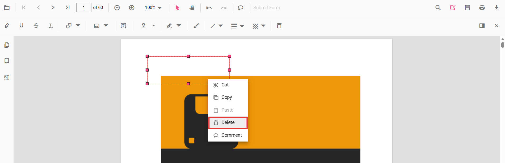
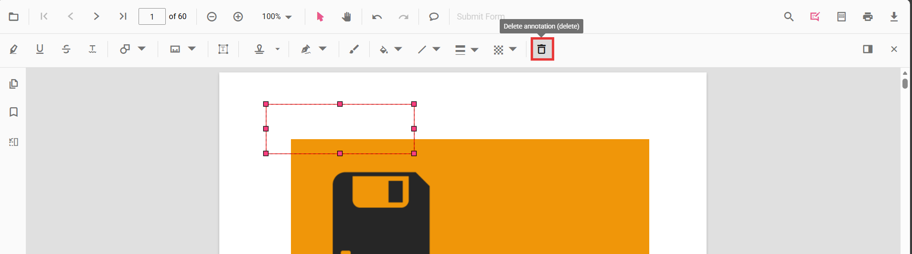

# Remove annotations in ASP.NET Core

Annotations can be removed using the built-in UI or programmatically. This page shows common methods to delete annotations in the viewer.

## Delete via UI

A selected annotation can be deleted in three ways:

- Context menu: right-click the annotation and choose Delete.

- Annotation toolbar: select the annotation and click the Delete button on the annotation toolbar.

- Keyboard: select the annotation and press the `Delete` key.

## Delete programmatically

Annotations can be deleted programmatically either by removing the currently selected annotation or by specifying an annotation id.




  

    <button onclick="deleteAnnotation()">Delete Annotation</button>
    <button onclick="deleteAnnotationById()">Delete Annotation By ID</button>
  

  <ejs-pdfviewer id="container" style="height:600px" resourceUrl="https://cdn.syncfusion.com/ej2/31.1.23/dist/ej2-pdfviewer-lib" documentPath="https://cdn.syncfusion.com/content/pdf/pdf-succinctly.pdf"></ejs-pdfviewer>




N> Deleting via the API requires the annotation to exist in the current document. Ensure an annotation is selected when using `deleteAnnotation()`, or pass a valid id to `deleteAnnotationById()`.

[View Sample on GitHub](https://github.com/SyncfusionExamples/aspnet-core-pdf-viewer-examples)

## See also

- [Annotation Overview](../overview)
- [Annotation Types](../annotation/annotation-types/area-annotation)
- [Annotation Toolbar](../toolbar-customization/annotation-toolbar)
- [Create and Modify Annotation](../annotation/create-modify-annotation)
- [Customize Annotation](../annotation/customize-annotation)
- [Handwritten Signature](../annotation/signature-annotation)
- [Export and Import Annotation](../annotation/export-import/export-annotation)
- [Annotation Permission](../annotation/annotation-permission)
- [Annotation in Mobile View](../annotation/annotations-in-mobile-view)
- [Annotation Events](../annotation/annotation-event)
- [Annotation API](../annotation/annotations-api)
