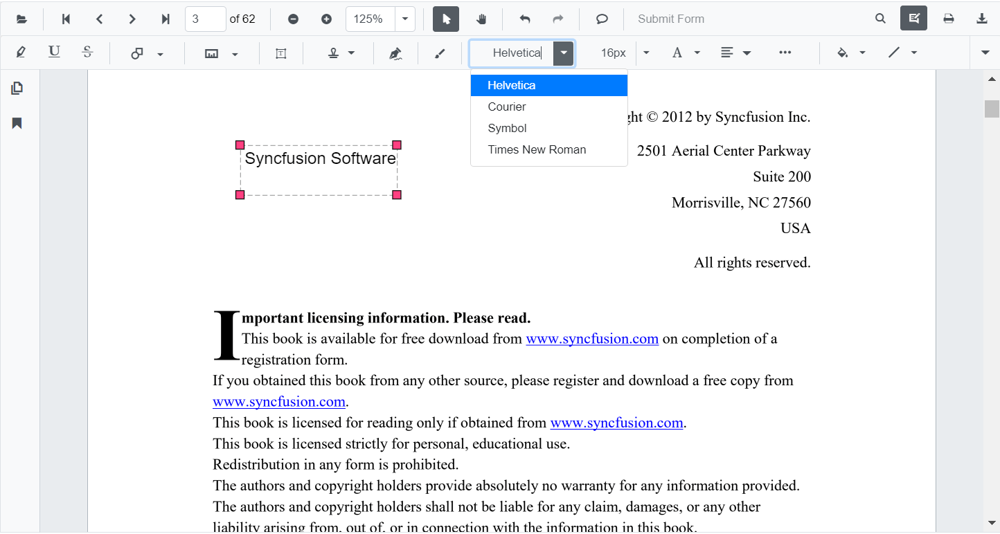

# Free Text Annotations in ASP.NET Core PDF Viewer

The PDF Viewer control provides comprehensive free text annotation capabilities for adding, editing, deleting, and customizing text annotations with full typographic and styling control.

## Add a free text annotation to the PDF document

Free text annotations can be added to PDF documents using the built-in annotation toolbar with simple click and type functionality.

### Step-by-step guide

**1. Enable annotation mode**
- Click the **Edit Annotation** button in the PDF Viewer toolbar
- The annotation toolbar appears below the main toolbar

**2. Select free text tool**
- Click the **Free Text Annotation** button in the annotation toolbar
- The cursor changes to text input mode

**3. Place text box on document**
- Click on the PDF page where you want to add text
- A text box appears at the clicked location

**4. Enter text content**
- Type your text directly into the text box
- Use the formatting toolbar to adjust font, size, color, and alignment

N> When in pan mode and free text annotation is selected, the PDF Viewer automatically switches to text select mode for smooth interaction.

**Example: Enable free text annotation mode**




<!--Element to set free text annotation mode-->
<button id="set" onclick="addAnnot()">FreeText</button>

    <ejs-pdfviewer id="pdfviewer"
                   style="height:600px"
                   documentPath="https://cdn.syncfusion.com/content/pdf/pdf-succinctly.pdf">
    </ejs-pdfviewer>




<!--Element to set free text annotation mode-->
<button id="set" onclick="addAnnot()">FreeText</button>

    <ejs-pdfviewer id="pdfviewer"
                   style="height:600px"
                   serviceUrl="/api/PdfViewer"
                   documentPath="https://cdn.syncfusion.com/content/pdf/pdf-succinctly.pdf">
    </ejs-pdfviewer>




## Add a free text annotation programmatically to the PDF document

The PDF Viewer library provides the [`addAnnotation()`](https://ej2.syncfusion.com/documentation/api/pdfviewer/annotation#addannotation) API method for programmatic free text insertion, enabling dynamic form filling and batch annotation operations.

**Example: Add free text annotation programmatically**




<button id="set" onclick="addAnnotation()">Add annotation programmatically</button>

    <ejs-pdfviewer id="pdfviewer"
                   style="height:600px"
                   documentPath="https://cdn.syncfusion.com/content/pdf/pdf-succinctly.pdf">
    </ejs-pdfviewer>




<button id="set" onclick="addAnnotation()">Add annotation programmatically</button>

    <ejs-pdfviewer id="pdfviewer"
                   style="height:600px"
                   serviceUrl="/api/PdfViewer"
                   documentPath="https://cdn.syncfusion.com/content/pdf/pdf-succinctly.pdf">
    </ejs-pdfviewer>




## Change the content of an existing free text annotation programmatically

Modify free text annotation properties including text content, position, formatting, and styling using the **editAnnotation()** API method.

**Example: Edit free text annotation content and properties**




<button id="set" onclick="editAnnotation()">Edit annotation programmatically</button>

    <ejs-pdfviewer id="pdfviewer"
                   style="height:600px"
                   documentPath="https://cdn.syncfusion.com/content/pdf/pdf-succinctly.pdf">
    </ejs-pdfviewer>




<button id="set" onclick="editAnnotation()">Edit annotation programmatically</button>

    <ejs-pdfviewer id="pdfviewer"
                   style="height:600px"
                   serviceUrl="/api/PdfViewer"
                   documentPath="https://cdn.syncfusion.com/content/pdf/pdf-succinctly.pdf">
    </ejs-pdfviewer>




N> The current version of the PDF Viewer does not edit existing document text. New free text annotations can be added and modified within the document.

## Edit the properties of free text annotations

Free text annotations support comprehensive typography and styling options through the annotation toolbar. Select any free text annotation to access these editing tools.

### Text formatting tools

**1. Edit Font Family**
- Select from available fonts in the Font Family tool
- Changes apply to the selected free text

**2. Edit Font Size**

Choose font size from the Font Size tool

**3. Edit Font Color**
- Use the color palette in the Font Color tool
- Click to select text color

### Text alignment

**4. Edit Text Alignment**

Select alignment from the Text Align tool

**5. Edit Text Styles**

Apply formatting from the Font Style tool

### Free Text appearance tools

**6. Edit Fill Color**

Use the color palette in the Edit Color tool to edit the fill color.

**7. Edit Stroke Color (Border)**
- Use the color palette in the Edit Stroke Color tool
- Select border color for the free text box outline

**8. Edit Thickness (Border Width)**

Use the range slider in the Edit Thickness tool.

**9. Edit Opacity**
- Use the range slider in the Edit Opacity tool
- Adjust from 0 (fully transparent) to 1 (fully opaque)

## Set default properties during control initialization

Configure default free text annotation properties globally during PDF Viewer initialization using the **freeTextSettings** property. These defaults apply to all subsequently created free text annotations.

**Example: Configure default free text properties**




    <ejs-pdfviewer id="pdfviewer"
                   style="height:600px"
                   documentPath="https://cdn.syncfusion.com/content/pdf/pdf-succinctly.pdf"
                   freeTextSettings="@(new Syncfusion.EJ2.PdfViewer.PdfViewerFreeTextSettings
            {FillColor="green", BorderColor="blue", FontColor="yellow"})">
    </ejs-pdfviewer>




    <ejs-pdfviewer id="pdfviewer"
                   style="height:600px"
                   serviceUrl="/api/PdfViewer"
                   documentPath="https://cdn.syncfusion.com/content/pdf/pdf-succinctly.pdf"
                   freeTextSettings="@(new Syncfusion.EJ2.PdfViewer.PdfViewerFreeTextSettings
            {FillColor="green", BorderColor="blue", FontColor="yellow"})">
    </ejs-pdfviewer>



