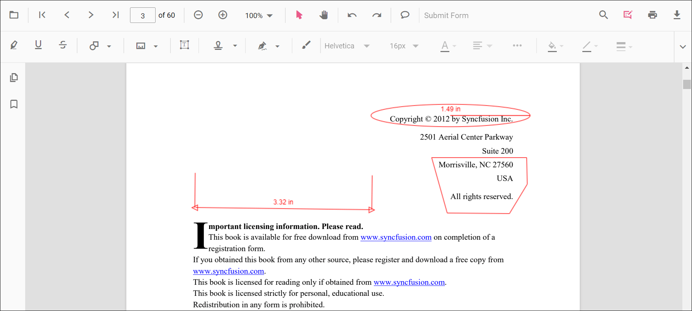

# Measurement annotation in ASP.NET Core PDF Viewer

The PDF Viewer supports measurement annotations for capturing distances, perimeters, areas, radius, and volumes.

Supported measurement annotations:

* Distance
* Perimeter
* Area
* Radius
* Volume

## Add measurement annotations

Measurement annotations are available from the annotation toolbar.

* Open the annotation toolbar using the **Edit Annotation** button in the PDF Viewer toolbar.
* Use the **Measurement Annotation** drop-down to choose a measurement type.
* Select a measurement type to enable its annotation mode, then place the measurement on the page.

If the viewer is in pan mode, selecting a measurement annotation activates text selection mode where applicable.

The following example switches the viewer to distance annotation mode.




  <ejs-pdfviewer id="pdfviewer" style="height:640px" documentPath="https://cdn.syncfusion.com/content/pdf/pdf-succinctly.pdf" resourceUrl="https://cdn.syncfusion.com/ej2/31.2.2/dist/ej2-pdfviewer-lib"></ejs-pdfviewer>

  <button onclick="distanceMode()">Distance</button>




  <ejs-pdfviewer id="pdfviewer" style="height:640px" documentPath="https://cdn.syncfusion.com/content/pdf/pdf-succinctly.pdf" serviceUrl="https://document.syncfusion.com/web-services/pdf-viewer/api/pdfviewer"></ejs-pdfviewer>

  <button onclick="distanceMode()">Distance</button>




## Add a measurement annotation to the PDF document programmatically

The PDF Viewer library allows adding an ink annotation programmatically using the `addAnnotation()` method.

The following examples demonstrate how to add measurement annotations programmatically using `addAnnotation()`.




  <ejs-pdfviewer id="pdfviewer" style="height:640px" documentPath="https://cdn.syncfusion.com/content/pdf/pdf-succinctly.pdf" resourceUrl="https://cdn.syncfusion.com/ej2/31.2.2/dist/ej2-pdfviewer-lib"></ejs-pdfviewer>

  <button onclick="addDistanceAnnotation()">Add Distance Annotation</button>
  <button onclick="addPerimeterAnnotation()">Add Perimeter Annotation</button>
  <button onclick="addAreaAnnotation()">Add Area Annotation</button>
  <button onclick="addRadiusAnnotation()">Add Radius Annotation</button>
  <button onclick="addVolumeAnnotation()">Add Volume Annotation</button>




  <ejs-pdfviewer id="pdfviewer" style="height:640px" documentPath="https://cdn.syncfusion.com/content/pdf/pdf-succinctly.pdf" serviceUrl="https://document.syncfusion.com/web-services/pdf-viewer/api/pdfviewer"></ejs-pdfviewer>

  <button onclick="addDistanceAnnotation()">Add Distance Annotation</button>
  <button onclick="addPerimeterAnnotation()">Add Perimeter Annotation</button>
  <button onclick="addAreaAnnotation()">Add Area Annotation</button>
  <button onclick="addRadiusAnnotation()">Add Radius Annotation</button>
  <button onclick="addVolumeAnnotation()">Add Volume Annotation</button>




## Edit an existing measurement annotation programmatically

Use the `editAnnotation()` method to modify existing measurement annotations programmatically.

The following example demonstrates `editAnnotation()`.




  <ejs-pdfviewer id="pdfviewer" style="height:640px" documentPath="https://cdn.syncfusion.com/content/pdf/pdf-succinctly.pdf" resourceUrl="https://cdn.syncfusion.com/ej2/31.2.2/dist/ej2-pdfviewer-lib"></ejs-pdfviewer>

  <button onclick="editDistanceAnnotation()">Edit Distance Annotation</button>
  <button onclick="editPerimeterAnnotation()">Edit Perimeter Annotation</button>
  <button onclick="editAreaAnnotation()">Edit Area Annotation</button>
  <button onclick="editRadiusAnnotation()">Edit Radius Annotation</button>
  <button onclick="editVolumeAnnotation()">Edit Volume Annotation</button>




  <ejs-pdfviewer id="pdfviewer" style="height:640px" documentPath="https://cdn.syncfusion.com/content/pdf/pdf-succinctly.pdf" serviceUrl="https://document.syncfusion.com/web-services/pdf-viewer/api/pdfviewer"></ejs-pdfviewer>

  <button onclick="editDistanceAnnotation()">Edit Distance Annotation</button>
  <button onclick="editPerimeterAnnotation()">Edit Perimeter Annotation</button>
  <button onclick="editAreaAnnotation()">Edit Area Annotation</button>
  <button onclick="editRadiusAnnotation()">Edit Radius Annotation</button>
  <button onclick="editVolumeAnnotation()">Edit Volume Annotation</button>




## Edit properties of measurement annotations

Change fill color, stroke color, thickness, and opacity using the annotation toolbar tools: Edit Color, Edit Stroke Color, Edit Thickness, and Edit Opacity.

### Edit fill color

Change the fill color with the color palette in the Edit Color tool.

### Edit stroke color

Change the stroke color with the Edit Stroke Color tool.

### Edit thickness

Adjust border thickness with the range slider in the Edit Thickness tool.

### Edit opacity

Adjust annotation opacity with the range slider in the Edit Opacity tool.

### Edit line properties

Line-based measurement annotations (distance and perimeter) include additional options in the Line Properties window. Open it by right-clicking the annotation and choosing Properties.

## Set default properties during initialization

Default properties for measurement annotations can be configured on the viewer before creation using the `distanceSettings`, `perimeterSettings`, `areaSettings`, `radiusSettings`, and `volumeSettings` properties.

The following code snippet shows how to set default measurement annotation settings on initialization.




  <ejs-pdfviewer id="pdfviewer" style="height:650px" documentPath="https://cdn.syncfusion.com/content/pdf/pdf-succinctly.pdf" resourceUrl="https://cdn.syncfusion.com/ej2/31.2.2/dist/ej2-pdfviewer-lib">
  </ejs-pdfviewer>




  <ejs-pdfviewer id="pdfviewer" style="height:650px" documentPath="https://cdn.syncfusion.com/content/pdf/pdf-succinctly.pdf" serviceUrl="https://document.syncfusion.com/web-services/pdf-viewer/api/pdfviewer">
  </ejs-pdfviewer>




## Scale ratio and measurement units

Modify the scale ratio and measurement unit via the Scale Ratio option in the viewer's context menu.

Supported units for measurement annotations:

* Inch
* Millimeter
* Centimeter
* Point
* Pica
* Feet

## Set default scale ratio during initialization

Configure scale ratio defaults using `measurementSettings` (for example, `scaleRatio`, `conversionUnit`, and `displayUnit`) before creating the viewer. The following snippet demonstrates these settings.



  <ejs-pdfviewer id="pdfviewer" 
                 style="height:650px" 
                 documentPath="https://cdn.syncfusion.com/content/pdf/pdf-succinctly.pdf"
                 resourceUrl="https://cdn.syncfusion.com/ej2/31.2.2/dist/ej2-pdfviewer-lib">
  </ejs-pdfviewer>




  <ejs-pdfviewer id="pdfviewer" 
                 style="height:650px" 
                 documentPath="https://cdn.syncfusion.com/content/pdf/pdf-succinctly.pdf"
                 serviceUrl="/api/PdfViewer">
  </ejs-pdfviewer>


