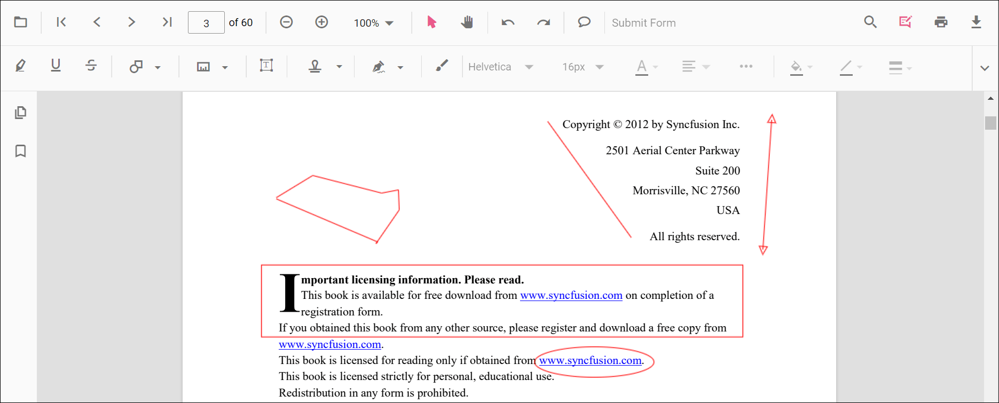
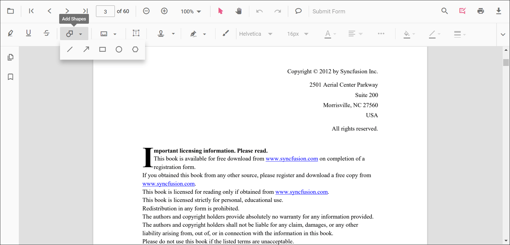
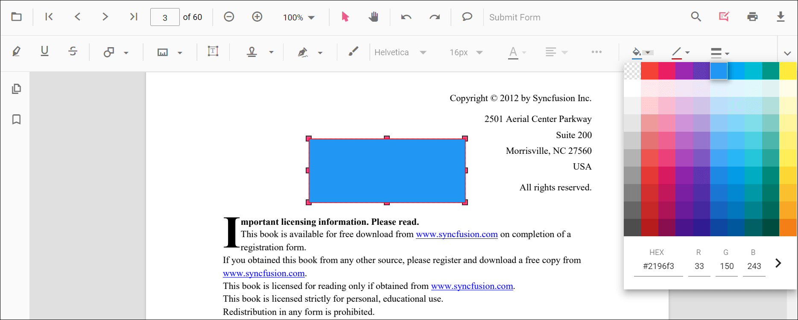
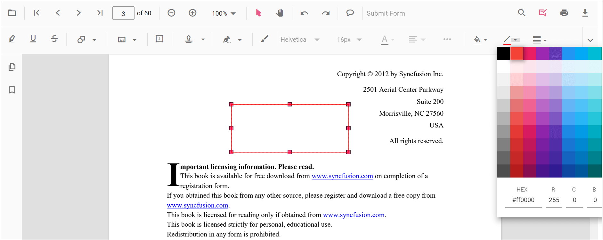
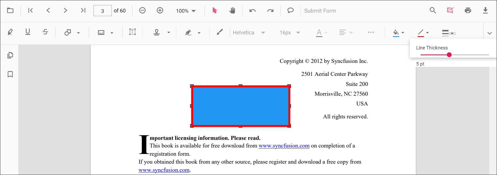
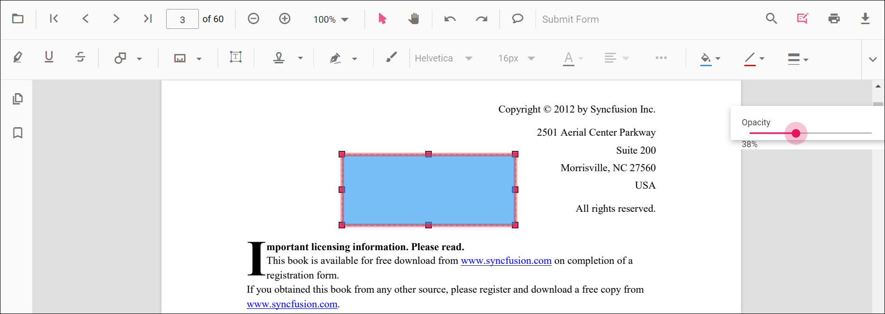
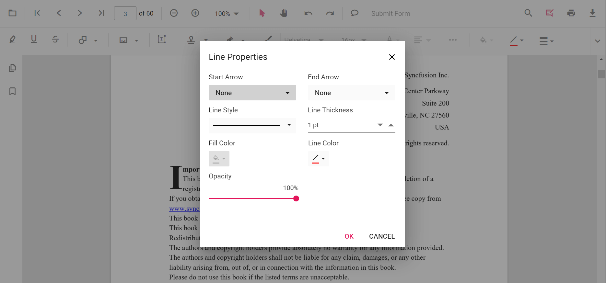

# Shape Annotations in ASP.NET Core PDF Viewer

The PDF Viewer control provides comprehensive shape annotation capabilities for adding, editing, deleting, and customizing various geometric shapes. This guide covers toolbar-based and programmatic approaches to shape creation.

## Shape types

The PDF Viewer supports five primary shape annotation types:

* Line
* Arrow
* Rectangle
* Circle
* Polygon

## Adding a shape annotation to the PDF document

Shape annotations can be added to PDF documents using the built-in annotation toolbar with an intuitive multi-step interface.

**1. Enable annotation mode**
- Click the **Edit Annotation** button in the PDF Viewer toolbar
- A secondary toolbar appears below the main toolbar

**2. Select shape type**
- Click the **Shape Annotation** drop-down button
- The pop-up displays all available shape annotation types

**3. Choose specific shape**
- Select a shape type to activate its annotation mode
- The cursor changes to indicate annotation mode is active

**4. Draw the shape**
- Click and drag on the PDF page to draw the shape
- Release to complete the shape placement
- Use handles to resize and reposition as needed

N> When in pan mode and a shape annotation tool is selected, the PDF Viewer automatically switches to text select mode for smooth interaction.

**Example: Switch to circle annotation mode**




<!--Element to set shape annotation mode-->
<button id="set" onclick="addAnnot()">Circle</button>

    <ejs-pdfviewer id="pdfviewer"
                   style="height:600px"
                   documentPath="https://cdn.syncfusion.com/content/pdf/pdf-succinctly.pdf">
    </ejs-pdfviewer>




<!--Element to set shape annotation mode-->
<button id="set" onclick="addAnnot()">Circle</button>

    <ejs-pdfviewer id="pdfviewer"
                   style="height:600px"
                   serviceUrl="/api/PdfViewer"
                   documentPath="https://cdn.syncfusion.com/content/pdf/pdf-succinctly.pdf">
    </ejs-pdfviewer>




## Add a shape annotation to the PDF document programmatically

The PDF Viewer library provides the **addAnnotation()** API method for programmatic shape insertion, enabling dynamic workflow automation and batch operations.

**Examples: Add shapes programmatically**




<button onclick="addLineAnnotation()">add Line Annotation programatically</button>
<button onclick="addArrowAnnotation()">add Arrow Annotation programatically</button>
<button onclick="addRectangleAnnotation()">add Rectangle Annotation programatically</button>
<button onclick="addCircleAnnotation()">add Circle Annotation programatically</button>
<button onclick="addPolygonAnnotation()">add Polygon Annotation programatically</button>

    <ejs-pdfviewer id="pdfviewer"
                   style="height:600px"
                   documentPath="https://cdn.syncfusion.com/content/pdf/pdf-succinctly.pdf">
    </ejs-pdfviewer>




<button onclick="addLineAnnotation()">add Line Annotation programatically</button>
<button onclick="addArrowAnnotation()">add Arrow Annotation programatically</button>
<button onclick="addRectangleAnnotation()">add Rectangle Annotation programatically</button>
<button onclick="addCircleAnnotation()">add Circle Annotation programatically</button>
<button onclick="addPolygonAnnotation()">add Polygon Annotation programatically</button>

    <ejs-pdfviewer id="pdfviewer"
                   style="height:600px"
                   serviceUrl="/api/PdfViewer"
                   documentPath="https://cdn.syncfusion.com/content/pdf/pdf-succinctly.pdf">
    </ejs-pdfviewer>




## Edit an existing shape annotation programmatically

Modify shape properties such as colors, thickness, and appearance using the **editAnnotation()** API method.

**Example: Edit shape annotation properties**




<button onclick="editLineAnnotation()">edit Line Annotation programatically</button>
<button onclick="editArrowAnnotation()">edit Arrow Annotation programatically</button>
<button onclick="editRectangleAnnotation()">edit Rectangle Annotation programatically</button>
<button onclick="editCircleAnnotation()">edit Circle Annotation programatically</button>
<button onclick="editPolygonAnnotation()">edit Polygon Annotation programatically</button>

    <ejs-pdfviewer id="pdfviewer"
                   style="height:600px"
                   documentPath="https://cdn.syncfusion.com/content/pdf/pdf-succinctly.pdf">
    </ejs-pdfviewer>




<button onclick="editLineAnnotation()">edit Line Annotation programatically</button>
<button onclick="editArrowAnnotation()">edit Arrow Annotation programatically</button>
<button onclick="editRectangleAnnotation()">edit Rectangle Annotation programatically</button>
<button onclick="editCircleAnnotation()">edit Circle Annotation programatically</button>
<button onclick="editPolygonAnnotation()">edit Polygon Annotation programatically</button>

    <ejs-pdfviewer id="pdfviewer"
                   style="height:600px"
                   serviceUrl="/api/PdfViewer"
                   documentPath="https://cdn.syncfusion.com/content/pdf/pdf-succinctly.pdf">
    </ejs-pdfviewer>




## Editing the properties of the shape annotation

Shape annotations support comprehensive styling options through the annotation toolbar and context menus.

The annotation toolbar provides four primary editing tools for all shapes:

**1. Edit Fill Color**
- Access the color palette via the Edit Color tool
- Select a color to apply fill to the shape

**2. Edit Stroke Color**
- Use the Edit Stroke Color tool to change the border color
- Open color palette and select desired stroke color

**3. Edit Thickness**

Adjust border thickness using the range slider in the Edit Thickness tool

**4. Edit Opacity**

Control shape transparency using the range slider in the Edit Opacity tool.

### Line and arrow properties

Line and arrow annotations offer additional customization through a dedicated properties dialog.

**Accessing line properties:**
1. Right-click on a line or arrow annotation
2. Select **Properties** from the context menu
3. Modify line start/end style, dash pattern, and other options

## Set default properties during control initialization

Configure default shape annotation properties globally during PDF Viewer initialization. These defaults apply to all subsequently created shapes of each type.

**Example: Configure default shape properties**




    <ejs-pdfviewer id="pdfviewer"
                   style="height:600px"
                   documentPath="https://cdn.syncfusion.com/content/pdf/pdf-succinctly.pdf"
                   lineSettings="@(new Syncfusion.EJ2.PdfViewer.PdfViewerLineSettings
            {FillColor="blue", Opacity=0.6, StrokeColor="green"})"
                   arrowSettings="@(new Syncfusion.EJ2.PdfViewer.PdfViewerArrowSettings
            {FillColor="green", Opacity=0.6, StrokeColor="blue"})"
                   rectangleSettings="@(new Syncfusion.EJ2.PdfViewer.PdfViewerRectangleSettings
            {FillColor="yellow", Opacity=0.6, StrokeColor="orange"})"
                   circleSettings="@(new Syncfusion.EJ2.PdfViewer.PdfViewerCircleSettings
            {FillColor="orange", Opacity=0.6, StrokeColor="pink"})"
                   polygonSettings="@(new Syncfusion.EJ2.PdfViewer.PdfViewerPolygonSettings
            {FillColor="pink", Opacity=0.6, StrokeColor="yellow"})">
    </ejs-pdfviewer>




    <ejs-pdfviewer id="pdfviewer"
                   style="height:600px"
                   serviceUrl="/api/PdfViewer"
                   documentPath="https://cdn.syncfusion.com/content/pdf/pdf-succinctly.pdf"
                   lineSettings="@(new Syncfusion.EJ2.PdfViewer.PdfViewerLineSettings
            {FillColor="blue", Opacity=0.6, StrokeColor="green"})"
                   arrowSettings="@(new Syncfusion.EJ2.PdfViewer.PdfViewerArrowSettings
            {FillColor="green", Opacity=0.6, StrokeColor="blue"})"
                   rectangleSettings="@(new Syncfusion.EJ2.PdfViewer.PdfViewerRectangleSettings
            {FillColor="yellow", Opacity=0.6, StrokeColor="orange"})"
                   circleSettings="@(new Syncfusion.EJ2.PdfViewer.PdfViewerCircleSettings
            {FillColor="orange", Opacity=0.6, StrokeColor="pink"})"
                   polygonSettings="@(new Syncfusion.EJ2.PdfViewer.PdfViewerPolygonSettings
            {FillColor="pink", Opacity=0.6, StrokeColor="yellow"})">
    </ejs-pdfviewer>



