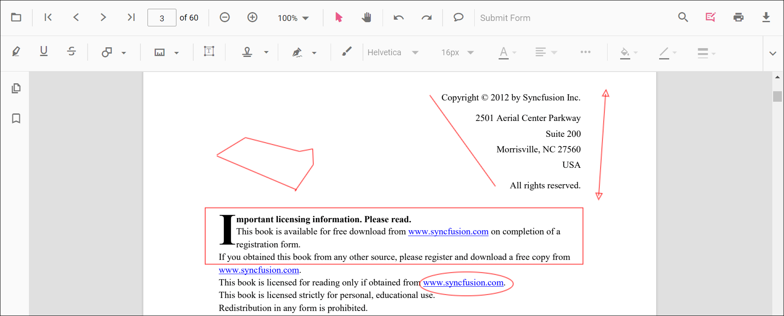
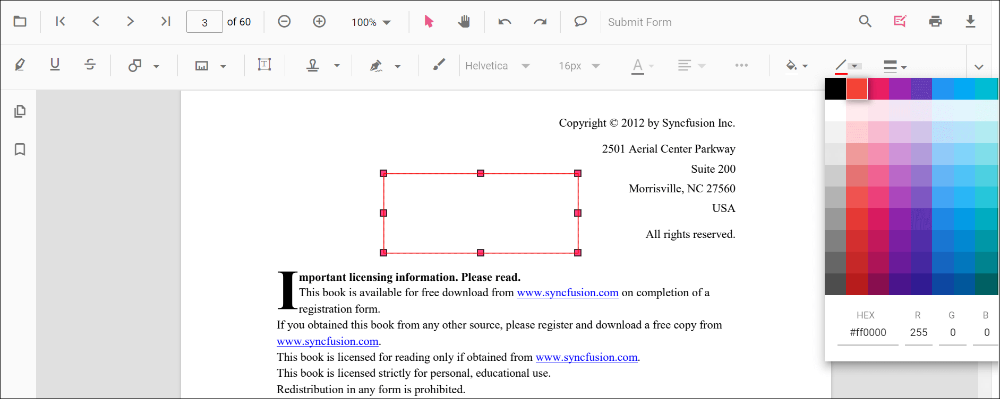
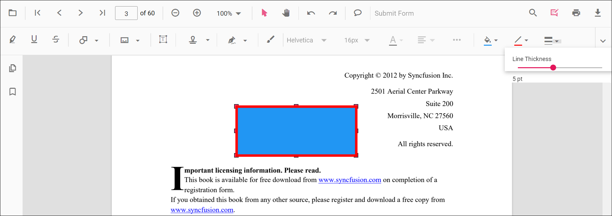
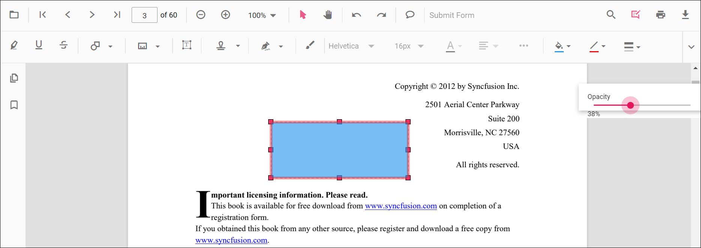
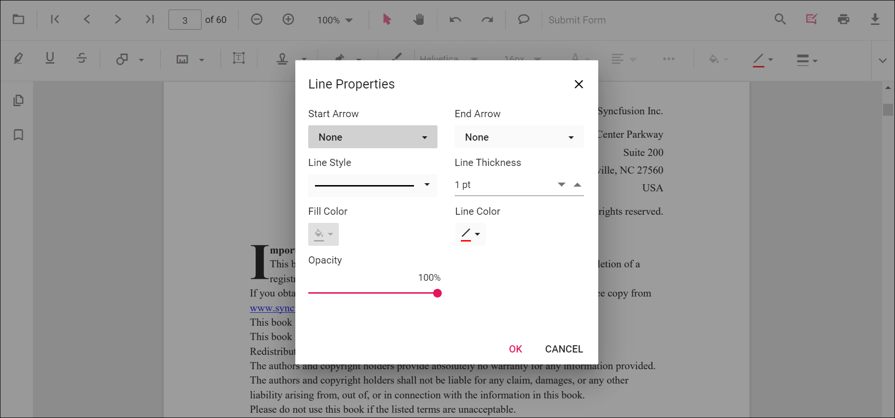

# Shape annotation in ASP.NET Core PDF Viewer

The PDF Viewer provides tools to add, edit, and delete shape annotations. Supported shape types:

* Line
* Arrow
* Rectangle
* Circle
* Polygon



## Add a shape annotation

Shape annotations are available from the annotation toolbar.

- Open the annotation toolbar with the **Edit Annotation** button in the PDF Viewer toolbar.
- Use the **Shape Annotation** drop-down to choose the desired shape type.
- Select a shape type to enable its annotation mode, then draw the shape on the page.

N> When the viewer is in pan mode and a shape tool is selected, the viewer switches to text selection mode where applicable to ensure a smooth interaction.


The following sample shows how to switch the viewer to circle annotation mode.



<div style="width:100%;height:640px">
  <ejs-pdfviewer id="pdfviewer" style="height:640px" documentPath="https://cdn.syncfusion.com/content/pdf/pdf-succinctly.pdf" resourceUrl="https://cdn.syncfusion.com/ej2/31.2.2/dist/ej2-pdfviewer-lib"></ejs-pdfviewer>
</div>
<div style="margin-top:8px">
  <button onclick="circleMode()">Circle</button>
</div>
<script>
  function circleMode() {
    var viewer = document.getElementById('pdfviewer').ej2_instances[0];
    viewer.annotation.setAnnotationMode('Circle');
  }
</script>


<div style="width:100%;height:640px">
  <ejs-pdfviewer id="pdfviewer" style="height:640px" documentPath="https://cdn.syncfusion.com/content/pdf/pdf-succinctly.pdf" serviceUrl="https://document.syncfusion.com/web-services/pdf-viewer/api/pdfviewer"></ejs-pdfviewer>
</div>
<div style="margin-top:8px">
  <button onclick="circleMode()">Circle</button>
</div>
<script>
  function circleMode() {
    var viewer = document.getElementById('pdfviewer').ej2_instances[0];
    viewer.annotation.setAnnotationMode('Circle');
  }
</script>



## Add a shape annotation to the PDF document programmatically

The PDF Viewer library allows adding an ink annotation programmatically using the `addAnnotation()` method.

The following examples show how to add shape annotations programmatically using `addAnnotation()`.



<div style="width:100%;height:640px">
  <ejs-pdfviewer id="pdfviewer" style="height:640px" documentPath="https://cdn.syncfusion.com/content/pdf/pdf-succinctly.pdf" resourceUrl="https://cdn.syncfusion.com/ej2/31.2.2/dist/ej2-pdfviewer-lib"></ejs-pdfviewer>
</div>
<div style="margin-top:8px">
  <button onclick="addLineAnnotation()">Add Line Annotation</button>
  <button onclick="addArrowAnnotation()">Add Arrow Annotation</button>
  <button onclick="addRectangleAnnotation()">Add Rectangle Annotation</button>
  <button onclick="addCircleAnnotation()">Add Circle Annotation</button>
  <button onclick="addPolygonAnnotation()">Add Polygon Annotation</button>
</div>
<script>
  function addLineAnnotation() {
    var viewer = document.getElementById('pdfviewer').ej2_instances[0];
    viewer.annotation.addAnnotation("Line", {
      offset: { x: 200, y: 230 },
      pageNumber: 1,
      vertexPoints: [{ x: 200, y: 230 }, { x: 350, y: 230 }]
    });
  }
  function addArrowAnnotation() {
    var viewer = document.getElementById('pdfviewer').ej2_instances[0];
    viewer.annotation.addAnnotation("Arrow", {
      offset: { x: 200, y: 370 },
      pageNumber: 1,
      vertexPoints: [{ x: 200, y: 370 }, { x: 350, y: 370 }]
    });
  }
  function addRectangleAnnotation() {
    var viewer = document.getElementById('pdfviewer').ej2_instances[0];
    viewer.annotation.addAnnotation("Rectangle", {
      offset: { x: 200, y: 500 },
      pageNumber: 1,
      vertexPoints: [{ x: 200, y: 500 }, { x: 288, y: 499 }, { x: 289, y: 553 }, { x: 200, y: 500 }]
    });
  }
  function addCircleAnnotation() {
    var viewer = document.getElementById('pdfviewer').ej2_instances[0];
    viewer.annotation.addAnnotation("Circle", {
      offset: { x: 200, y: 630 },
      pageNumber: 1,
      width: 90,
      height: 90
    });
  }
  function addPolygonAnnotation() {
    var viewer = document.getElementById('pdfviewer').ej2_instances[0];
    viewer.annotation.addAnnotation("Polygon", {
      offset: { x: 200, y: 800 },
      pageNumber: 1,
      vertexPoints: [{ x: 200, y: 800 }, { x: 242, y: 771 }, { x: 289, y: 799 }, { x: 278, y: 842 }, { x: 211, y: 842 }, { x: 200, y: 800 }]
    });
  }
</script>


<div style="width:100%;height:640px">
  <ejs-pdfviewer id="pdfviewer" style="height:640px" documentPath="https://cdn.syncfusion.com/content/pdf/pdf-succinctly.pdf" serviceUrl="https://document.syncfusion.com/web-services/pdf-viewer/api/pdfviewer"></ejs-pdfviewer>
</div>
<div style="margin-top:8px">
  <button onclick="addLineAnnotation()">Add Line Annotation</button>
  <button onclick="addArrowAnnotation()">Add Arrow Annotation</button>
  <button onclick="addRectangleAnnotation()">Add Rectangle Annotation</button>
  <button onclick="addCircleAnnotation()">Add Circle Annotation</button>
  <button onclick="addPolygonAnnotation()">Add Polygon Annotation</button>
</div>
<script>
  function addLineAnnotation() {
    var viewer = document.getElementById('pdfviewer').ej2_instances[0];
    viewer.annotation.addAnnotation("Line", {
      offset: { x: 200, y: 230 },
      pageNumber: 1,
      vertexPoints: [{ x: 200, y: 230 }, { x: 350, y: 230 }]
    });
  }
  function addArrowAnnotation() {
    var viewer = document.getElementById('pdfviewer').ej2_instances[0];
    viewer.annotation.addAnnotation("Arrow", {
      offset: { x: 200, y: 370 },
      pageNumber: 1,
      vertexPoints: [{ x: 200, y: 370 }, { x: 350, y: 370 }]
    });
  }
  function addRectangleAnnotation() {
    var viewer = document.getElementById('pdfviewer').ej2_instances[0];
    viewer.annotation.addAnnotation("Rectangle", {
      offset: { x: 200, y: 500 },
      pageNumber: 1,
      vertexPoints: [{ x: 200, y: 500 }, { x: 288, y: 499 }, { x: 289, y: 553 }, { x: 200, y: 500 }]
    });
  }
  function addCircleAnnotation() {
    var viewer = document.getElementById('pdfviewer').ej2_instances[0];
    viewer.annotation.addAnnotation("Circle", {
      offset: { x: 200, y: 630 },
      pageNumber: 1,
      width: 90,
      height: 90
    });
  }
  function addPolygonAnnotation() {
    var viewer = document.getElementById('pdfviewer').ej2_instances[0];
    viewer.annotation.addAnnotation("Polygon", {
      offset: { x: 200, y: 800 },
      pageNumber: 1,
      vertexPoints: [{ x: 200, y: 800 }, { x: 242, y: 771 }, { x: 289, y: 799 }, { x: 278, y: 842 }, { x: 211, y: 842 }, { x: 200, y: 800 }]
    });
  }
</script>



## Edit an existing shape annotation programmatically

Use the `editAnnotation()` method to modify existing shape annotations programmatically.

The following example demonstrates `editAnnotation()`.



<div style="width:100%;height:640px">
  <ejs-pdfviewer id="pdfviewer" style="height:640px" documentPath="https://cdn.syncfusion.com/content/pdf/pdf-succinctly.pdf" resourceUrl="https://cdn.syncfusion.com/ej2/31.2.2/dist/ej2-pdfviewer-lib"></ejs-pdfviewer>
</div>
<div style="margin-top:8px">
  <button onclick="editLineAnnotation()">Edit Line Annotation</button>
  <button onclick="editArrowAnnotation()">Edit Arrow Annotation</button>
  <button onclick="editRectangleAnnotation()">Edit Rectangle Annotation</button>
  <button onclick="editCircleAnnotation()">Edit Circle Annotation</button>
  <button onclick="editPolygonAnnotation()">Edit Polygon Annotation</button>
</div>
<script>
  function editLineAnnotation() {
    var viewer = document.getElementById('pdfviewer').ej2_instances[0];
    for (var i = 0; i < viewer.annotationCollection.length; i++) {
      if (viewer.annotationCollection[i].subject === "Line") {
        viewer.annotationCollection[i].strokeColor = "#0000FF";
        viewer.annotationCollection[i].thickness = 2;
        viewer.annotationCollection[i].annotationSelectorSettings.resizerShape = "Circle";
        viewer.annotation.editAnnotation(viewer.annotationCollection[i]);
      }
    }
  }
  function editArrowAnnotation() {
    var viewer = document.getElementById('pdfviewer').ej2_instances[0];
    for (var i = 0; i < viewer.annotationCollection.length; i++) {
      if (viewer.annotationCollection[i].subject === "Arrow") {
        viewer.annotationCollection[i].strokeColor = "#0000FF";
        viewer.annotationCollection[i].thickness = 2;
        viewer.annotationCollection[i].fillColor = "#FFFF00";
        viewer.annotationCollection[i].annotationSelectorSettings.resizerShape = "Circle";
        viewer.annotation.editAnnotation(viewer.annotationCollection[i]);
      }
    }
  }
  function editRectangleAnnotation() {
    var viewer = document.getElementById('pdfviewer').ej2_instances[0];
    for (var i = 0; i < viewer.annotationCollection.length; i++) {
      if (viewer.annotationCollection[i].subject === "Rectangle") {
        viewer.annotationCollection[i].strokeColor = "#0000FF";
        viewer.annotationCollection[i].thickness = 2;
        viewer.annotationCollection[i].fillColor = "#FFFF00";
        viewer.annotationCollection[i].annotationSelectorSettings.resizerShape = "Circle";
        viewer.annotation.editAnnotation(viewer.annotationCollection[i]);
      }
    }
  }
  function editCircleAnnotation() {
    var viewer = document.getElementById('pdfviewer').ej2_instances[0];
    for (var i = 0; i < viewer.annotationCollection.length; i++) {
      if (viewer.annotationCollection[i].subject === "Circle") {
        viewer.annotationCollection[i].strokeColor = "#0000FF";
        viewer.annotationCollection[i].thickness = 2;
        viewer.annotationCollection[i].fillColor = "#FFFF00";
        viewer.annotationCollection[i].annotationSelectorSettings.resizerShape = "Circle";
        viewer.annotation.editAnnotation(viewer.annotationCollection[i]);
      }
    }
  }
  function editPolygonAnnotation() {
    var viewer = document.getElementById('pdfviewer').ej2_instances[0];
    for (var i = 0; i < viewer.annotationCollection.length; i++) {
      if (viewer.annotationCollection[i].subject === "Polygon") {
        viewer.annotationCollection[i].strokeColor = "#0000FF";
        viewer.annotationCollection[i].thickness = 2;
        viewer.annotationCollection[i].fillColor = "#FFFF00";
        viewer.annotationCollection[i].annotationSelectorSettings.resizerShape = "Circle";
        viewer.annotation.editAnnotation(viewer.annotationCollection[i]);
      }
    }
  }
</script>


<div style="width:100%;height:640px">
  <ejs-pdfviewer id="pdfviewer" style="height:640px" documentPath="https://cdn.syncfusion.com/content/pdf/pdf-succinctly.pdf" serviceUrl="https://document.syncfusion.com/web-services/pdf-viewer/api/pdfviewer"></ejs-pdfviewer>
</div>
<div style="margin-top:8px">
  <button onclick="editLineAnnotation()">Edit Line Annotation</button>
  <button onclick="editArrowAnnotation()">Edit Arrow Annotation</button>
  <button onclick="editRectangleAnnotation()">Edit Rectangle Annotation</button>
  <button onclick="editCircleAnnotation()">Edit Circle Annotation</button>
  <button onclick="editPolygonAnnotation()">Edit Polygon Annotation</button>
</div>
<script>
  function editLineAnnotation() {
    var viewer = document.getElementById('pdfviewer').ej2_instances[0];
    for (var i = 0; i < viewer.annotationCollection.length; i++) {
      if (viewer.annotationCollection[i].subject === "Line") {
        viewer.annotationCollection[i].strokeColor = "#0000FF";
        viewer.annotationCollection[i].thickness = 2;
        viewer.annotationCollection[i].annotationSelectorSettings.resizerShape = "Circle";
        viewer.annotation.editAnnotation(viewer.annotationCollection[i]);
      }
    }
  }
  function editArrowAnnotation() {
    var viewer = document.getElementById('pdfviewer').ej2_instances[0];
    for (var i = 0; i < viewer.annotationCollection.length; i++) {
      if (viewer.annotationCollection[i].subject === "Arrow") {
        viewer.annotationCollection[i].strokeColor = "#0000FF";
        viewer.annotationCollection[i].thickness = 2;
        viewer.annotationCollection[i].fillColor = "#FFFF00";
        viewer.annotationCollection[i].annotationSelectorSettings.resizerShape = "Circle";
        viewer.annotation.editAnnotation(viewer.annotationCollection[i]);
      }
    }
  }
  function editRectangleAnnotation() {
    var viewer = document.getElementById('pdfviewer').ej2_instances[0];
    for (var i = 0; i < viewer.annotationCollection.length; i++) {
      if (viewer.annotationCollection[i].subject === "Rectangle") {
        viewer.annotationCollection[i].strokeColor = "#0000FF";
        viewer.annotationCollection[i].thickness = 2;
        viewer.annotationCollection[i].fillColor = "#FFFF00";
        viewer.annotationCollection[i].annotationSelectorSettings.resizerShape = "Circle";
        viewer.annotation.editAnnotation(viewer.annotationCollection[i]);
      }
    }
  }
  function editCircleAnnotation() {
    var viewer = document.getElementById('pdfviewer').ej2_instances[0];
    for (var i = 0; i < viewer.annotationCollection.length; i++) {
      if (viewer.annotationCollection[i].subject === "Circle") {
        viewer.annotationCollection[i].strokeColor = "#0000FF";
        viewer.annotationCollection[i].thickness = 2;
        viewer.annotationCollection[i].fillColor = "#FFFF00";
        viewer.annotationCollection[i].annotationSelectorSettings.resizerShape = "Circle";
        viewer.annotation.editAnnotation(viewer.annotationCollection[i]);
      }
    }
  }
  function editPolygonAnnotation() {
    var viewer = document.getElementById('pdfviewer').ej2_instances[0];
    for (var i = 0; i < viewer.annotationCollection.length; i++) {
      if (viewer.annotationCollection[i].subject === "Polygon") {
        viewer.annotationCollection[i].strokeColor = "#0000FF";
        viewer.annotationCollection[i].thickness = 2;
        viewer.annotationCollection[i].fillColor = "#FFFF00";
        viewer.annotationCollection[i].annotationSelectorSettings.resizerShape = "Circle";
        viewer.annotation.editAnnotation(viewer.annotationCollection[i]);
      }
    }
  }
</script>



## Editing the properties of the shape annotation

## Edit properties of shape annotations

Change fill color, stroke color, thickness, and opacity using the Edit Color, Edit Stroke Color, Edit Thickness, and Edit Opacity tools in the annotation toolbar.

### Edit fill color

Change the fill color using the color palette in the Edit Color tool.


### Edit stroke color

Change the stroke color using the Edit Stroke Color tool.



### Edit thickness

Adjust border thickness using the Edit Thickness range slider.



### Edit opacity

Adjust opacity using the Edit Opacity range slider.



### Line properties

Line and arrow annotations include additional options in the Line Properties dialog. Open it by right-clicking a line or arrow annotation and choosing Properties.



### Edit annotation programmatically

Modify annotations programmatically using the `editAnnotation()` method. The example below demonstrates selecting and editing an annotation.
```
<button onclick="editAnnotation()()">Edit Annotation</button>

<script>

//Edit Annotation
function editAnnotation(){
var pdfviewer = document.getElementById('container').ej2_instances[0];
  pdfviewer.annotationModule.selectAnnotation(pdfviewer.annotationCollection[0].annotationId);
  pdfviewer.annotationCollection[0].opacity ="0.5";
  pdfviewer.annotation.editAnnotation(pdfviewer.annotationCollection[0]);
}
</script>
```
### Delete annotation programmatically

Delete a specific annotation with `deleteAnnotationById()` by providing the annotation's id. The example below demonstrates usage.

```
<button onclick="deleteAnnotationbyId()">Delete Annotation by ID</button>

<script>
  //Delete Annotation by id.
  function deleteAnnotationbyId() {
    var viewer = document.getElementById('container').ej2_instances[0];
    viewer.annotationModule.deleteAnnotationById(viewer.annotationCollection[0].annotationId);
  }
</script>
```

## Set default properties during initialization

Default properties for shape annotations can be configured before creating the viewer using `lineSettings`, `arrowSettings`, `rectangleSettings`, `circleSettings`, and `polygonSettings`.



<div style="width:100%;height:640px">
  <ejs-pdfviewer id="pdfviewer" style="height:640px" documentPath="https://cdn.syncfusion.com/content/pdf/pdf-succinctly.pdf" resourceUrl="https://cdn.syncfusion.com/ej2/31.2.2/dist/ej2-pdfviewer-lib"></ejs-pdfviewer>
</div>
<script>
  window.onload = function() {
    var viewer = document.getElementById('pdfviewer').ej2_instances[0];
    if (viewer) {
      viewer.lineSettings = { fillColor: 'blue', opacity: 0.6, strokeColor: 'green' };
      viewer.arrowSettings = { fillColor: 'green', opacity: 0.6, strokeColor: 'blue' };
      viewer.rectangleSettings = { fillColor: 'yellow', opacity: 0.6, strokeColor: 'orange' };
      viewer.circleSettings = { fillColor: 'orange', opacity: 0.6, strokeColor: 'pink' };
      viewer.polygonSettings = { fillColor: 'pink', opacity: 0.6, strokeColor: 'yellow' };
    }
  };
</script>


<div style="width:100%;height:640px">
  <ejs-pdfviewer id="pdfviewer" style="height:640px" documentPath="https://cdn.syncfusion.com/content/pdf/pdf-succinctly.pdf" serviceUrl="https://document.syncfusion.com/web-services/pdf-viewer/api/pdfviewer"></ejs-pdfviewer>
</div>
<script>
  window.onload = function() {
    var viewer = document.getElementById('pdfviewer').ej2_instances[0];
    if (viewer) {
      viewer.lineSettings = { fillColor: 'blue', opacity: 0.6, strokeColor: 'green' };
      viewer.arrowSettings = { fillColor: 'green', opacity: 0.6, strokeColor: 'blue' };
      viewer.rectangleSettings = { fillColor: 'yellow', opacity: 0.6, strokeColor: 'orange' };
      viewer.circleSettings = { fillColor: 'orange', opacity: 0.6, strokeColor: 'pink' };
      viewer.polygonSettings = { fillColor: 'pink', opacity: 0.6, strokeColor: 'yellow' };
    }
  };
</script>



N> In both the Arrow and Line settings, the Fill Color option is available only when an arrowhead style is applied at the Start or End. If both Start and End arrowhead styles are set to `None`, lines do not support fill rendering and the Fill Color option is disabled. See Arrow settings and Line settings for API details.
