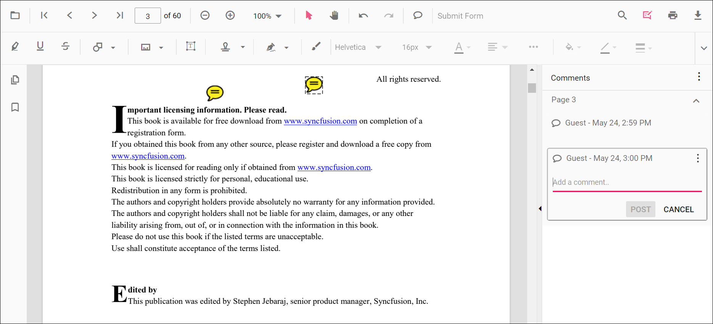
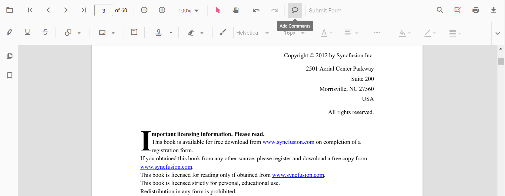
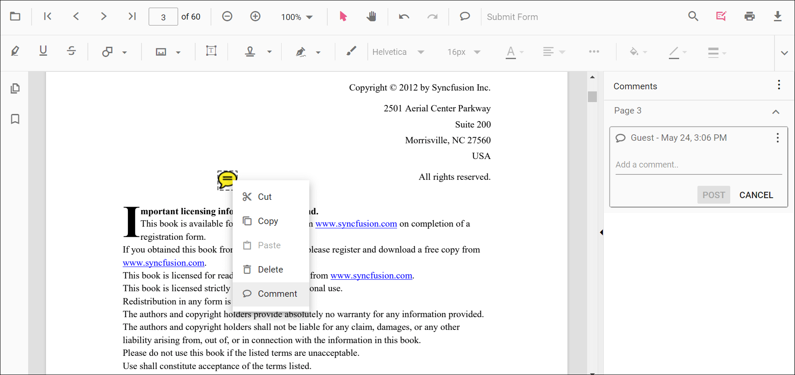
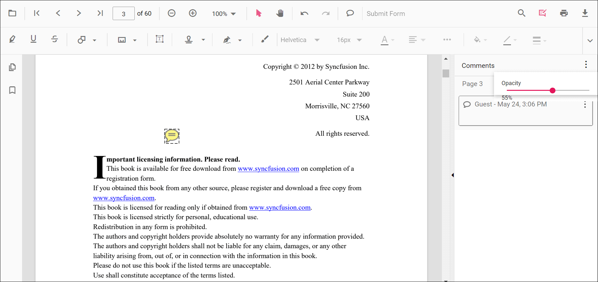
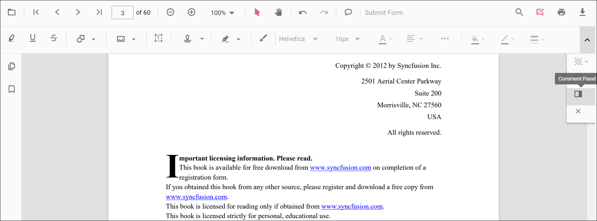
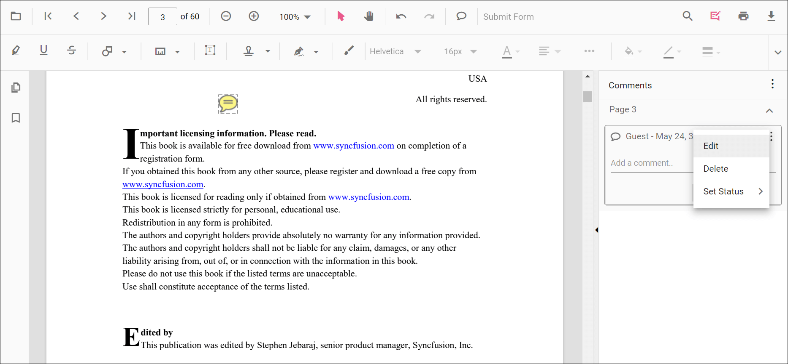

# Sticky notes annotation in ASP.NET Core PDF Viewer

The PDF Viewer provides options to add, edit, and delete sticky note annotations.

## Add a sticky note annotation

Annotation comments are added using the comment panel.

* Right-click a sticky note annotation and choose **Comment** from the context menu.
* Use the comment panel to add comments, reply, and change status.

## Add a sticky note annotation to the PDF document programmatically

Use the `addAnnotation()` method to add a sticky note annotation programmatically.

The following example demonstrates using `addAnnotation()` to create a sticky note annotation.




  <ejs-pdfviewer id="pdfviewer" style="height:640px" documentPath="https://cdn.syncfusion.com/content/pdf/pdf-succinctly.pdf" resourceUrl="https://cdn.syncfusion.com/ej2/31.2.2/dist/ej2-pdfviewer-lib"></ejs-pdfviewer>

  <button onclick="addAnnotation()">Add Annotation</button>





  <ejs-pdfviewer id="pdfviewer" style="height:640px" documentPath="https://cdn.syncfusion.com/content/pdf/pdf-succinctly.pdf" serviceUrl="https://document.syncfusion.com/web-services/pdf-viewer/api/pdfviewer"></ejs-pdfviewer>

  <button onclick="addAnnotation()">Add Annotation</button>




## Edit an existing sticky note annotation programmatically

Use the `editAnnotation()` method to modify existing sticky note annotations programmatically.

The following example demonstrates `editAnnotation()`.




  <ejs-pdfviewer id="pdfviewer" style="height:640px" documentPath="https://cdn.syncfusion.com/content/pdf/pdf-succinctly.pdf" resourceUrl="https://cdn.syncfusion.com/ej2/31.2.2/dist/ej2-pdfviewer-lib"></ejs-pdfviewer>

  <button onclick="editAnnotation()">Edit Annotation</button>





  <ejs-pdfviewer id="pdfviewer" style="height:640px" documentPath="https://cdn.syncfusion.com/content/pdf/pdf-succinctly.pdf" serviceUrl="https://document.syncfusion.com/web-services/pdf-viewer/api/pdfviewer"></ejs-pdfviewer>

  <button onclick="editAnnotation()">Edit Annotation</button>




## Edit the properties of sticky note annotations

### Editing opacity

Edit opacity using the range slider in the Edit Opacity tool.

### Editing comments

Comment text, replies, and status can be edited using the comment panel.

* Open the comment panel using the Comment Panel button in the annotation toolbar.

  

Modify or delete comments or replies, and change status using the menu options in the comment panel.

  

## Set default properties during control initialization

Set default properties for sticky note annotations before creating the control by specifying `stickyNotesSettings`.

After changing the default opacity using the Edit Opacity tool, the selected value is applied. The example below shows how to set default sticky note annotation settings.




  <ejs-pdfviewer id="pdfviewer" style="height:640px" documentPath="https://cdn.syncfusion.com/content/pdf/pdf-succinctly.pdf" resourceUrl="https://cdn.syncfusion.com/ej2/31.2.2/dist/ej2-pdfviewer-lib"></ejs-pdfviewer>





  <ejs-pdfviewer id="pdfviewer" style="height:640px" documentPath="https://cdn.syncfusion.com/content/pdf/pdf-succinctly.pdf" serviceUrl="https://document.syncfusion.com/web-services/pdf-viewer/api/pdfviewer"></ejs-pdfviewer>




## Disable sticky note annotations

The PDF Viewer control provides an option to disable sticky note annotations. The following example disables the feature.




  <ejs-pdfviewer id="pdfviewer" style="height:640px" documentPath="https://cdn.syncfusion.com/content/pdf/pdf-succinctly.pdf" resourceUrl="https://cdn.syncfusion.com/ej2/31.2.2/dist/ej2-pdfviewer-lib"enableStickyNotesAnnotation="false"></ejs-pdfviewer>




  <ejs-pdfviewer id="pdfviewer" style="height:640px" documentPath="https://cdn.syncfusion.com/content/pdf/pdf-succinctly.pdf" serviceUrl="https://document.syncfusion.com/web-services/pdf-viewer/api/pdfviewer" enableStickyNotesAnnotation="false"></ejs-pdfviewer>


