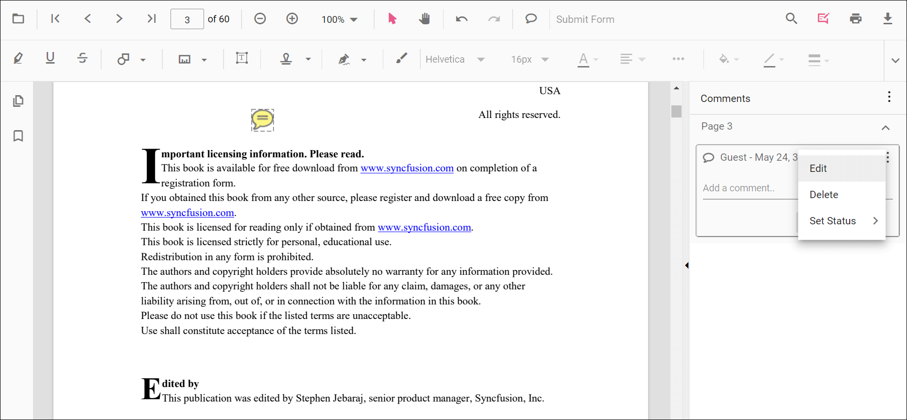

# Sticky Notes in ASP.NET Core PDF Viewer

The PDF Viewer control provides comprehensive sticky note annotation capabilities for adding quick notes and comments to PDF documents. Create, edit, and delete sticky notes with full comment support for discussions and document review workflows.

## Add a sticky note annotation to the PDF document

Sticky notes can be added directly using the toolbar or context menu. They serve as markers for attaching comments and discussions to specific page locations.

### Adding sticky notes using toolbar

1. **Click the Comments button** in the PDF Viewer toolbar to enable annotation mode
2. **Click on the page** at the desired location where you want to place the note
3. **Sticky note is created** - A small marker appears at the clicked position

### Adding comments to sticky notes

Comments provide detailed information and discussions for sticky notes:

1. **Select a sticky note** - Click on any sticky note annotation on the page
2. **Right-click the note** - Context menu appears with available actions
3. **Select Comment** - Opens the comment panel for the selected note
4. **Add comment text** - Type your comment in the text field
5. **Save comment** - Comment is saved to the note on clicking post.

## Add a sticky note annotation to the PDF document programmatically

The **addAnnotation()** method enables programmatic sticky note creation with precise positioning and configuration. This allows dynamic note placement without user interaction.

**Example: Add sticky note annotations programmatically**




<button id="set" onclick="addAnnotation()">Add annotation programmatically</button>

    <ejs-pdfviewer id="pdfviewer"
                   style="height:600px"
                   documentPath="https://cdn.syncfusion.com/content/pdf/pdf-succinctly.pdf">
    </ejs-pdfviewer>




<button id="set" onclick="addAnnotation()">Add annotation programmatically</button>

    <ejs-pdfviewer id="pdfviewer"
                   style="height:600px"
                   serviceUrl="/api/PdfViewer"
                   documentPath="https://cdn.syncfusion.com/content/pdf/pdf-succinctly.pdf">
    </ejs-pdfviewer>




## Edit an existing sticky note annotation programmatically

To modify an existing sticky note annotation programmatically, use the **editAnnotation()** method.

Here is an example of using editAnnotation():




<button id="set" onclick="editAnnotation()">Edit annotation programmatically</button>

    <ejs-pdfviewer id="pdfviewer"
                   style="height:600px"
                   documentPath="https://cdn.syncfusion.com/content/pdf/pdf-succinctly.pdf">
    </ejs-pdfviewer>




<button id="set" onclick="editAnnotation()">Edit annotation programmatically</button>

    <ejs-pdfviewer id="pdfviewer"
                   style="height:600px"
                   serviceUrl="/api/PdfViewer"
                   documentPath="https://cdn.syncfusion.com/content/pdf/pdf-succinctly.pdf">
    </ejs-pdfviewer>




## Edit the properties of sticky note annotations

Sticky note annotations support multiple property editing workflows. Properties can be modified through the UI toolbar, comment panel interface, or programmatically.

### Editing opacity

The **opacity property** controls note transparency, allowing visual customization for emphasis or reduced prominence.

### Editing comments

Comments provide detailed annotations to sticky notes. Comment text, threaded replies, and status states are fully editable through the comment panel interface.

**Using the comment panel:**
1. **Open comment panel** - Click Comment Panel button in toolbar
2. **Select sticky note** - Choose note to edit comments for
3. **Modify or delete** - Edit existing comment text or remove comments
4. **Add replies** - Create threaded discussion under comments
5. **Change status** - Update comment status

**Comment editing options:**
- **Edit text** - Modify comment content inline
- **Delete comment** - Remove selected comment permanently
- **Add reply** - Create threaded response to existing comment
- **Mark status** - Change comment state (Review/Done/Cancelled)

## Set default properties during control initialization

The **StickyNotesSettings** object enables configuration of default sticky note behavior at PDF Viewer initialization. These properties apply to all subsequently created sticky notes unless explicitly overridden.

The following example sets default sticky note annotation settings during control initialization:




    <ejs-pdfviewer id="pdfviewer"
                   style="height:600px"
                   documentPath="https://cdn.syncfusion.com/content/pdf/pdf-succinctly.pdf"
                   stickyNotesSettings="@(new Syncfusion.EJ2.PdfViewer.PdfViewerStickyNotesSettings
            {Author="Syncfusion"})">
    </ejs-pdfviewer>




    <ejs-pdfviewer id="pdfviewer"
                   style="height:600px"
                   serviceUrl="/api/PdfViewer"
                   documentPath="https://cdn.syncfusion.com/content/pdf/pdf-succinctly.pdf"
                   stickyNotesSettings="@(new Syncfusion.EJ2.PdfViewer.PdfViewerStickyNotesSettings
            {Author="Syncfusion"})">
    </ejs-pdfviewer>




## Disable sticky note annotations

The **enableStickyNotesAnnotation** property controls sticky note feature availability. When disabled, sticky note creation is prevented while existing annotations remain visible.

### Disabling sticky note annotations programmatically

The following example demonstrates disabling sticky note annotations during control initialization:




    <ejs-pdfviewer id="pdfviewer"
                   style="height:600px"
                   enableStickyNotesAnnotation=false
                   documentPath="https://cdn.syncfusion.com/content/pdf/pdf-succinctly.pdf">
    </ejs-pdfviewer>




    <ejs-pdfviewer id="pdfviewer"
                   style="height:600px"
                   enableStickyNotesAnnotation=false
                   serviceUrl="/api/PdfViewer"
                   documentPath="https://cdn.syncfusion.com/content/pdf/pdf-succinctly.pdf">
    </ejs-pdfviewer>



