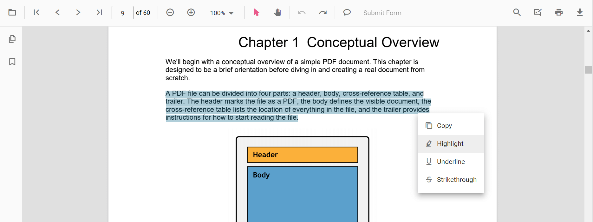
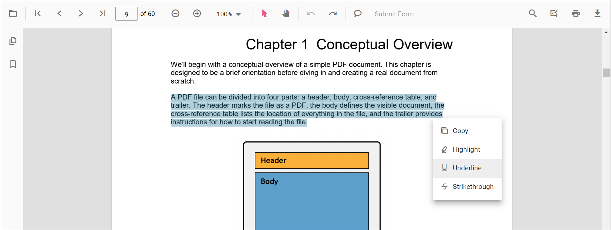
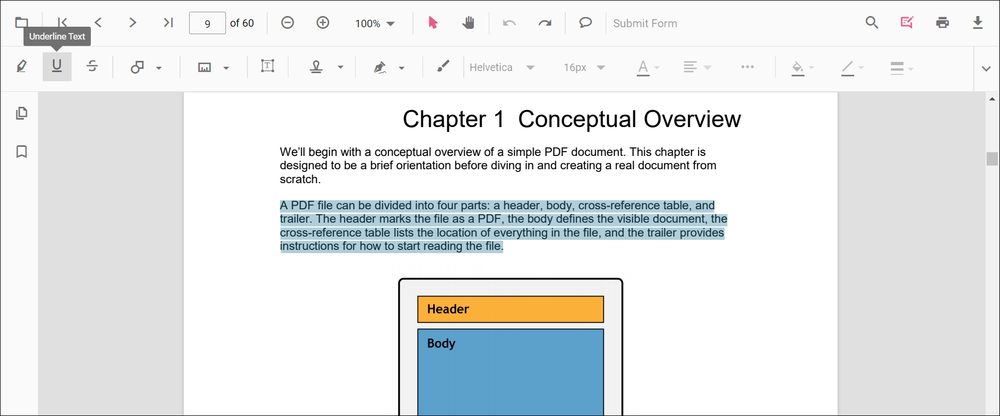
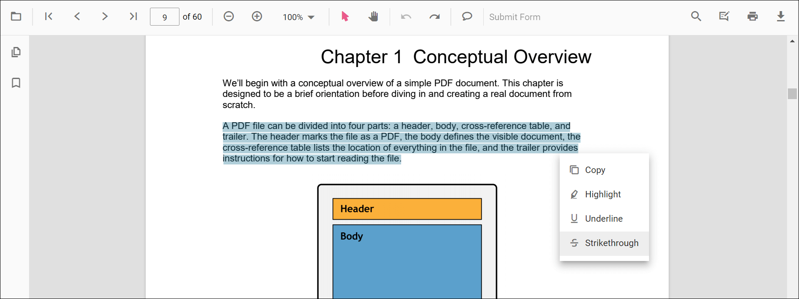
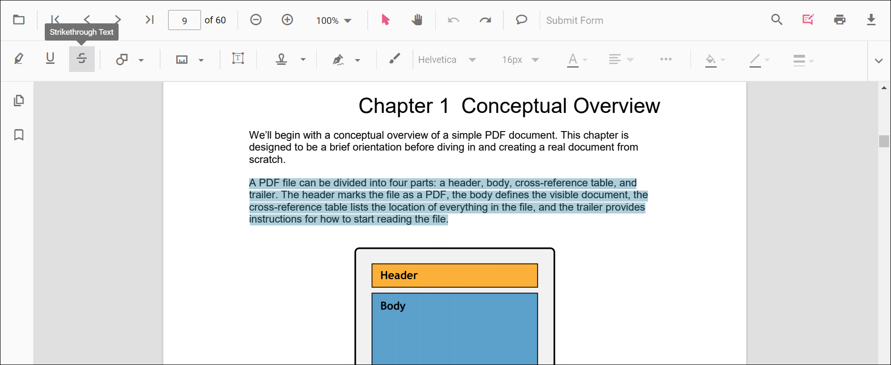
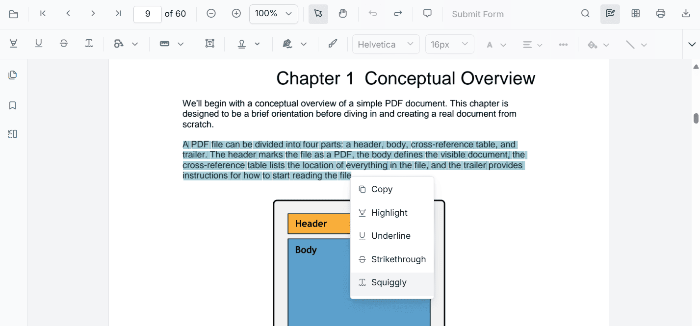
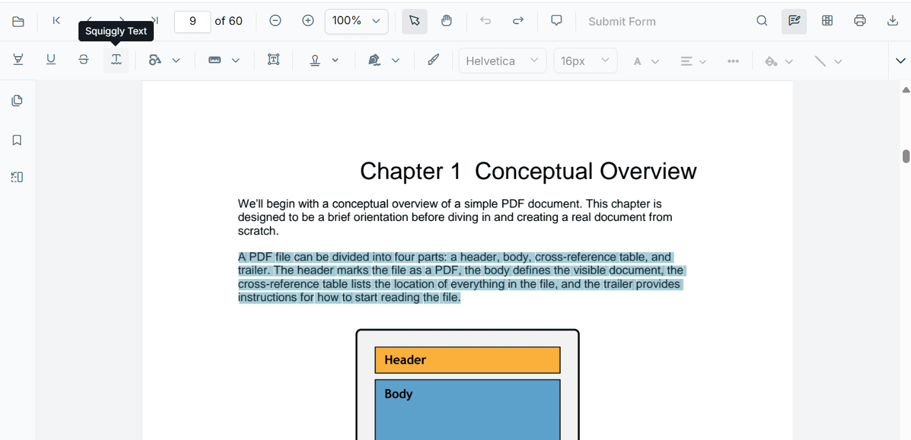
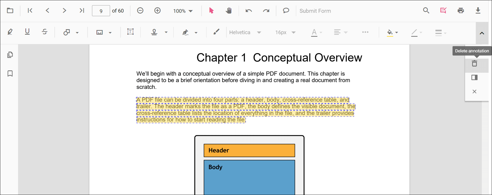
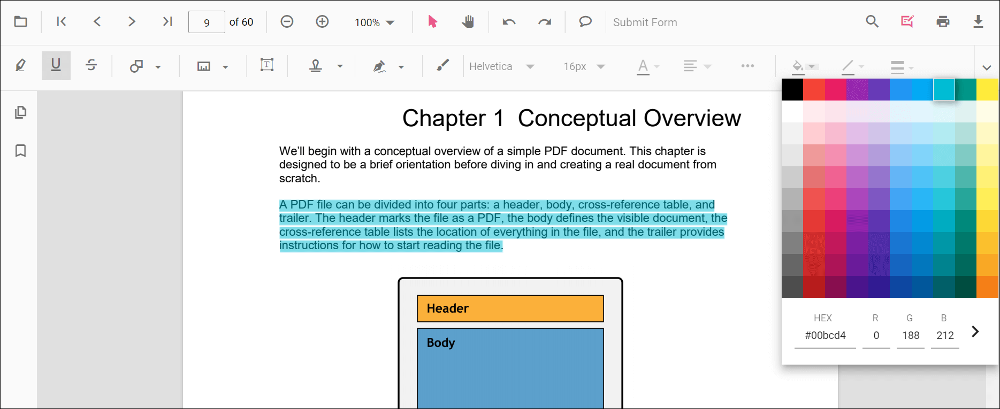
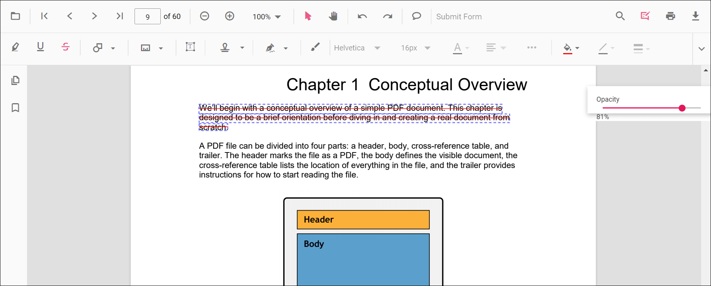

# Text markup annotation in ASP.NET Core PDF Viewer

The PDF Viewer provides options to add, edit, and delete text markup annotations, including Highlight, Underline, Strikethrough, and Squiggly.

## Highlight text

Two ways to add highlights:

1. Using the context menu
* Select text in the PDF document and right-click it.
* Select **Highlight** in the context menu.

  

2. Using the annotation toolbar
* Click the **Edit Annotation** button in the PDF Viewer toolbar to open the annotation toolbar.
* Select **Highlight** to enable highlight mode.
* Select text to add the highlight annotation.
* Alternatively, select text first and then click **Highlight**.

  

When pan mode is active, entering any text markup mode switches the PDF Viewer to text selection mode.

Refer to the following code snippet to switch to highlight mode.




<button onclick="highlightMode()">Highlight</button>

    <ejs-pdfviewer id="pdfviewer" style="height:640px" documentPath="https://cdn.syncfusion.com/content/pdf/pdf-succinctly.pdf" resourceUrl="https://cdn.syncfusion.com/ej2/31.2.2/dist/ej2-pdfviewer-lib">
    </ejs-pdfviewer>




<button onclick="highlightMode()">Highlight</button>

    <ejs-pdfviewer id="pdfviewer" style="height:640px" serviceUrl="/api/PdfViewer" documentPath="https://cdn.syncfusion.com/content/pdf/pdf-succinctly.pdf">
    </ejs-pdfviewer>




Refer to the following code snippet to switch back to normal mode from highlight mode.




<button onclick="highlightMode()">Highlight</button>
<button onclick="normalMode()">Normal Mode</button>

    <ejs-pdfviewer id="pdfviewer" style="height:640px" documentPath="https://cdn.syncfusion.com/content/pdf/pdf-succinctly.pdf" resourceUrl="https://cdn.syncfusion.com/ej2/31.2.2/dist/ej2-pdfviewer-lib">
    </ejs-pdfviewer>




<button onclick="highlightMode()">Highlight</button>
<button onclick="normalMode()">Normal Mode</button>

    <ejs-pdfviewer id="pdfviewer" style="height:640px" serviceUrl="/api/PdfViewer" documentPath="https://cdn.syncfusion.com/content/pdf/pdf-succinctly.pdf">
    </ejs-pdfviewer>




## Highlight text programmatically

Programmatically add highlights using the [addAnnotation](https://ej2.syncfusion.com/javascript/documentation/api/pdfviewer/index-default#addannotation) method.

Example:




<button onclick="addAnnotation()">Add Annotation</button>

    <ejs-pdfviewer id="pdfviewer" style="height:640px" documentPath="https://cdn.syncfusion.com/content/pdf/pdf-succinctly.pdf" resourceUrl="https://cdn.syncfusion.com/ej2/31.2.2/dist/ej2-pdfviewer-lib">
    </ejs-pdfviewer>




<button onclick="addAnnotation()">Add Annotation</button>

    <ejs-pdfviewer id="pdfviewer" style="height:640px" serviceUrl="/api/PdfViewer" documentPath="https://cdn.syncfusion.com/content/pdf/pdf-succinctly.pdf">
    </ejs-pdfviewer>




## Underline text

Two ways to add underlines:

1. Using the context menu
* Select text in the PDF document and right-click it.
* Select **Underline** in the context menu.

  

2. Using the annotation toolbar
* Click the **Edit Annotation** button in the PDF Viewer toolbar to open the annotation toolbar.
* Select **Underline** to enable underline mode.
* Select text to add the underline annotation.
* Alternatively, select text first and then click **Underline**.

  

When pan mode is active, entering underline mode switches the PDF Viewer to text selection mode to enable text selection for underlining.

Refer to the following code snippet to switch to underline mode.




<button onclick="underlineMode()">Underline</button>

    <ejs-pdfviewer id="pdfviewer" style="height:640px" documentPath="https://cdn.syncfusion.com/content/pdf/pdf-succinctly.pdf" resourceUrl="https://cdn.syncfusion.com/ej2/31.2.2/dist/ej2-pdfviewer-lib">
    </ejs-pdfviewer>




<button onclick="underlineMode()">Underline</button>

    <ejs-pdfviewer id="pdfviewer" style="height:640px" serviceUrl="/api/PdfViewer" documentPath="https://cdn.syncfusion.com/content/pdf/pdf-succinctly.pdf">
    </ejs-pdfviewer>




Refer to the following code snippet to switch back to normal mode from underline mode.




<button onclick="underlineMode()">Underline</button>
<button onclick="normalMode()">Normal Mode</button>

    <ejs-pdfviewer id="pdfviewer" style="height:640px" documentPath="https://cdn.syncfusion.com/content/pdf/pdf-succinctly.pdf" resourceUrl="https://cdn.syncfusion.com/ej2/31.2.2/dist/ej2-pdfviewer-lib">
    </ejs-pdfviewer>




<button onclick="underlineMode()">Underline</button>
<button onclick="normalMode()">Normal Mode</button>

    <ejs-pdfviewer id="pdfviewer" style="height:640px" serviceUrl="/api/PdfViewer" documentPath="https://cdn.syncfusion.com/content/pdf/pdf-succinctly.pdf" resourceUrl="https://cdn.syncfusion.com/ej2/31.2.2/dist/ej2-pdfviewer-lib">
    </ejs-pdfviewer>




## Underline text programmatically

Programmatically add underlines using the [addAnnotation](https://ej2.syncfusion.com/javascript/documentation/api/pdfviewer/index-default#addannotation) method.

Example:




<button onclick="addAnnotation()">Add Annotation</button>

    <ejs-pdfviewer id="pdfviewer" style="height:640px" documentPath="https://cdn.syncfusion.com/content/pdf/pdf-succinctly.pdf" resourceUrl="https://cdn.syncfusion.com/ej2/31.2.2/dist/ej2-pdfviewer-lib">
    </ejs-pdfviewer>




<button onclick="addAnnotation()">Add Annotation</button>

    <ejs-pdfviewer id="pdfviewer" style="height:640px" serviceUrl="/api/PdfViewer" documentPath="https://cdn.syncfusion.com/content/pdf/pdf-succinctly.pdf">
    </ejs-pdfviewer>




## Strikethrough text

Two ways to add strikethroughs:

1. Using the context menu
* Select text in the PDF document and right-click it.
* Select **Strikethrough** in the context menu.

  

2. Using the annotation toolbar
* Click the **Edit Annotation** button in the PDF Viewer toolbar to open the annotation toolbar.
* Select **Strikethrough** to enable strikethrough mode.
* Select text to add the strikethrough annotation.
* Alternatively, select text first and then click **Strikethrough**.

  

When pan mode is active, entering strikethrough mode switches the PDF Viewer to text selection mode to enable text selection for striking through.

Refer to the following code snippet to switch to strikethrough mode.




<button onclick="strikethroughMode()">Strikethrough</button>

    <ejs-pdfviewer id="pdfviewer" style="height:640px" documentPath="https://cdn.syncfusion.com/content/pdf/pdf-succinctly.pdf" resourceUrl="https://cdn.syncfusion.com/ej2/31.2.2/dist/ej2-pdfviewer-lib">
    </ejs-pdfviewer>




<button onclick="strikethroughMode()">Strikethrough</button>

    <ejs-pdfviewer id="pdfviewer" style="height:640px" serviceUrl="/api/PdfViewer" documentPath="https://cdn.syncfusion.com/content/pdf/pdf-succinctly.pdf">
    </ejs-pdfviewer>




Refer to the following code snippet to switch back to normal mode from strikethrough mode.




<button onclick="strikethroughMode()">Strikethrough</button>
<button onclick="normalMode()">Normal Mode</button>

    <ejs-pdfviewer id="pdfviewer" style="height:640px" documentPath="https://cdn.syncfusion.com/content/pdf/pdf-succinctly.pdf" resourceUrl="https://cdn.syncfusion.com/ej2/31.2.2/dist/ej2-pdfviewer-lib">
    </ejs-pdfviewer>




<button onclick="strikethroughMode()">Strikethrough</button>
<button onclick="normalMode()">Normal Mode</button>

    <ejs-pdfviewer id="pdfviewer" style="height:640px" serviceUrl="/api/PdfViewer" documentPath="https://cdn.syncfusion.com/content/pdf/pdf-succinctly.pdf">
    </ejs-pdfviewer>




## Strikethrough text programmatically

Programmatically add strikethrough using the [addAnnotation](https://ej2.syncfusion.com/javascript/documentation/api/pdfviewer/index-default#addannotation) method.

Example:




<button onclick="addAnnotation()">Add Annotation</button>

    <ejs-pdfviewer id="pdfviewer" style="height:640px" documentPath="https://cdn.syncfusion.com/content/pdf/pdf-succinctly.pdf" resourceUrl="https://cdn.syncfusion.com/ej2/31.2.2/dist/ej2-pdfviewer-lib">
    </ejs-pdfviewer>




<button onclick="addAnnotation()">Add Annotation</button>

    <ejs-pdfviewer id="pdfviewer" style="height:640px" serviceUrl="/api/PdfViewer" documentPath="https://cdn.syncfusion.com/content/pdf/pdf-succinctly.pdf">
    </ejs-pdfviewer>




## Add squiggly to text

Two ways to add squiggly annotations:

1. Using the context menu
* Select text in the PDF document and right-click it.
* Select **Squiggly** in the context menu.

  

2. Using the annotation toolbar
* Click the **Edit Annotation** button in the PDF Viewer toolbar to open the annotation toolbar.
* Select **Squiggly** to enable squiggly mode.
* Select text to add the squiggly annotation.
* Alternatively, select text first and then click **Squiggly**.

  

When pan mode is active, entering squiggly mode switches the PDF Viewer to text selection mode to enable text selection for adding squiggly annotations.

Refer to the following code snippet to switch to squiggly mode.




<button onclick="squigglyMode()">Squiggly</button>

    <ejs-pdfviewer id="pdfviewer" style="height:640px" documentPath="https://cdn.syncfusion.com/content/pdf/pdf-succinctly.pdf" resourceUrl="https://cdn.syncfusion.com/ej2/31.2.2/dist/ej2-pdfviewer-lib">
    </ejs-pdfviewer>




<button onclick="squigglyMode()">Squiggly</button>

    <ejs-pdfviewer id="pdfviewer" style="height:640px" serviceUrl="/api/PdfViewer" documentPath="https://cdn.syncfusion.com/content/pdf/pdf-succinctly.pdf">
    </ejs-pdfviewer>




Refer to the following code snippet to switch back to normal mode from squiggly mode.




<button onclick="squigglyMode()">Squiggly</button>
<button onclick="normalMode()">Normal Mode</button>

    <ejs-pdfviewer id="pdfviewer" style="height:640px" documentPath="https://cdn.syncfusion.com/content/pdf/pdf-succinctly.pdf" resourceUrl="https://cdn.syncfusion.com/ej2/31.2.2/dist/ej2-pdfviewer-lib">
    </ejs-pdfviewer>




<button onclick="squigglyMode()">Squiggly</button>
<button onclick="normalMode()">Normal Mode</button>

    <ejs-pdfviewer id="pdfviewer" style="height:640px" serviceUrl="/api/PdfViewer" documentPath="https://cdn.syncfusion.com/content/pdf/pdf-succinctly.pdf">
    </ejs-pdfviewer>




## Add squiggly to text programmatically

Programmatically add squiggly using the [addAnnotation](https://ej2.syncfusion.com/javascript/documentation/api/pdfviewer/index-default#addannotation) method.

Example:




<button onclick="addAnnotation()">Add Annotation</button>

    <ejs-pdfviewer id="pdfviewer" style="height:640px" documentPath="https://cdn.syncfusion.com/content/pdf/pdf-succinctly.pdf" resourceUrl="https://cdn.syncfusion.com/ej2/31.2.2/dist/ej2-pdfviewer-lib">
    </ejs-pdfviewer>




<button onclick="addAnnotation()">Add Annotation</button>

    <ejs-pdfviewer id="pdfviewer" style="height:640px" serviceUrl="/api/PdfViewer" documentPath="https://cdn.syncfusion.com/content/pdf/pdf-succinctly.pdf">
    </ejs-pdfviewer>




## Deleting a text markup annotation

The selected annotation can be deleted in the following ways:

1. Using the Delete/Backspace key
  * Select the annotation.
  * Press Delete (or Backspace). The selected annotation is removed.

2. Using the annotation toolbar
  * Select the annotation.
  * Click **Delete Annotation** in the annotation toolbar. The selected annotation is removed.

   

## Edit text markup annotation properties

The color and the opacity of the text markup annotation can be edited using the Edit Color tool and the Edit Opacity tool in the annotation toolbar.

### Edit color

Use the color palette in the Edit Color tool to change the annotation color.

### Edit opacity

Use the range slider in the Edit Opacity tool to change annotation opacity.

## Set default properties during control initialization

Set default properties before creating the control using `highlightSettings`, `underlineSettings`, `strikethroughSettings`, and `squigglySettings`.

> After editing default color and opacity using the Edit Color and Edit Opacity tools, the values update to the selected settings.

Refer to the following code snippet to set the default annotation settings.




    <ejs-pdfviewer id="pdfviewer" style="height:640px" documentPath="https://cdn.syncfusion.com/content/pdf/pdf-succinctly.pdf" resourceUrl="https://cdn.syncfusion.com/ej2/31.2.2/dist/ej2-pdfviewer-lib">
    </ejs-pdfviewer>




    <ejs-pdfviewer id="pdfviewer" style="height:640px" serviceUrl="/api/PdfViewer" documentPath="https://cdn.syncfusion.com/content/pdf/pdf-succinctly.pdf">
    </ejs-pdfviewer>




## Perform undo and redo

The PDF Viewer supports undo and redo for changes. For text markup annotations, undo and redo are provided for:

* Inclusion of the text markup annotations.
* Deletion of the text markup annotations.
* Change of either color or opacity of the text markup annotations.

Undo and redo actions can be performed in the following ways:

1.Using keyboard shortcuts:
    After performing a text markup annotation action, press Ctrl+Z to undo and Ctrl+Y to redo.
2.Using the toolbar:
    Use the **Undo** and **Redo** tools in the toolbar.

Refer to the following code snippet to call undo and redo actions from the client side.




<button onclick="undo()">Undo</button>
<button onclick="redo()">Redo</button>

    <ejs-pdfviewer id="pdfviewer" style="height:640px" documentPath="https://cdn.syncfusion.com/content/pdf/pdf-succinctly.pdf" resourceUrl="https://cdn.syncfusion.com/ej2/31.2.2/dist/ej2-pdfviewer-lib">
    </ejs-pdfviewer>




<button onclick="undo()">Undo</button>
<button onclick="redo()">Redo</button>

    <ejs-pdfviewer id="pdfviewer" style="height:640px" serviceUrl="/api/PdfViewer" documentPath="https://cdn.syncfusion.com/content/pdf/pdf-succinctly.pdf">
    </ejs-pdfviewer>




## Save text markup annotations

Click the download tool in the toolbar to save text markup annotations to the PDF document. The original document is not modified.

## Print text markup annotations

Click the print tool in the toolbar to print the PDF document with text markup annotations. The original document is not modified.

## Disable text markup annotation

Disable text markup annotations using the `enableTextMarkupAnnotation` property.




    <ejs-pdfviewer id="pdfviewer" style="height:640px" enableTextMarkupAnnotation="false" documentPath="https://cdn.syncfusion.com/content/pdf/pdf-succinctly.pdf" resourceUrl="https://cdn.syncfusion.com/ej2/31.2.2/dist/ej2-pdfviewer-lib">
    </ejs-pdfviewer>




    <ejs-pdfviewer id="pdfviewer" style="height:640px" enableTextMarkupAnnotation="false" serviceUrl="/api/PdfViewer" documentPath="https://cdn.syncfusion.com/content/pdf/pdf-succinctly.pdf">
    </ejs-pdfviewer>




## See also

* [Toolbar items](../../pdfviewer/toolbar)
* [Feature modules](../../pdfviewer/feature-module)