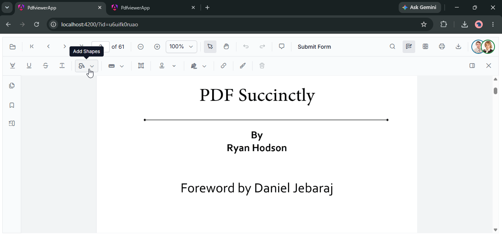

# Collaborative Editing in Syncfusion ASP.NET Core PDF Viewer

The ASP.NET Core PDF Viewer supports real-time collaborative editing through the Syncfusion Collaborator framework. The framework uses CDN-based client resources and a platform-specific Collaboration Server to synchronize PDF Viewer actions between users.



## Architecture

Collaborative editing uses the following components:

- **PDF Viewer from CDN** - Load ej2.min.js from Syncfusion CDN for client-side PDF Viewer functionality
- **PDF Viewer adapter** - A client-side JavaScript `PdfViewerAdapter` implements the collaboration provider and translates actions between the PDF Viewer and the Collaboration Server.
- **Collaboration Server** - Use `ej2-collaborator-server` for Node.js.
- **Redis** - Required by the Collaboration Server for operation storage, synchronization, and scale-out.

The Collaboration Server manages the transport, collaboration sessions, operation synchronization, and save processing. The PDF Viewer application supplies the control adapter and document routes. Do not add a separate Socket.IO Redis adapter or implement the collaboration operation queue in the PDF Viewer application.

## Collaborative features

Users can collaborate on the same PDF room and see shared changes to:

- **Annotations** - Comments, highlights, drawings, and stamps
- **Form field interactions** - Form field changes and value updates
- **Page Organizer operations** - Page reordering, page rotation, and page changes

## Prerequisites

- An ASP.NET Core web application with PDF Viewer support.
- Script(ej2.min.js) and resources.
- A Redis instance reachable from the server.
- Node.js 18 or later (for the Collaboration Server).
- A PDF Viewer adapter on the client and server. The adapter is the control-specific bridge; the common Collaborator packages provide the collaboration infrastructure.

## Client resources

Load the PDF Viewer and collaborator resources from CDN in your ASP.NET Core view:

```html
  <script src="https://cdn.syncfusion.com/ej2/35.1.37/dist/ej2.min.js" type="text/javascript"></script>
  <link href="https://cdn.syncfusion.com/ej2/35.1.37/tailwind3.css" rel="stylesheet" />
```

Create a `pdfViewerAdapter.js` file that implements the collaboration provider contract as pure JavaScript, then initialize the PDF Viewer and join the room after the document has been loaded. See the implementation guide for the adapter and initialization examples:

- [Collaborative editing with Node.js](./using-redis-cache-nodejs)

## Server packages

Choose the following Collaboration Server implementation:

| Server | Package | Transport |
| --- | --- | --- |
| Node.js | `ej2-collaborator-server` | WebSocket |

The server implementation requires Redis. Configure the Redis connection and register the PDF Viewer server adapter before starting the server.

## Collaboration flow

1. The adapter posts to `ImportFile` with the room name, PDF file name, and user name.
2. The server returns the current version and pending PDF Viewer action snapshots.
3. The client joins the room with `CollaborationClient.joinRoomAsync`.
4. The PDF Viewer `documentChanged` event sends annotation, form field, form field action, or page organizer operations to `UpdateAction`.
5. The server stores the operation and broadcasts the clean action request to the other users in the room.
6. The adapter applies remote actions through the PDF Viewer collaborative editing handler.
7. `GetPDFDocument` returns the current PDF content for the room, including the finalized document when it is available.

The Node.js sample uses the following routes under `/api/CollaborativeEditing`:

| Route | Purpose |
| --- | --- |
| `POST /ImportFile` | Loads the room state and returns pending operations. |
| `POST /UpdateAction` | Validates, stores, and broadcasts a PDF Viewer operation. |
| `GET /GetPDFDocument` | Retrieves the PDF content for a room as Base64. |

## See Also

- [Collaborative editing with Node.js](./using-redis-cache-nodejs)
- [Collaboration Client](../../../../Collaborator/collaboration-client)
- [Collaboration Server](../../../../Collaborator/collaboration-server)