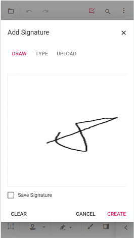

# Add Digital Signature in ASP.NET Core PDF Viewer

Learn how to **add signature fields** with the Syncfusion **ASP.NET Core PDF Viewer** and how to apply **digital (PKI) signatures** with the **.NET PDF Library**.

N> As instructed by team leads — use the **ASP.NET Core PDF Viewer only to add & place signature fields**. Use the **.NET PDF Library** to apply the *actual cryptographic digital signature*.

## Overview

A **digital signature** provides:
- **Authenticity** – confirms the signer's identity.
- **Integrity** – detects modification after signing.
- **Non‑repudiation** – signer cannot deny signing.

Syncfusion supports a hybrid workflow:
- Viewer → **[Design signature fields](../forms/manage-form-fields/create-form-fields#signature-field)**, capture Draw/Type/Upload electronic signature.
- PDF Library → **[Apply PKCS#7/CMS digital signature](https://help.syncfusion.com/document-processing/pdf/pdf-library/net/working-with-digitalsignature)** using a certificate (PFX/P12).

## Add a Signature Field (How-to)

### Using the UI
1. Open **Form Designer**.
2. Select **Signature Field**.
3. Click on the document to place the field.
4. Configure **Name**, **Tooltip**, and **Required** as needed.



### Using the API
```html
<ejs-pdfviewer id="pdfviewer"
               style="height:600px"
               documentPath="https://cdn.syncfusion.com/content/pdf/form-filling-document.pdf">
</ejs-pdfviewer>

<script>
    window.onload = function () {
        var viewer = document.getElementById('pdfviewer').ej2_instances[0];
        viewer.formDesignerModule.addFormField('SignatureField', {
            name: 'ApproverSignature',
            pageNumber: 1,
            bounds: { X: 72, Y: 640, Width: 220, Height: 48 },
            isRequired: true,
            tooltip: 'Sign here'
        });
    }
</script>
```

## Capture Electronic Signature (Draw / Type / Upload)
When the user clicks the field, a dialog appears where they can **Draw**, **Type**, or **Upload** a handwritten signature. The result is a *visual* signature only — it is not cryptographically secure. For a cryptographically secure signature, use the .NET PDF Library.

## Apply PKI Digital Signature (.NET PDF Library)

Digital signature must be applied using the **Syncfusion .NET PDF Library** in server-side code (for example, an ASP.NET Core controller or middleware).

```csharp
using Syncfusion.Pdf;
using Syncfusion.Pdf.Security;
using Syncfusion.Pdf.Interactive;

public byte[] SignPdf(byte[] pdfBytes, byte[] pfxBytes, string password)
{
    using (PdfDocument document = new PdfDocument(pdfBytes))
    {
        PdfPageBase page = document.Pages[0];

        // Create a visible signature field
        PdfSignatureField field = new PdfSignatureField(page, "ApproverSignature",
            new PdfRectangle(72, 640, 220, 48));
        document.Form.Fields.Add(field);

        // Build a CMS digital signature using SHA-256
        PdfSignature signature = new PdfSignature(document, page, pfxBytes, password)
        {
            CryptographicStandard = CryptographicStandard.CMS,
            DigestAlgorithm = DigestAlgorithm.SHA256
        };

        field.Signature = signature;
        using (MemoryStream stream = new MemoryStream())
        {
            document.Save(stream);
            document.Close(true);
            return stream.ToArray();
        }
    }
}
```

N> See the PDF Library [Digital signature](https://help.syncfusion.com/document-processing/pdf/pdf-library/net/working-with-digitalsignature) to know more about Digital Signature in PDF Documents.

## Important Notes
- **Complete all form edits before signing.** Any PDF modification after signing invalidates the signature.
- A self‑signed PFX certificate displays as **Unknown / Untrusted** until it is added to the consumer's **Trusted Certificates**.

## Best Practices
- Place signature fields with the Viewer for accurate layout.
- Apply the PKI signature with the .NET PDF Library only.
- Use **CMS** with **SHA‑256** for broad compatibility.
- Avoid flattening the form after signing.

## See Also
- [Validate Digital Signatures](./validate-digital-signatures) — verify an existing digital signature and inspect signer details.
- [Custom fonts for Signature fields](../../how-to/custom-font-signature-field) — configure custom fonts for the signature field appearance.
- [Signature workflows](./signature-workflow) — end-to-end signing and approval workflows.
