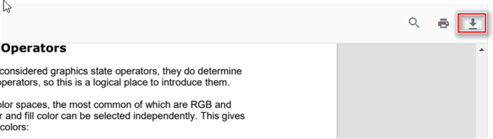

# Downloading PDF documents in PDF Viewer

The PDF Viewer component enables users to download the currently loaded PDF document. Downloads can be triggered through the user interface or programmatically via code. This feature allows end users to save documents locally for offline access or archival purposes.

By default, the download button appears in the PDF Viewer toolbar. Set the `enableDownload` property to `true` to enable the download feature, or `false` to hide the download button:




    <ejs-pdfviewer id="pdfviewer"
                   style="height:600px"
                   documentPath="https://cdn.syncfusion.com/content/pdf/pdf-succinctly.pdf"
                   enableDownload="true">
    </ejs-pdfviewer>




    <ejs-pdfviewer id="pdfviewer"
                   style="height:600px"
                   serviceUrl="/api/PdfViewer"
                   documentPath="https://cdn.syncfusion.com/content/pdf/pdf-succinctly.pdf"
                   enableDownload="true">
    </ejs-pdfviewer>




In addition to the toolbar button, the PDF Viewer provides the `download()` method to programmatically trigger document downloads. This method initiates a download of the currently displayed PDF file using the document's filename or a default name as shown below:




    <ejs-pdfviewer id="pdfviewer"
                   style="height:600px"
                   documentPath="https://cdn.syncfusion.com/content/pdf/form-designer.pdf"
                   enableDownload="true"
                   documentLoad="documentLoaded">
    </ejs-pdfviewer>




    <ejs-pdfviewer id="pdfviewer"
                   style="height:600px"
                   serviceUrl="/api/PdfViewer"
                   documentPath="https://cdn.syncfusion.com/content/pdf/form-designer.pdf"
                   enableDownload="true"
                   documentLoad="documentLoaded">
    </ejs-pdfviewer>




## Retrieving base64 data during download

The PDF Viewer component provides the [downloadEnd](https://help.syncfusion.com/cr/aspnetcore-js2/syncfusion.ej2.pdfviewer.pdfviewer.html#Syncfusion_EJ2_PdfViewer_PdfViewer_DownloadEnd) event, which fires when the download process completes. This event can be used to retrieve the downloaded document as a base64-encoded string for custom processing, server transmission, or storage purposes.

## See also

* [Toolbar items](./toolbar)
* [Feature Modules](./feature-module)