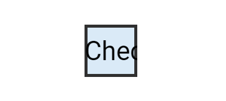
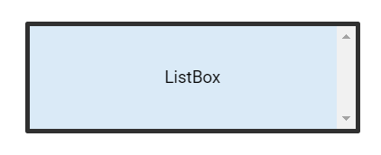

# Create form fields programmatically in ASP.NET Core PDF Viewer

The PDF Viewer component provides options to add, edit, and delete form fields. The supported form field types are:

- Textbox
- Password
- CheckBox
- RadioButton
- ListBox
- DropDown
- Signature field
- Initial field

## Add a form field to PDF document programmatically

Use the addFormField method to add form fields programmatically. Pass the form field type and the corresponding property object as parameters. The following example demonstrates adding a field on document load.




<div style="width:100%;height:600px">
    <ejs-pdfviewer id="pdfviewer"
                   style="height:600px"
                   documentPath="https://cdn.syncfusion.com/content/pdf/form-designer.pdf"
                   documentLoad="documentLoaded">
    </ejs-pdfviewer>
</div>
<script>
    function documentLoaded() {
        var pdfviewer = document.getElementById('pdfviewer').ej2_instances[0];
        pdfviewer.formDesignerModule.addFormField("Textbox",
            {
                name: "Textbox",
                bounds: { X: 146, Y: 229, Width: 150, Height: 24 }
            });
    }
</script>



<div style="width:100%;height:600px">
    <ejs-pdfviewer id="pdfviewer"
                   style="height:600px"
                   serviceUrl="/api/PdfViewer"
                   documentPath="https://cdn.syncfusion.com/content/pdf/form-designer.pdf"
                   documentLoad="documentLoaded">
    </ejs-pdfviewer>
</div>
<script>
    function documentLoaded() {
        var pdfviewer = document.getElementById('pdfviewer').ej2_instances[0];
        pdfviewer.formDesignerModule.addFormField("Textbox",
            {
                name: "Textbox",
                bounds: { X: 146, Y: 229, Width: 150, Height: 24 }
            });
    }
</script>



## Edit/Update form field programmatically

Use the updateFormField method to modify a form field programmatically. Retrieve the target field from the formFieldCollections property (by object or ID) and pass it as the first parameter. Provide the properties to update as the second parameter. The following example updates the background color of a Textbox field.




<div style="width:100%;height:600px">
    <ejs-pdfviewer id="pdfviewer"
                   style="height:600px"
                   documentPath="https://cdn.syncfusion.com/content/pdf/form-designer.pdf"
                   documentLoad="documentLoaded">
    </ejs-pdfviewer>
</div>
<script>
    function documentLoaded() {
        var pdfviewer = document.getElementById('pdfviewer').ej2_instances[0];
        pdfviewer.formDesignerModule.addFormField("Textbox",
            { name: "Textbox", bounds: { X: 146, Y: 229, Width: 150, Height: 24 } });
        pdfviewer.formDesignerModule.addFormField("Textbox",
            { name: "Textfield", bounds: { X: 300, Y: 229, Width: 150, Height: 24 } });
        pdfviewer.formDesignerModule.updateFormField(pdfviewer.formFieldCollections[0],
            { backgroundColor: 'red' });
    }
</script>




<div style="width:100%;height:600px">
    <ejs-pdfviewer id="pdfviewer"
                   style="height:600px"
                   serviceUrl="/api/PdfViewer"
                   documentPath="https://cdn.syncfusion.com/content/pdf/form-designer.pdf"
                   documentLoad="documentLoaded">
    </ejs-pdfviewer>
</div>
<script>
    function documentLoaded() {
        var pdfviewer = document.getElementById('pdfviewer').ej2_instances[0];
        pdfviewer.formDesignerModule.addFormField("Textbox",
            { name: "Textbox", bounds: { X: 146, Y: 229, Width: 150, Height: 24 } });
        pdfviewer.formDesignerModule.addFormField("Textbox",
            { name: "Textfield", bounds: { X: 300, Y: 229, Width: 150, Height: 24 } });
        pdfviewer.formDesignerModule.updateFormField(pdfviewer.formFieldCollections[0],
            { backgroundColor: 'red' });
    }
</script>




## Delete form field programmatically

Use the deleteFormField method to remove a form field programmatically. Retrieve the target field from the formFieldCollections property (by object or ID) and pass it to deleteFormField. The following example deletes the first form field.




<div style="width:100%;height:600px">
    <ejs-pdfviewer id="pdfviewer"
                   style="height:600px"
                   documentPath="https://cdn.syncfusion.com/content/pdf/form-designer.pdf"
                   documentLoad="documentLoaded">
    </ejs-pdfviewer>
</div>
<script>
    function documentLoaded() {
        var pdfviewer = document.getElementById('pdfviewer').ej2_instances[0];
        pdfviewer.formDesignerModule.addFormField("Textbox",
            { name: "Textbox", bounds: { X: 146, Y: 229, Width: 150, Height: 24 } });
        pdfviewer.formDesignerModule.addFormField("Textbox",
            { name: "Textfield", bounds: { X: 300, Y: 229, Width: 150, Height: 24 } });
        pdfviewer.formDesignerModule.deleteFormField(pdfviewer.formFieldCollections[0] });
     }
</script>




<div style="width:100%;height:600px">
    <ejs-pdfviewer id="pdfviewer"
                   style="height:600px"
                   serviceUrl="/api/PdfViewer"
                   documentPath="https://cdn.syncfusion.com/content/pdf/form-designer.pdf"
                   documentLoad="documentLoaded">
    </ejs-pdfviewer>
</div>
<script>
    function documentLoaded() {
        var pdfviewer = document.getElementById('pdfviewer').ej2_instances[0];
        pdfviewer.formDesignerModule.addFormField("Textbox",
            { name: "Textbox", bounds: { X: 146, Y: 229, Width: 150, Height: 24 } });
        pdfviewer.formDesignerModule.addFormField("Textbox",
            { name: "Textfield", bounds: { X: 300, Y: 229, Width: 150, Height: 24 } });
        pdfviewer.formDesignerModule.deleteFormField(pdfviewer.formFieldCollections[0] });
     }
</script>




## Save form fields

Selecting the Download icon on the toolbar saves the form fields in the exported PDF without modifying the original document. See the following GIF for reference.


You can invoke the download action using the following code snippet.



<div style="width:100%;height:600px">
    <ejs-pdfviewer id="pdfviewer"
                   style="height:600px"
                   documentPath="https://cdn.syncfusion.com/content/pdf/form-designer.pdf"
                   enableDownload="true"
                   documentLoad="documentLoaded">
    </ejs-pdfviewer>
</div>
<script>
    function documentLoaded() {
        var pdfViewer = document.getElementById('pdfviewer').ej2_instances[0];
        pdfViewer.download();
    }
</script>



<div style="width:100%;height:600px">
    <ejs-pdfviewer id="pdfviewer"
                   style="height:600px"
                   serviceUrl="/api/PdfViewer"
                   documentPath="https://cdn.syncfusion.com/content/pdf/form-designer.pdf"
                   enableDownload="true"
                   documentLoad="documentLoaded">
    </ejs-pdfviewer>
</div>
<script>
    function documentLoaded() {
        var pdfViewer = document.getElementById('pdfviewer').ej2_instances[0];
        pdfViewer.download();
    }
</script>




## Print form fields

Selecting the Print icon on the toolbar prints the PDF with the added form fields. This action does not modify the original document. See the following GIF for reference.


You can invoke the print action using the following code snippet:




<div style="width:100%;height:600px">
    <ejs-pdfviewer id="pdfviewer"
                   style="height:600px"
                   documentPath="https://cdn.syncfusion.com/content/pdf/form-designer.pdf"
                   enablePrint="true"
                   documentLoad="print">
    </ejs-pdfviewer>
</div>
<script>
    function print() {
        var pdfViewer = document.getElementById('pdfviewer').ej2_instances[0];
        pdfViewer.print.print();
    }
</script>




<div style="width:100%;height:600px">
    <ejs-pdfviewer id="pdfviewer"
                   style="height:600px"
                   serviceUrl="/api/PdfViewer"
                   documentPath="https://cdn.syncfusion.com/content/pdf/form-designer.pdf"
                   enablePrint="true"
                   documentLoad="print">
    </ejs-pdfviewer>
</div>
<script>
    function print() {
        var pdfViewer = document.getElementById('pdfviewer').ej2_instances[0];
        pdfViewer.print.print();
    }
</script>




## Open an existing PDF document

Open a PDF that already contains form fields by clicking the Open icon on the toolbar. See the following GIF for reference.


## Validate form fields

Form fields are validated when `enableFormFieldsValidation` is set to true and the validateFormFields event is handled. The event triggers during download or print if required fields are not filled. The non-filled fields are available in the `nonFillableFields` property of the event arguments.

Add the following code to validate form fields:




<div style="width:100%;height:600px">
    <ejs-pdfviewer id="pdfviewer"
                   style="height:600px"
                   documentPath="https://cdn.syncfusion.com/content/pdf/form-designer.pdf"
                   EnableFormFieldsValidation=true
                   ValidateFormFields="validateFormFields">
    </ejs-pdfviewer>
</div>
<script>
    function validateFormFields(args) {
        var nonfilledFormFields = args.nonFillableFields;
    }
</script>




<div style="width:100%;height:600px">
    <ejs-pdfviewer id="pdfviewer"
                   style="height:600px"
                   serviceUrl="/api/PdfViewer"
                   documentPath="https://cdn.syncfusion.com/content/pdf/form-designer.pdf"
                   EnableFormFieldsValidation=true
                   ValidateFormFields="validateFormFields">
    </ejs-pdfviewer>
</div>
<script>
    function validateFormFields(args) {
        var nonfilledFormFields = args.nonFillableFields;
    }
</script>




## Export and import form fields

The PDF Viewer component supports exporting and importing form field data using the `importFormFields`, `exportFormFields`, and `exportFormFieldsAsObject` methods in the following formats:

- FDF
- XFDF
- JSON

### Export and import as FDF

Using the `exportFormFields` method, the form field data can be exported in the specified data format. This method accepts two parameters:

- The first parameter is the destination path for the exported data. If the path is not specified, a location is requested during export.
- The second parameter specifies the format type for the form data.

The following code exports and imports form field data as FDF.

```html

<button id="exportFdf" onclick="exportFdf()">Export FDF</button>
<button id="importFdf" onclick="importFdf()">Import FDF</button>

<div style="width:100%;height:600px">
    <ejs-pdfviewer id="pdfviewer"
                   style="height:600px"
                   serviceUrl="/api/PdfViewer"
                   documentPath="https://cdn.syncfusion.com/content/pdf/form-designer.pdf">
    </ejs-pdfviewer>
</div>

<script>
    // Event triggers on Export FDF button click.
    function exportFdf() {
        var viewer = document.getElementById('pdfviewer').ej2_instances[0];
        // Data must be the desired path for the exported document.
        viewer.exportFormFields('Data', FormFieldDataFormat.Fdf);
    }

    // Event triggers on Import FDF button click.
    function importFdf() {
        var viewer = document.getElementById('pdfviewer').ej2_instances[0];
        // The file for importing the form fields should be placed in the desired location, and the path should be provided correctly.
        viewer.importFormFields('File', FormFieldDataFormat.Fdf);
    }
</script>

```

### Export and import as XFDF

The following code exports and imports form field data as XFDF.

```html

<button id="exportXfdf" onclick="exportXfdf()">Export XFDF</button>
<button id="importXfdf" onclick="importXfdf()">Import XFDF</button>

<div style="width:100%;height:600px">
    <ejs-pdfviewer id="pdfviewer"
                   style="height:600px"
                   serviceUrl="/api/PdfViewer"
                   documentPath="https://cdn.syncfusion.com/content/pdf/form-designer.pdf">
    </ejs-pdfviewer>
</div>

<script>
    // Event triggers on Export XFDF button click.
    function exportXfdf() {
        var viewer = document.getElementById('pdfviewer').ej2_instances[0];
        // Data must be the desired path for the exported document.
        viewer.exportFormFields('Data', FormFieldDataFormat.Xfdf);
    }

    // Event triggers on Import XFDF button click.
    function importXfdf() {
        var viewer = document.getElementById('pdfviewer').ej2_instances[0];
        // The file for importing the form fields should be placed in the desired location, and the path should be provided correctly.
        viewer.importFormFields('File', FormFieldDataFormat.Xfdf);
    }
</script>

```

### Export and import as JSON

The following code exports and imports form field data as JSON.

```html

<button id="exportJson" onclick="exportJson()">Export JSON</button>
<button id="importJson" onclick="importJson()">Import JSON</button>

<div style="width:100%;height:600px">
    <ejs-pdfviewer id="pdfviewer"
                   style="height:600px"
                   serviceUrl="/api/PdfViewer"
                   documentPath="https://cdn.syncfusion.com/content/pdf/form-designer.pdf">
    </ejs-pdfviewer>
</div>

<script>
    // Event triggers on Export JSON button click.
    function exportJson() {
        var viewer = document.getElementById('pdfviewer').ej2_instances[0];
        // Data must be the desired path for the exported document.
        viewer.exportFormFields('Data', FormFieldDataFormat.Json);
    }

    // Event triggers on Import JSON button click.
    function importJson() {
        var viewer = document.getElementById('pdfviewer').ej2_instances[0];
        // The file for importing the form fields should be placed in the desired location, and the path should be provided correctly.
        viewer.importFormFields('File', FormFieldDataFormat.Json);
    }
</script>

```

### Export and import as Object

The PDF Viewer component supports exporting the form field data as an object and importing that data back into the current PDF document.

The following example shows how to export the form field data as an object and import the form field data from that object into the current PDF document via a button click.

```html

<button id="exportDataAsObject" onclick="exportDataAsObject()">Export Object</button>
<button id="importData" onclick="importData()">Import Data</button>

<div style="width:100%;height:600px">
    <ejs-pdfviewer id="pdfviewer"
                   style="height:600px"
                   serviceUrl="/api/PdfViewer"
                   documentPath="https://cdn.syncfusion.com/content/pdf/form-designer.pdf">
    </ejs-pdfviewer>
</div>

<script>
    var exportedData;

    // Event triggers on Export Object button click.
    function exportDataAsObject() {
        var viewer = document.getElementById('pdfviewer').ej2_instances[0];

        // Export the form field data to an FDF object.
        viewer.exportFormFieldsAsObject(FormFieldDataFormat.Fdf).then(value => {
            exportedData = value;
        })

        //// Export the form field data to an XFDF object.
        //viewer.exportFormFieldsAsObject(FormFieldDataFormat.Xfdf).then(value => {
        //    exportedData = value;
        //})

        //// Export the form field data to an JSON object.
        //viewer.exportFormFieldsAsObject(FormFieldDataFormat.Json).then(value => {
        //    exportedData = value;
        //})
    }

    // Event triggers on Import Data button click.
    function importData() {
        var viewer = document.getElementById('pdfviewer').ej2_instances[0];

        // Import the form field data from the FDF object into the current PDF document.
        viewer.importFormFields(exportedData, FormFieldDataFormat.Fdf);

        //// Import the form field data from the XFDF object into the current PDF document.
        //viewer.importFormFields (exportedData, FormFieldDataFormat.Xfdf);

        //// Import the form field data from the FDF object into the current PDF document.
        //viewer.importFormFields (exportedData, FormFieldDataFormat.Json);
    }
</script>

```

## Form field properties

Form field properties allow customization and interaction with fields embedded in PDF documents. The following sections outline the supported field types and their configurable settings.

- Textbox
- Password
- CheckBox
- RadioButton
- ListBox
- DropDown
- Signature field
- Initial field

### Signature and initial fields settings

Use the `updateFormField` method to modify form fields programmatically.

The following code example explains how to update the signature field properties on a button click.




<button id="updateProperties" onclick="updateProperties()">Update Properties</button>

<div style="width:100%;height:600px">
    <ejs-pdfviewer id="pdfviewer"
                   style="height:600px"
                   documentPath="https://cdn.syncfusion.com/content/pdf/pdf-succinctly.pdf">
    </ejs-pdfviewer>
</div>

<script>

    // Event triggers on Update Properties button click.
    function updateProperties() {
        var viewer = document.getElementById('pdfviewer').ej2_instances[0];
        var formField = viewer.retrieveFormFields();
        viewer.formDesignerModule.updateFormField(formField[0], {
            name: 'Signature',
            isReadOnly: true,
            visibility: 'visible',
            isRequired: false,
            isPrint: true,
            tooltip: 'Signature',
            thickness: 4
        });
    }
</script>




<button id="updateProperties" onclick="updateProperties()">Update Properties</button>

<div style="width:100%;height:600px">
    <ejs-pdfviewer id="pdfviewer"
                   style="height:600px"
                   serviceUrl="/api/PdfViewer"
                   documentPath="https://cdn.syncfusion.com/content/pdf/pdf-succinctly.pdf">
    </ejs-pdfviewer>
</div>

<script>

    // Event triggers on Update Properties button click.
    function updateProperties() {
        var viewer = document.getElementById('pdfviewer').ej2_instances[0];
        var formField = viewer.retrieveFormFields();
        viewer.formDesignerModule.updateFormField(formField[0], {
            name: 'Signature',
            isReadOnly: true,
            visibility: 'visible',
            isRequired: false,
            isPrint: true,
            tooltip: 'Signature',
            thickness: 4
        });
    }
</script>




The following code shows how to configure default properties for a signature field added from the Form Designer toolbar.




<div style="width:100%;height:600px">
    <ejs-pdfviewer id="pdfviewer"
                   style="height:600px"
                   serviceUrl="/api/PdfViewer"
                   documentPath="https://cdn.syncfusion.com/content/pdf/pdf-succinctly.pdf"
                   documentLoad="onload"
                   >
    </ejs-pdfviewer>
</div>

<script type="text/javascript">

    window.onload = function () {
        var viewer = document.getElementById('pdfviewer').ej2_instances[0];
        viewer.signatureFieldSettings = {
            // Set the name of the form field element.
            name: 'Signature',
            // Specify whether the signature field is in read-only or read-write mode.
            isReadOnly: false,
            // Set the visibility of the form field.
            visibility: 'visible',
            // Specify whether the field is mandatory or not.
            isRequired: false,
            // Specify whether to print the signature field.
            isPrint: true,
            // Set the text to be displayed as a tooltip.
            tooltip: 'Signature',
            // Set the thickness of the signature field. To hide the borders, set the value to 0 (zero).
            thickness: 4,
            // Specify the properties of the signature indicator in the signature field.
            signatureIndicatorSettings: {
                opacity: 1,
                backgroundColor: '#daeaf7ff',
                height: 50,
                fontSize: 15,
                text: 'Signature Field',
                color: 'white'
            }
        }
    }

</script>




<div style="width:100%;height:600px">
    <ejs-pdfviewer id="pdfviewer"
                   style="height:600px"
                   serviceUrl="/api/PdfViewer"
                   documentPath="https://cdn.syncfusion.com/content/pdf/pdf-succinctly.pdf"
                   documentLoad="onload"
                   >
    </ejs-pdfviewer>
</div>
<script type="text/javascript">

    window.onload = function () {
        var viewer = document.getElementById('pdfviewer').ej2_instances[0];
        viewer.signatureFieldSettings = {
            // Set the name of the form field element.
            name: 'Signature',
            // Specify whether the signature field is in read-only or read-write mode.
            isReadOnly: false,
            // Set the visibility of the form field.
            visibility: 'visible',
            // Specify whether the field is mandatory or not.
            isRequired: false,
            // Specify whether to print the signature field.
            isPrint: true,
            // Set the text to be displayed as a tooltip.
            tooltip: 'Signature',
            // Set the thickness of the signature field. To hide the borders, set the value to 0 (zero).
            thickness: 4,
            // Specify the properties of the signature indicator in the signature field.
            signatureIndicatorSettings: {
                opacity: 1,
                backgroundColor: '#daeaf7ff',
                height: 50,
                fontSize: 15,
                text: 'Signature Field',
                color: 'white'
            }
        }
    }

</script>





The following code shows how to configure default properties for an initial field added from the Form Designer toolbar.

<script type="text/javascript">

window.load = function () {
    var viewer = document.getElementById('viewer').ej2_instances[0];
    viewer.initialFieldSettings  = {
        // Set the name of the form field element.
        name: 'Initial',
        // Specify whether the initial field is in read-only or read-write mode.
        isReadOnly: false,
        // Set the visibility of the form field.
        visibility: 'visible',
        // Specify whether the field is mandatory or not.
        isRequired: false,
        // Specify whether to print the initial field.
        isPrint: true,
        // Set the text to be displayed as tooltip.
        tooltip: 'Initial',
        // Set the thickness of the initial field. To hide the borders, set the value to 0 (zero).
        thickness: 4,
        // Specify the properties of the initial indicator in the initial field.
        initialIndicatorSettings: {
        opacity: 1,
        backgroundColor: '#daeaf7ff',
        height: 50,
        fontSize: 15,
        text: 'Initial Field',
        color: 'white'
        },
    }
}

</script>


### Textbox field settings

Use the `updateFormField` method to modify form fields programmatically.

The following example updates Textbox field properties on a button click.




<button id="updateProperties" onclick="updateProperties()">Update Properties</button>

<div style="width:100%;height:600px">
    <ejs-pdfviewer id="pdfviewer"
                   style="height:600px"
                   documentPath="https://cdn.syncfusion.com/content/pdf/pdf-succinctly.pdf">
    </ejs-pdfviewer>
</div>

<script>

    // Event triggers on Update Properties button click.
    function updateProperties() {
        var viewer = document.getElementById('pdfviewer').ej2_instances[0];
        var formField = viewer.retrieveFormFields();
        viewer.formDesignerModule.updateFormField(formField[0], {
            name: 'Textbox',
            isReadOnly: false,
            visibility: 'visible',
            isRequired: false,
            isPrint: true,
            tooltip: 'Textbox',
            thickness: 4,
            value:'Textbox',
            fontFamily: 'Courier',
            fontSize: 10,
            fontStyle: 'None',
            color: 'black',
            borderColor: 'black',
            backgroundColor: '#daeaf7ff',
            alignment: 'Left',
            maxLength: 0,
            isMultiline: false,
            bounds: { X: 146, Y: 229, Width: 150, Height: 24 }
        });
    }
</script>




<button id="updateProperties" onclick="updateProperties()">Update Properties</button>

<div style="width:100%;height:600px">
    <ejs-pdfviewer id="pdfviewer"
                   style="height:600px"
                   documentPath="https://cdn.syncfusion.com/content/pdf/pdf-succinctly.pdf">
    </ejs-pdfviewer>
</div>

<script>

    // Event triggers on Update Properties button click.
    function updateProperties() {
        var viewer = document.getElementById('pdfviewer').ej2_instances[0];
        var formField = viewer.retrieveFormFields();
        viewer.formDesignerModule.updateFormField(formField[0], {
            name: 'Textbox',
            isReadOnly: false,
            visibility: 'visible',
            isRequired: false,
            isPrint: true,
            tooltip: 'Textbox',
            thickness: 4,
            value:'Textbox',
            fontFamily: 'Courier',
            fontSize: 10,
            fontStyle: 'None',
            color: 'black',
            borderColor: 'black',
            backgroundColor: '#daeaf7ff',
            alignment: 'Left',
            maxLength: 0,
            isMultiline: false,
            bounds: { X: 146, Y: 229, Width: 150, Height: 24 }
        });
    }
</script>




The following code shows how to configure default properties for a Textbox field added from the Form Designer toolbar.




<div style="width:100%;height:600px">
    <ejs-pdfviewer id="pdfviewer"
                   style="height:600px"
                   documentPath="https://cdn.syncfusion.com/content/pdf/pdf-succinctly.pdf"
                   documentLoad="onload">
    </ejs-pdfviewer>
</div>

<script type="text/javascript">

    window.onload = function () {
        var viewer = document.getElementById('pdfviewer').ej2_instances[0];
        viewer.textFieldSettings = {
            // Set the name of the form field element.
            name: 'Textbox',
            // Specify whether the Textbox field is in read-only or read-write mode.
            isReadOnly: false,
            // Set the visibility of the form field.
            visibility: 'visible',
            // Specify whether the field is mandatory or not.
            isRequired: false,
            // Specify whether to print the Textbox field.
            isPrint: true,
            // Set the text to be displayed as a tooltip.
            tooltip: 'Textbox',
            // Set the thickness of the Textbox field. To hide the borders, set the value to 0 (zero).
            thickness: 4,
            // Set the value of the form field element.
            value:'Textbox',
            // Set the font family of the textbox field.
            fontFamily: 'Courier',
            // Set the font size of the textbox field.
            fontSize: 10,
            // Specify the font style
            fontStyle: 'None',
            // Set the font color of the textbox field.
            color: 'black',
            // Set the border color of the textbox field.
            borderColor: 'black',
            // Set the background color of the textbox field.
            backgroundColor: '#daeaf7ff',
            // Set the alignment of the text.
            alignment: 'Left',
            // Set the maximum character length.
            maxLength: 0,
            // Allows multiline input in the text field. FALSE, by default.
            isMultiline: false
        }
    }

</script>




<div style="width:100%;height:600px">
    <ejs-pdfviewer id="pdfviewer"
                   style="height:600px"
                   serviceUrl="/api/PdfViewer"
                   documentPath="https://cdn.syncfusion.com/content/pdf/pdf-succinctly.pdf"
                   documentLoad="onload">
    </ejs-pdfviewer>
</div>

<script type="text/javascript">

    window.onload = function () {
        var viewer = document.getElementById('pdfviewer').ej2_instances[0];
        viewer.textFieldSettings = {
            // Set the name of the form field element.
            name: 'Textbox',
            // Specify whether the Textbox field is in read-only or read-write mode.
            isReadOnly: false,
            // Set the visibility of the form field.
            visibility: 'visible',
            // Specify whether the field is mandatory or not.
            isRequired: false,
            // Specify whether to print the Textbox field.
            isPrint: true,
            // Set the text to be displayed as a tooltip.
            tooltip: 'Textbox',
            // Set the thickness of the Textbox field. To hide the borders, set the value to 0 (zero).
            thickness: 4,
            // Set the value of the form field element.
            value:'Textbox',
            // Set the font family of the textbox field.
            fontFamily: 'Courier',
            // Set the font size of the textbox field.
            fontSize: 10,
            // Specify the font style
            fontStyle: 'None',
            // Set the font color of the textbox field.
            color: 'black',
            // Set the border color of the textbox field.
            borderColor: 'black',
            // Set the background color of the textbox field.
            backgroundColor: '#daeaf7ff',
            // Set the alignment of the text.
            alignment: 'Left',
            // Set the maximum character length.
            maxLength: 0,
            // Allows multiline input in the text field. FALSE, by default.
            isMultiline: false
        }
    }

</script>





### Password field settings

Use the `updateFormField` method to modify form fields programmatically.

The following example updates Password field properties on a button click.




<button id="updateProperties" onclick="updateProperties()">Update Properties</button>

<div style="width:100%;height:600px">
    <ejs-pdfviewer id="pdfviewer"
                   style="height:600px"
                   documentPath="https://cdn.syncfusion.com/content/pdf/pdf-succinctly.pdf">
    </ejs-pdfviewer>
</div>

<script>

    // Event triggers on Update Properties button click.
    function updateProperties() {
        var viewer = document.getElementById('pdfviewer').ej2_instances[0];
        var formField = viewer.retrieveFormFields();
        viewer.formDesignerModule.updateFormField(formField[0], {
            name: 'Password',
            isReadOnly: false,
            visibility: 'visible',
            isRequired: false,
            isPrint: true,
            tooltip: 'Password',
            thickness: 4,
            value:'Password',
            fontFamily: 'Courier',
            fontSize: 10,
            fontStyle: 'None',
            color: 'black',
            borderColor: 'black',
            backgroundColor:'#daeaf7ff',
            alignment: 'Left',
            maxLength: 0,
            bounds: { X: 148, Y: 229, Width: 150, Height: 24 }
        });
    }
</script>




<button id="updateProperties" onclick="updateProperties()">Update Properties</button>

<div style="width:100%;height:600px">
    <ejs-pdfviewer id="pdfviewer"
                   style="height:600px"
                   serviceUrl="/api/PdfViewer"
                   documentPath="https://cdn.syncfusion.com/content/pdf/pdf-succinctly.pdf">
    </ejs-pdfviewer>
</div>

<script>

    // Event triggers on Update Properties button click.
    function updateProperties() {
        var viewer = document.getElementById('pdfviewer').ej2_instances[0];
        var formField = viewer.retrieveFormFields();
        viewer.formDesignerModule.updateFormField(formField[0], {
            name: 'Password',
            isReadOnly: false,
            visibility: 'visible',
            isRequired: false,
            isPrint: true,
            tooltip: 'Password',
            thickness: 4,
            value:'Password',
            fontFamily: 'Courier',
            fontSize: 10,
            fontStyle: 'None',
            color: 'black',
            borderColor: 'black',
            backgroundColor:'#daeaf7ff',
            alignment: 'Left',
            maxLength: 0,
            bounds: { X: 148, Y: 229, Width: 150, Height: 24 }
        });
    }
</script>




The following code shows how to configure default properties for a Password field added from the Form Designer toolbar.




<div style="width:100%;height:600px">
    <ejs-pdfviewer id="pdfviewer"
                   style="height:600px"
                   documentPath="https://cdn.syncfusion.com/content/pdf/pdf-succinctly.pdf"
                   documentLoad="onload">
    </ejs-pdfviewer>
</div>

<script type="text/javascript">

    window.onload = function () {
        var viewer = document.getElementById('pdfviewer').ej2_instances[0];
            viewer.passwordFieldSettings = {
            // Set the name of the form field element.
            name: 'Password',
            // Specify whether the Password field is in read-only or read-write mode.
            isReadOnly: false,
            // Set the visibility of the form field.
            visibility: 'visible',
            // Specify whether the field is mandatory or not.
            isRequired: false,
            // Specify whether to print the Password field.
            isPrint: true,
            // Set the text to be displayed as a tooltip.
            tooltip: 'Password',
            // Set the thickness of the Password field. To hide the borders, set the value to 0 (zero).
            thickness: 4,
            // Set the value of the form field element.
            value:'Password',
            // Set the font family of the Password field.
            fontFamily: 'Courier',
            // Set the font size of the Password field.
            fontSize: 10,
            // Specify the font style
            fontStyle: 'None',
            // Set the font color of the Password field.
            color: 'black',
            // Set the border color of the Password field.
            borderColor: 'black',
            // Set the background color of the Password field.
            backgroundColor: '#daeaf7ff',
            // Set the alignment of the text.
            alignment: 'Left',
            // Set the maximum character length.
            maxLength: 0,
        }
    }

</script>




<div style="width:100%;height:600px">
    <ejs-pdfviewer id="pdfviewer"
                   style="height:600px"
                   serviceUrl="/api/PdfViewer"
                   documentPath="https://cdn.syncfusion.com/content/pdf/pdf-succinctly.pdf"
                   documentLoad="onload">
    </ejs-pdfviewer>
</div>

<script type="text/javascript">

    window.onload = function () {
        var viewer = document.getElementById('pdfviewer').ej2_instances[0];
            viewer.passwordFieldSettings = {
            // Set the name of the form field element.
            name: 'Password',
            // Specify whether the Password field is in read-only or read-write mode.
            isReadOnly: false,
            // Set the visibility of the form field.
            visibility: 'visible',
            // Specify whether the field is mandatory or not.
            isRequired: false,
            // Specify whether to print the Password field.
            isPrint: true,
            // Set the text to be displayed as a tooltip.
            tooltip: 'Password',
            // Set the thickness of the Password field. To hide the borders, set the value to 0 (zero).
            thickness: 4,
            // Set the value of the form field element.
            value:'Password',
            // Set the font family of the Password field.
            fontFamily: 'Courier',
            // Set the font size of the Password field.
            fontSize: 10,
            // Specify the font style
            fontStyle: 'None',
            // Set the font color of the Password field.
            color: 'black',
            // Set the border color of the Password field.
            borderColor: 'black',
            // Set the background color of the Password field.
            backgroundColor: '#daeaf7ff',
            // Set the alignment of the text.
            alignment: 'Left',
            // Set the maximum character length.
            maxLength: 0,
        }
    }

</script>





### CheckBox field settings

Use the `updateFormField` method to modify form fields programmatically.

The following example updates CheckBox field properties on a button click.




<button id="updateProperties" onclick="updateProperties()">Update Properties</button>

<div style="width:100%;height:600px">
    <ejs-pdfviewer id="pdfviewer"
                   style="height:600px"
                   documentPath="https://cdn.syncfusion.com/content/pdf/pdf-succinctly.pdf">
    </ejs-pdfviewer>
</div>

<script>
    // Event triggers on Update Properties button click.
    function updateProperties() {
        var viewer = document.getElementById('pdfviewer').ej2_instances[0];
        var formField = viewer.retrieveFormFields();
        viewer.formDesignerModule.updateFormField(formField[0], {
            name: 'CheckBox',
            isReadOnly: true,
            visibility: 'visible',
            isRequired: false,
            isPrint: true,
            tooltip: 'CheckBox',
            thickness: 4,
            isChecked: true,
            backgroundColor: '#daeaf7ff',
            borderColor: 'black',
            value: 'CheckBox'
        });
    }
</script>




<button id="updateProperties" onclick="updateProperties()">Update Properties</button>

<div style="width:100%;height:600px">
    <ejs-pdfviewer id="pdfviewer"
                   style="height:600px"
                   serviceUrl="/api/PdfViewer"
                   documentPath="https://cdn.syncfusion.com/content/pdf/pdf-succinctly.pdf">
    </ejs-pdfviewer>
</div>

<script>
    // Event triggers on Update Properties button click.
    function updateProperties() {
        var viewer = document.getElementById('pdfviewer').ej2_instances[0];
        var formField = viewer.retrieveFormFields();
        viewer.formDesignerModule.updateFormField(formField[0], {
            name: 'CheckBox',
            isReadOnly: true,
            visibility: 'visible',
            isRequired: false,
            isPrint: true,
            tooltip: 'CheckBox',
            thickness: 4,
            isChecked: true,
            backgroundColor: '#daeaf7ff',
            borderColor: 'black',
            value: 'CheckBox'
        });
    }
</script>




The following code shows how to configure default properties for a CheckBox field added from the Form Designer toolbar.




<div style="width:100%;height:600px">
    <ejs-pdfviewer id="pdfviewer"
                   style="height:600px"
                   documentPath="https://cdn.syncfusion.com/content/pdf/pdf-succinctly.pdf"
                   documentLoad="onload">
    </ejs-pdfviewer>
</div>

<script type="text/javascript">

    window.onload = function () {
        var viewer = document.getElementById('pdfviewer').ej2_instances[0];
        viewer.checkBoxFieldSettings = {
            // Set the name of the form field element.
            name: 'CheckBox',
            // Specify whether the CheckBox field is in read-only or read-write mode.
            isReadOnly: false,
            // Set the visibility of the form field.
            visibility: 'visible',
            // Specify whether the field is mandatory or not.
            isRequired: false,
            // Specify whether to print the CheckBox field.
            isPrint: true,
            // Set the text to be displayed as a tooltip.
            tooltip: 'CheckBox',
            // Set the thickness of the CheckBox field. To hide the borders, set the value to 0 (zero).
            thickness: 4,
            // Specifies whether the check box is in checked state or not.
            isChecked: true,
            // Set the background color of the check box in hexadecimal string format.
            backgroundColor: '#daeaf7ff',
            // Set the border color of the check box field.
            borderColor: 'black'
            // Set the value of the form field element.
            value: 'CheckBox'
        }
    }

</script>




<div style="width:100%;height:600px">
    <ejs-pdfviewer id="pdfviewer"
                   style="height:600px"
                   serviceUrl="/api/PdfViewer"
                   documentPath="https://cdn.syncfusion.com/content/pdf/pdf-succinctly.pdf"
                   documentLoad="onload">
    </ejs-pdfviewer>
</div>

<script type="text/javascript">

    window.onload = function () {
        var viewer = document.getElementById('pdfviewer').ej2_instances[0];
        viewer.checkBoxFieldSettings = {
            // Set the name of the form field element.
            name: 'CheckBox',
            // Specify whether the CheckBox field is in read-only or read-write mode.
            isReadOnly: false,
            // Set the visibility of the form field.
            visibility: 'visible',
            // Specify whether the field is mandatory or not.
            isRequired: false,
            // Specify whether to print the CheckBox field.
            isPrint: true,
            // Set the text to be displayed as a tooltip.
            tooltip: 'CheckBox',
            // Set the thickness of the CheckBox field. To hide the borders, set the value to 0 (zero).
            thickness: 4,
            // Specifies whether the check box is in checked state or not.
            isChecked: true,
            // Set the background color of the check box in hexadecimal string format.
            backgroundColor: '#daeaf7ff',
            // Set the border color of the check box field.
            borderColor: 'black'
            // Set the value of the form field element.
            value: 'CheckBox'
        }
    }

</script>






### RadioButton field settings

Use the `updateFormField` method to modify form fields programmatically.

The following example updates RadioButton field properties on a button click.




<button id="updateProperties" onclick="updateProperties()">Update Properties</button>

<div style="width:100%;height:600px">
    <ejs-pdfviewer id="pdfviewer"
                   style="height:600px"
                   documentPath="https://cdn.syncfusion.com/content/pdf/pdf-succinctly.pdf">
    </ejs-pdfviewer>
</div>

<script>
    // Event triggers on Update Properties button click.
    function updateProperties() {
        var viewer = document.getElementById('pdfviewer').ej2_instances[0];
        var formField = viewer.retrieveFormFields();
        viewer.formDesignerModule.updateFormField(formField[0], {
            name: 'RadioButton',
            isReadOnly: false,
            visibility: 'visible',
            isRequired: false,
            isPrint: true,
            tooltip: 'RadioButton',
            thickness: 4,
            isSelected: true,
            backgroundColor: '#daeaf7ff',
            borderColor: 'black',
            value: 'RadioButton'
        });
    }
</script>




<button id="updateProperties" onclick="updateProperties()">Update Properties</button>

<div style="width:100%;height:600px">
    <ejs-pdfviewer id="pdfviewer"
                   style="height:600px"
                   serviceUrl="/api/PdfViewer"
                   documentPath="https://cdn.syncfusion.com/content/pdf/pdf-succinctly.pdf">
    </ejs-pdfviewer>
</div>

<script>
    // Event triggers on Update Properties button click.
    function updateProperties() {
        var viewer = document.getElementById('pdfviewer').ej2_instances[0];
        var formField = viewer.retrieveFormFields();
        viewer.formDesignerModule.updateFormField(formField[0], {
            name: 'RadioButton',
            isReadOnly: false,
            visibility: 'visible',
            isRequired: false,
            isPrint: true,
            tooltip: 'RadioButton',
            thickness: 4,
            isSelected: true,
            backgroundColor: '#daeaf7ff',
            borderColor: 'black',
            value: 'RadioButton'
        });
    }
</script>




The following code shows how to configure default properties for a RadioButton field added from the Form Designer toolbar.




<div style="width:100%;height:600px">
    <ejs-pdfviewer id="pdfviewer"
                   style="height:600px"
                   documentPath="https://cdn.syncfusion.com/content/pdf/pdf-succinctly.pdf"
                   documentLoad="onload">
    </ejs-pdfviewer>
</div>

<script type="text/javascript">

    window.onload = function () {
        var viewer = document.getElementById('pdfviewer').ej2_instances[0];
        viewer.radioButtonFieldSettings = {
            // Set the name of the form field element.
            name: 'RadioButton',
            // Specify whether the RadioButton field is in read-only or read-write mode.
            isReadOnly: false,
            // Set the visibility of the form field.
            visibility: 'visible',
            // Specify whether the field is mandatory or not.
            isRequired: false,
            // Specify whether to print the RadioButton field.
            isPrint: true,
            // Set the text to be displayed as a tooltip.
            tooltip: 'RadioButton',
            // Set the thickness of the RadioButton field. To hide the borders, set the value to 0 (zero).
            thickness: 4,
            // Specifies whether the radio button is in checked state or not.
            isSelected: true,
            // Set the background color of the radio button in hexadecimal string format.
            backgroundColor: '#daeaf7ff',
            // Set the border color of the radio button field.
            borderColor: 'black'
            // Set the value of the form field element.
            value: 'RadioButton'
        }
    }

</script>




<div style="width:100%;height:600px">
    <ejs-pdfviewer id="pdfviewer"
                   style="height:600px"
                   serviceUrl="/api/PdfViewer"
                   documentPath="https://cdn.syncfusion.com/content/pdf/pdf-succinctly.pdf"
                   documentLoad="onload">
    </ejs-pdfviewer>
</div>

<script type="text/javascript">

    window.onload = function () {
        var viewer = document.getElementById('pdfviewer').ej2_instances[0];
        viewer.radioButtonFieldSettings = {
            // Set the name of the form field element.
            name: 'RadioButton',
            // Specify whether the RadioButton field is in read-only or read-write mode.
            isReadOnly: false,
            // Set the visibility of the form field.
            visibility: 'visible',
            // Specify whether the field is mandatory or not.
            isRequired: false,
            // Specify whether to print the RadioButton field.
            isPrint: true,
            // Set the text to be displayed as a tooltip.
            tooltip: 'RadioButton',
            // Set the thickness of the RadioButton field. To hide the borders, set the value to 0 (zero).
            thickness: 4,
            // Specifies whether the radio button is in checked state or not.
            isSelected: true,
            // Set the background color of the radio button in hexadecimal string format.
            backgroundColor: '#daeaf7ff',
            // Set the border color of the radio button field.
            borderColor: 'black'
            // Set the value of the form field element.
            value: 'RadioButton'
        }
    }

</script>





### ListBox field settings

Use the `updateFormField` method to modify form fields programmatically.

The following example updates ListBox field properties on a button click.




<button id="updateProperties" onclick="updateProperties()">Update Properties</button>

<div style="width:100%;height:600px">
    <ejs-pdfviewer id="pdfviewer"
                   style="height:600px"
                   documentPath="https://cdn.syncfusion.com/content/pdf/pdf-succinctly.pdf">
    </ejs-pdfviewer>
</div>

<script>
    // Event triggers on Update Properties button click.
    function updateProperties() {
        var viewer = document.getElementById('pdfviewer').ej2_instances[0];
        var formField = viewer.retrieveFormFields();
        var customOptions = [
            { itemName: 'item1', itemValue: 'item1' },
            { itemName: 'item2', itemValue: 'item2' },
            { itemName: 'item3', itemValue: 'item3' }
        ];
        var formField = viewer.retrieveFormFields();
        viewer.formDesignerModule.updateFormField(formField[0], {
 name: 'ListBox',
            isReadOnly: false,
            visibility: 'visible',
            isRequired: false,
            isPrint: true,
            tooltip: 'ListBox',
            thickness: 4,
            fontFamily: 'Courier',
            fontSize: 10,
            fontStyle: 'None',
            color: 'black',
            borderColor: 'black',
            backgroundColor: '#daeaf7ff',
            alignment: 'Left',
            options: customOptions
        });
    }
</script>




<button id="updateProperties" onclick="updateProperties()">Update Properties</button>

<div style="width:100%;height:600px">
    <ejs-pdfviewer id="pdfviewer"
                   style="height:600px"
                   serviceUrl="/api/PdfViewer"
                   documentPath="https://cdn.syncfusion.com/content/pdf/pdf-succinctly.pdf">
    </ejs-pdfviewer>
</div>

<script>
    // Event triggers on Update Properties button click.
    function updateProperties() {
        var viewer = document.getElementById('pdfviewer').ej2_instances[0];
        var formField = viewer.retrieveFormFields();
        const customOptions = [
            { itemName: 'item1', itemValue: 'item1' },
            { itemName: 'item2', itemValue: 'item2' },
            { itemName: 'item3', itemValue: 'item3' }
        ];
        var formField = viewer.retrieveFormFields();
        viewer.formDesignerModule.updateFormField(formField[0], {
 name: 'ListBox',
            isReadOnly: false,
            visibility: 'visible',
            isRequired: false,
            isPrint: true,
            tooltip: 'ListBox',
            thickness: 4,
            fontFamily: 'Courier',
            fontSize: 10,
            fontStyle: 'None',
            color: 'black',
            borderColor: 'black',
            backgroundColor: '#daeaf7ff',
            alignment: 'Left',
            options: customOptions
        });
    }
</script>




The following code shows how to configure default properties for a ListBox field added from the Form Designer toolbar.




<div style="width:100%;height:600px">
    <ejs-pdfviewer id="pdfviewer"
                   style="height:600px"
                   documentPath="https://cdn.syncfusion.com/content/pdf/pdf-succinctly.pdf"
                   documentLoad="onload">
    </ejs-pdfviewer>
</div>

<script type="text/javascript">

    window.onload = function () {
        var viewer = document.getElementById('pdfviewer').ej2_instances[0];
        const customOptions = [
        { itemName: 'item1', itemValue: 'item1' },
        { itemName: 'item2', itemValue: 'item2' },
        { itemName: 'item3', itemValue: 'item3' }
        ];
        viewer.listBoxFieldSettings = {
            // Set the name of the form field element.
            name: 'ListBox',
            // Specify whether the ListBox field is in read-only or read-write mode.
            isReadOnly: false,
            // Set the visibility of the form field.
            visibility: 'visible',
            // Specify whether the field is mandatory or not.
            isRequired: false,
            // Specify whether to print the ListBox field.
            isPrint: true,
            // Set the text to be displayed as a tooltip.
            tooltip: 'ListBox',
            // Set the thickness of the ListBox field. To hide the borders, set the value to 0 (zero).
            thickness: 4,
            // Set the value of the form field element.
            value:'ListBox',
            // Set the font family of the ListBox field.
            fontFamily: 'Courier',
            // Set the font size of the ListBox field.
            fontSize: 10,
            // Specify the font style
            fontStyle: 'None',
            // Set the  font color of the ListBox field.
            color: 'black',
            // Set the border color of the ListBox field.
            borderColor: 'black',
            // Set the background color of the ListBox field.
            backgroundColor: '#daeaf7ff',
            // Set the alignment of the text.
            alignment: 'Left',
            // Set the listbox items.
            options: customOptions
        }
    };

</script>




<div style="width:100%;height:600px">
    <ejs-pdfviewer id="pdfviewer"
                   style="height:600px"
                   serviceUrl="/api/PdfViewer"
                   documentPath="https://cdn.syncfusion.com/content/pdf/pdf-succinctly.pdf"
                   documentLoad="onload">
    </ejs-pdfviewer>
</div>

<script type="text/javascript">

    window.onload = function () {
        var viewer = document.getElementById('pdfviewer').ej2_instances[0];
        const customOptions = [
        { itemName: 'item1', itemValue: 'item1' },
        { itemName: 'item2', itemValue: 'item2' },
        { itemName: 'item3', itemValue: 'item3' }
        ];
        viewer.listBoxFieldSettings = {
            // Set the name of the form field element.
            name: 'ListBox',
            // Specify whether the ListBox field is in read-only or read-write mode.
            isReadOnly: false,
            // Set the visibility of the form field.
            visibility: 'visible',
            // Specify whether the field is mandatory or not.
            isRequired: false,
            // Specify whether to print the ListBox field.
            isPrint: true,
            // Set the text to be displayed as a tooltip.
            tooltip: 'ListBox',
            // Set the thickness of the ListBox field. To hide the borders, set the value to 0 (zero).
            thickness: 4,
            // Set the value of the form field element.
            value:'ListBox',
            // Set the font family of the ListBox field.
            fontFamily: 'Courier',
            // Set the font size of the ListBox field.
            fontSize: 10,
            // Specify the font style
            fontStyle: 'None',
            // Set the  font color of the ListBox field.
            color: 'black',
            // Set the border color of the ListBox field.
            borderColor: 'black',
            // Set the background color of the ListBox field.
            backgroundColor: '#daeaf7ff',
            // Set the alignment of the text.
            alignment: 'Left',
            // Set the listbox items.
            options: customOptions
        }
    };

</script>






### DropDown field settings

Use the `updateFormField` method to modify form fields programmatically.

The following example updates DropDown field properties on a button click.




<button id="updateProperties" onclick="updateProperties()">Update Properties</button>

<div style="width:100%;height:600px">
    <ejs-pdfviewer id="pdfviewer"
                   style="height:600px"
                   documentPath="https://cdn.syncfusion.com/content/pdf/pdf-succinctly.pdf">
    </ejs-pdfviewer>
</div>

<script>
    // Event triggers on Update Properties button click.
    function updateProperties() {
        var viewer = document.getElementById('pdfviewer').ej2_instances[0];
        var formField = viewer.retrieveFormFields();
        const customOptions = [
            { itemName: 'item1', itemValue: 'item1' },
            { itemName: 'item2', itemValue: 'item2' },
            { itemName: 'item3', itemValue: 'item3' }
        ];
        var formField = viewer.retrieveFormFields();
        viewer.formDesignerModule.updateFormField(formField[0], {
           name: 'DropDown',
            isReadOnly: false,
            visibility: 'visible',
            isRequired: false,
            isPrint: true,
            tooltip: 'DropDown',
            thickness: 4,
            fontFamily: 'Courier',
            fontSize: 10,
            fontStyle: 'None',
            color: 'black',
            borderColor: 'black',
            backgroundColor: '#daeaf7ff',
            alignment: 'Left',
            options: customOptions,
        });
    }
</script>




<button id="updateProperties" onclick="updateProperties()">Update Properties</button>

<div style="width:100%;height:600px">
    <ejs-pdfviewer id="pdfviewer"
                   style="height:600px"
                   serviceUrl="/api/PdfViewer"
                   documentPath="https://cdn.syncfusion.com/content/pdf/pdf-succinctly.pdf">
    </ejs-pdfviewer>
</div>

<script>
    // Event triggers on Update Properties button click.
    function updateProperties() {
        var viewer = document.getElementById('pdfviewer').ej2_instances[0];
        var formField = viewer.retrieveFormFields();
        const customOptions = [
            { itemName: 'item1', itemValue: 'item1' },
            { itemName: 'item2', itemValue: 'item2' },
            { itemName: 'item3', itemValue: 'item3' }
        ];
        var formField = viewer.retrieveFormFields();
        viewer.formDesignerModule.updateFormField(formField[0], {
           name: 'DropDown',
            isReadOnly: false,
            visibility: 'visible',
            isRequired: false,
            isPrint: true,
            tooltip: 'DropDown',
            thickness: 4,
            fontFamily: 'Courier',
            fontSize: 10,
            fontStyle: 'None',
            color: 'black',
            borderColor: 'black',
            backgroundColor: '#daeaf7ff',
            alignment: 'Left',
            options: customOptions,
        });
    }
</script>




The following code shows how to configure default properties for a DropDown field added from the Form Designer toolbar.




<div style="width:100%;height:600px">
    <ejs-pdfviewer id="pdfviewer"
                   style="height:600px"
                   documentPath="https://cdn.syncfusion.com/content/pdf/pdf-succinctly.pdf"
                   documentLoad="onload">
    </ejs-pdfviewer>
</div>

<script type="text/javascript">

    window.onload = function () {
        var viewer = document.getElementById('pdfviewer').ej2_instances[0];
        const customOptions = [
        { itemName: 'item1', itemValue: 'item1' },
        { itemName: 'item2', itemValue: 'item2' },
        { itemName: 'item3', itemValue: 'item3' }
        ];
        viewer.DropdownFieldSettings = {
            // Set the name of the form field element.
            name: 'DropDown',
            // Specify whether the DropDown field is in read-only or read-write mode.
            isReadOnly: false,
            // Set the visibility of the form field.
            visibility: 'visible',
            // Specify whether the field is mandatory or not.
            isRequired: false,
            // Specify whether to print the DropDown field.
            isPrint: true,
            // Set the text to be displayed as a tooltip.
            tooltip: 'DropDown',
            // Set the thickness of the DropDown field. To hide the borders, set the value to 0 (zero).
            thickness: 4,
            // Set the value of the form field element.
            value:'DropDown',
            // Set the font family of the DropDown field.
            fontFamily: 'Courier',
            // Set the font size of the DropDown field.
            fontSize: 10,
            // Specify the font style
            fontStyle: 'None',
            // Set the  font color of the DropDown field.
            color: 'black',
            // Set the border color of the DropDown field.
            borderColor: 'black',
            // Set the background color of the DropDown field.
            backgroundColor: '#daeaf7ff',
            // Set the alignment of the text.
            alignment: 'Left',
            // Set the DropDown items.
            options: customOptions
        }
    };

</script>




<div style="width:100%;height:600px">
    <ejs-pdfviewer id="pdfviewer"
                   style="height:600px"
                   serviceUrl="/api/PdfViewer"
                   documentPath="https://cdn.syncfusion.com/content/pdf/pdf-succinctly.pdf"
                   documentLoad="onload">
    </ejs-pdfviewer>
</div>

<script type="text/javascript">

    window.onload = function () {
        var viewer = document.getElementById('pdfviewer').ej2_instances[0];
        const customOptions = [
        { itemName: 'item1', itemValue: 'item1' },
        { itemName: 'item2', itemValue: 'item2' },
        { itemName: 'item3', itemValue: 'item3' }
        ];
        viewer.DropdownFieldSettings = {
            // Set the name of the form field element.
            name: 'DropDown',
            // Specify whether the DropDown field is in read-only or read-write mode.
            isReadOnly: false,
            // Set the visibility of the form field.
            visibility: 'visible',
            // Specify whether the field is mandatory or not.
            isRequired: false,
            // Specify whether to print the DropDown field.
            isPrint: true,
            // Set the text to be displayed as a tooltip.
            tooltip: 'DropDown',
            // Set the thickness of the DropDown field. To hide the borders, set the value to 0 (zero).
            thickness: 4,
            // Set the value of the form field element.
            value:'DropDown',
            // Set the font family of the DropDown field.
            fontFamily: 'Courier',
            // Set the font size of the DropDown field.
            fontSize: 10,
            // Specify the font style
            fontStyle: 'None',
            // Set the  font color of the DropDown field.
            color: 'black',
            // Set the border color of the DropDown field.
            borderColor: 'black',
            // Set the background color of the DropDown field.
            backgroundColor: '#daeaf7ff',
            // Set the alignment of the text.
            alignment: 'Left',
            // Set the DropDown items.
            options: customOptions
        }
    };

</script>





