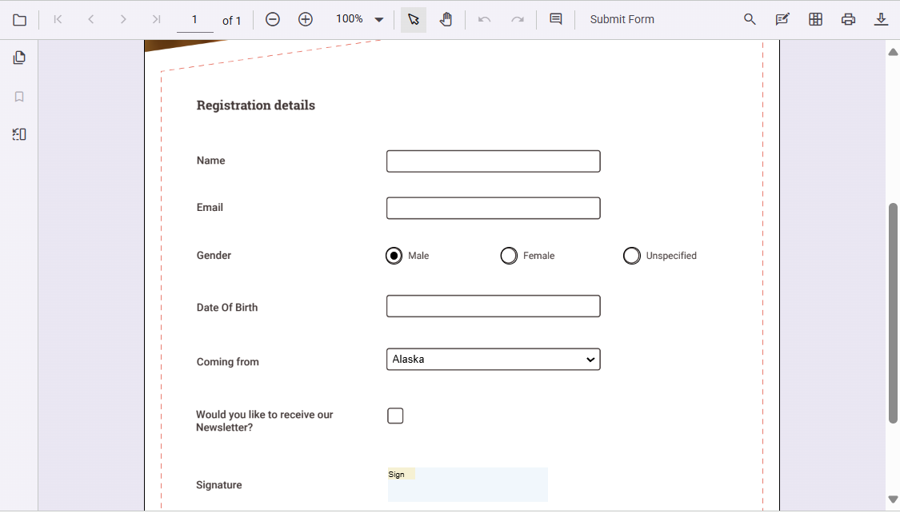
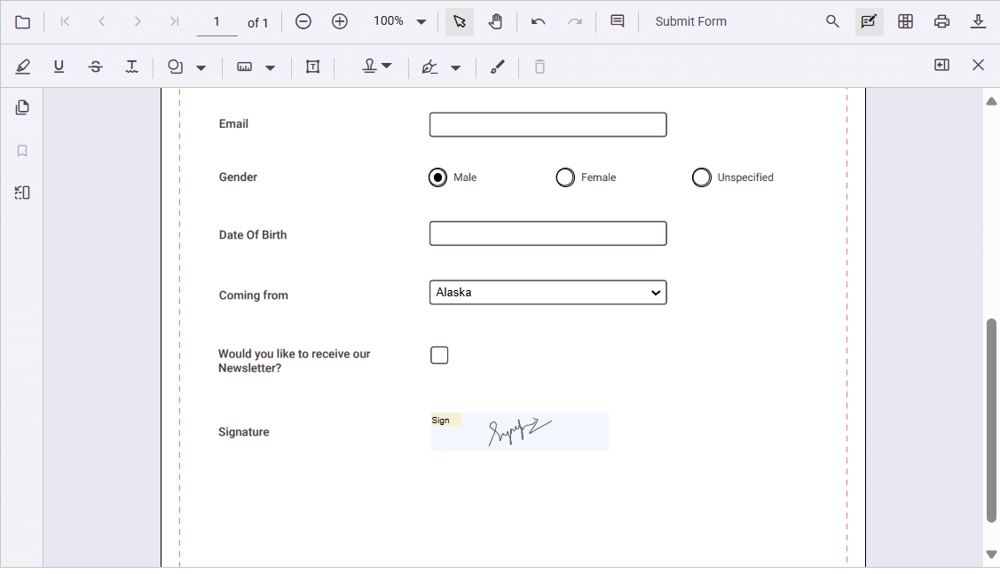

# Form filling in ASP.NET Core PDF Viewer Component

The PDF Viewer component displays existing form fields in a PDF document and enables filling and downloading filled data.

The form fields displayed in the PDF Viewer are:

* Textbox
* Password
* CheckBox
* RadioButton
* ListBox
* DropDown
* SignatureField
* InitialField

## Disabling form fields

The PDF Viewer control provides an option to disable interaction with form fields. Use the following configuration to disable form fields in the viewer.




    <ejs-pdfviewer id="pdfviewer"
                   style="height:600px"
                   documentPath="https://cdn.syncfusion.com/content/pdf/form-filling-document.pdf"
                   resourceUrl="https://cdn.syncfusion.com/ej2/31.1.17/dist/ej2-pdfviewer-lib"
                   enableFormFields="false">
    </ejs-pdfviewer>




    <ejs-pdfviewer id="pdfviewer"
                   style="height:600px"
                   documentPath="https://cdn.syncfusion.com/content/pdf/form-filling-document.pdf"
                   serviceUrl="/api/PdfViewer"
                   enableFormFields="false">
    </ejs-pdfviewer>




## How to draw handwritten signature in the signature field

Add a handwritten signature to a Signature field by following these steps:

* Click the signature field in the PDF document to open the signature panel.

* Draw the signature in the signature panel.

* Click the **CREATE** button. The drawn signature is added to the signature field.

## Delete the signature inside the signature field

Delete a signature placed in a signature field by using the Delete option in the annotation toolbar.

## Export and import form fields

The PDF Viewer control provides the support to export and import the form field data in the following formats using the `importFormFields`, `exportFormFields`, and `exportFormFieldsAsObject` methods.

* FDF
* XFDF
* JSON

For detailed information about exporting and importing form fields, please refer to the [Form Fields documentation](https://help.syncfusion.com/document-processing/pdf/pdf-viewer/asp-net-core/form-designer/create-programmatically#export-and-import-form-fields).

## See also

* [Handwritten Signature in ASP.NET Core PDF Viewer Component](./annotation/signature-annotation)
* [Form Designer](./form-designer/form-field-events)