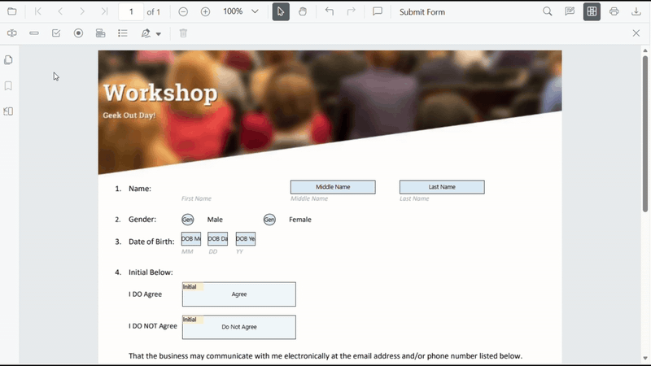
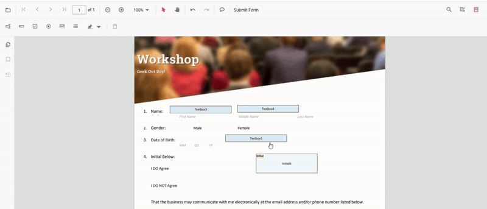

# Form Designer in ASP.NET Core PDF Viewer

When **Form Designer mode** is enabled in the Syncfusion ASP.NET Core PDF Viewer, a default [Form Designer user interface (UI)](https://document.syncfusion.com/demos/pdf-viewer/asp-net-core/pdfviewer/formdesigner#/tailwind3) is displayed. This UI includes a built in toolbar for adding form fields such as text boxes, password fields, check boxes, radio buttons, drop down lists, list boxes, and signature and initial fields.

Form fields can be placed on the PDF, moved and resized, configured with field and widget properties, previewed, and removed as needed. The Form Designer toolbar can be shown, hidden, and customized to control available tools based on application requirements, enabling flexible and interactive form design directly within the viewer.

## Key Features

**Add Form Fields**

The following form fields can be added to the PDF:

- [Text box](../forms/manage-form-fields/create-form-fields#add-textbox)
- [Password Field](../forms/manage-form-fields/create-form-fields#add-password)
- [Check box](../forms/manage-form-fields/create-form-fields#add-checkbox)
- [Radio button](../forms/manage-form-fields/create-form-fields#add-radiobutton)
- [Dropdown List](../forms/manage-form-fields/create-form-fields#add-dropdown)
- [List box](../forms/manage-form-fields/create-form-fields#add-listbox)
- [Signature field](../forms/manage-form-fields/create-form-fields#add-signature-field)
- [Initial field](../forms/manage-form-fields/create-form-fields#add-initial-field)

**Edit Form Fields**

Form fields can be moved, resized, aligned, distributed, copied, pasted, and changes can be undone or redone.

**Set Field Properties**

Field properties such as name, value, font, color, border, alignment, visibility, tab order, and required or read-only state can be configured.

**Control Field Behavior**

Read-only mode can be enabled or disabled, fields can be shown or hidden, and visibility during printing can be controlled.

**Manage Form Fields**

Form fields can be selected, grouped or ungrouped, reordered, and deleted as needed.

**Save and Print Forms**

Designed form fields can be saved to the PDF document and printed with their appearances.

## Enable Form Designer

Form design features are enabled using the ASP.NET Core TagHelper for the PDF Viewer. The TagHelper renders the client component and loads the EJ2 bundle (via `resourceUrl`), which provides the Form Designer modules at runtime.




@page "{handler?}"
@model IndexModel
@{
    ViewData["Title"] = "Home page";
}

    <ejs-pdfviewer id="pdfviewer" style="height:600px" resourceUrl="https://cdn.syncfusion.com/ej2/31.1.23/dist/ej2-pdfviewer-lib" documentPath="https://cdn.syncfusion.com/content/pdf/form-filling-document.pdf">
    </ejs-pdfviewer>




## Form Designer UI

When Form Designer mode is enabled in the Syncfusion ASP.NET Core PDF Viewer, a default [Form Designer UI](https://document.syncfusion.com/demos/pdf-viewer/asp-net-core/pdfviewer/formdesigner#/tailwind3) is displayed. This UI provides a built-in toolbar for adding common form fields such as text boxes, check boxes, radio buttons, drop-down lists, and signature fields. Fields can be placed on the PDF, selected, resized or moved, and configured using available editing options, enabling interactive form creation directly within the viewer.



For more information about creating and editing form fields in the PDF Viewer, refer to the [Form Creation](./manage-form-fields/create-form-fields) documentation.

## Form Designer Toolbar

The Form Designer toolbar appears at the top of the PDF Viewer and provides quick access to form field creation tools. It includes frequently used field types such as:

- [Text box](../forms/manage-form-fields/create-form-fields#add-textbox)
- [Password Field](../forms/manage-form-fields/create-form-fields#add-password)
- [Check box](../forms/manage-form-fields/create-form-fields#add-checkbox)
- [Radio button](../forms/manage-form-fields/create-form-fields#add-radiobutton)
- [Dropdown List](../forms/manage-form-fields/create-form-fields#add-dropdown)
- [List box](../forms/manage-form-fields/create-form-fields#add-listbox)
- [Signature field](../forms/manage-form-fields/create-form-fields#add-signature-field)
- [Initial field](../forms/manage-form-fields/create-form-fields#add-initial-field)

Each toolbar item allows placing the corresponding form field by selecting the tool and clicking the desired location in the PDF document.

The following code snippet enables Form Designer using the ASP.NET Core TagHelper:




@page "{handler?}"
@model IndexModel
@{
    ViewData["Title"] = "Home page";
}

    <ejs-pdfviewer id="pdfviewer" style="height:600px" resourceUrl="https://cdn.syncfusion.com/ej2/31.1.23/dist/ej2-pdfviewer-lib" documentPath="https://cdn.syncfusion.com/content/pdf/form-filling-document.pdf">
    </ejs-pdfviewer>




For more information about creating and editing form fields in the PDF Viewer, refer to the [Form Creation](./manage-form-fields/create-form-fields) documentation.

## Show or Hide the Built-in Form Designer Toolbar

The visibility of the Form Designer toolbar can be controlled using the [isFormDesignerToolbarVisible()](https://help.syncfusion.com/cr/aspnetcore-js2/syncfusion.ej2.pdfviewer.pdfviewer.html#Syncfusion_EJ2_PdfViewer_PdfViewer_IsFormDesignerToolbarVisible) method. This allows displaying or hiding the Form Designer tools based on application requirements.

**Use this method to:**
- Show the Form Designer toolbar when form design is required.
- Hide the toolbar to provide a cleaner viewing experience.



<!-- Buttons to toggle the Form Designer toolbar -->
<button id="showDesignerBtn">Show Form Designer Toolbar</button>
<button id="hideDesignerBtn">Hide Form Designer Toolbar</button>

    <ejs-pdfviewer id="pdfviewer" style="height:600px" resourceUrl="https://cdn.syncfusion.com/ej2/31.1.23/dist/ej2-pdfviewer-lib" documentPath="https://cdn.syncfusion.com/content/pdf/form-filling-document.pdf">
    </ejs-pdfviewer>




## Customize the Built-in Form Designer Toolbar

The Form Designer toolbar can be customized by specifying the tools to display and arranging them in the required order using the [FormDesignerToolbarItems](https://help.syncfusion.com/cr/aspnetcore-js2/syncfusion.ej2.pdfviewer.pdfviewer.html#Syncfusion_EJ2_PdfViewer_PdfViewer_EnableFormDesignerToolbar) property. This customization limits available tools and simplifies the user interface.

**Key Points**
- Include only the toolbar items needed, in the exact order specified.
- Toolbar items not listed remain hidden, resulting in a cleaner, more focused UI.




    <ejs-pdfviewer id="pdfviewer"
                   documentPath="https://cdn.syncfusion.com/content/pdf/pdf-succinctly.pdf"
                   toolbarSettings="@(new Syncfusion.EJ2.PdfViewer.PdfViewerToolbarSettings 
                   { 
                       ToolbarItems = new List<string> 
                       {
                           "OpenOption",
                           "UndoRedoTool",
                           "PageNavigationTool",
                           "ZoomTool",
                           "PanTool",
                           "SelectionTool",
                           "SearchOption",
                           "PrintOption",
                           "FormDesignerEditTool",
                           "DownloadOption"
                       },
                       FormDesignerToolbarItems = "TextboxTool PasswordTool CheckBoxTool RadioButtonTool DropdownTool ListboxTool DrawSignatureTool DeleteTool",
                   })">
    </ejs-pdfviewer>




## Move, Resize, and Edit Form Fields

Existing form fields can be moved, resized, and edited directly in the PDF Viewer using the Form Designer.

- Move a field by selecting it and dragging it to the required position.
- Resize a field using the handles displayed on the field boundary.

- Edit a field by selecting it to open the Form Field Properties popover. The popover allows modifying form field and widget annotation properties. Changes are reflected immediately and saved when the properties popover is closed. For more information, see [Editing Form Fields](./manage-form-fields/modify-form-fields).

## Deleting Form Fields

Form fields can be removed from the PDF document by selecting the field and using one of the following methods:
- Click the Delete option in the Form Designer UI.
- Press the Delete key after selecting the form field.

The selected form field and its associated widget annotation are permanently removed from the page. For more information, see [Deleting Form Fields](./manage-form-fields/remove-form-fields).

## See Also

- [Filling PDF Forms](./form-filling)
- [Create](./manage-form-fields/create-form-fields), [edit](./manage-form-fields/modify-form-fields), [style](./manage-form-fields/style-form-fields) and [remove](./manage-form-fields/remove-form-fields) form fields
- [Grouping form fields](./group-form-fields)
- [Form Constrains](./form-constrain)
- [Form Validation](./form-validation)
- [Custom Data](./custom-data)
- [Import](./import-export-form-fields/import-form-fields)/[Export Form Data](./import-export-form-fields/export-form-fields)
- [Form field events](./form-field-events)
