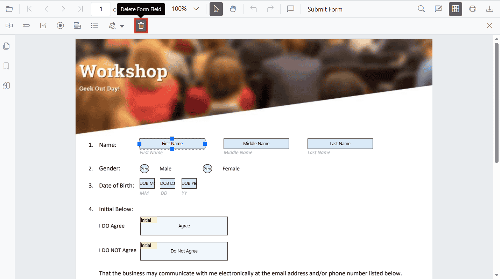

# Remove PDF Form Fields from a PDF in ASP.NET Core

The PDF Viewer supports removing form fields using the Form Designer UI or programmatically via the API.

### Remove form fields using the UI

**Steps:**

- Enable **Form Designer** mode.
- Select the form field.
- Click **Delete** in the toolbar or press the **Delete** key.

### Remove form fields programmatically

Use `deleteFormField()` with a field reference or the field id. The method accepts either a field object returned by `retrieveFormFields()` or a numeric/string id.

#### Example

Liquid

<button id="deleteAllFields">Delete Form Fields</button>
<button id="deleteById">Delete First Field By ID</button>

    <ejs-pdfviewer id="pdfviewer" style="height:600px" resourceUrl="https://cdn.syncfusion.com/ej2/31.2.2/dist/ej2-pdfviewer-lib" documentPath=documentPath="https://cdn.syncfusion.com/content/pdf/form-designer.pdf">
    </ejs-pdfviewer>




[View Sample on GitHub](https://github.com/SyncfusionExamples/asp-core-pdf-viewer-examples)

## See also

- [Form Designer overview](../overview)
- [Form Designer Toolbar](../../toolbar-customization/form-designer-toolbar)
- [Create form fields](./create-form-fields)
- [Modify form fields](./modify-form-fields)
- [Customize form fields](./customize-form-fields)
- [Group form fields](../group-form-fields)
- [Form validation](../form-validation)
- [Add custom data to form fields](../custom-data)
- [Form fields API](../form-fields-api)
