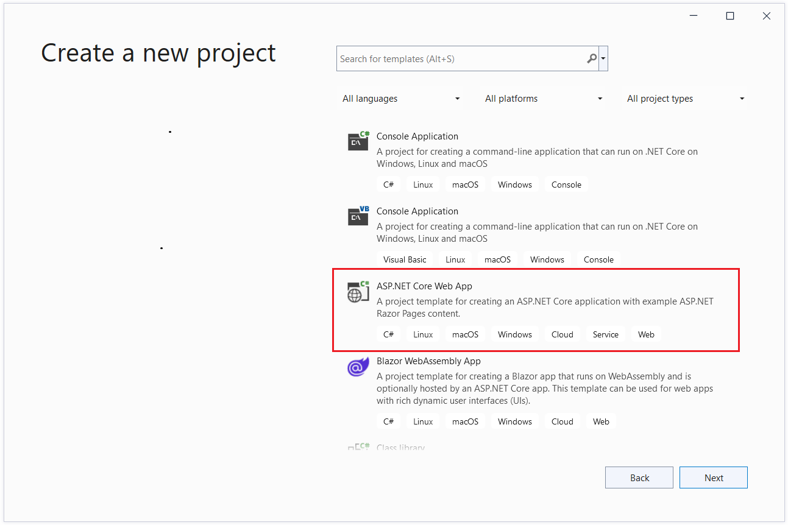
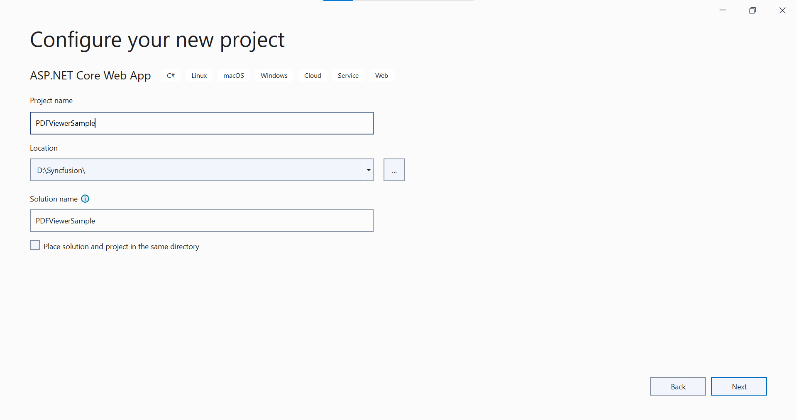
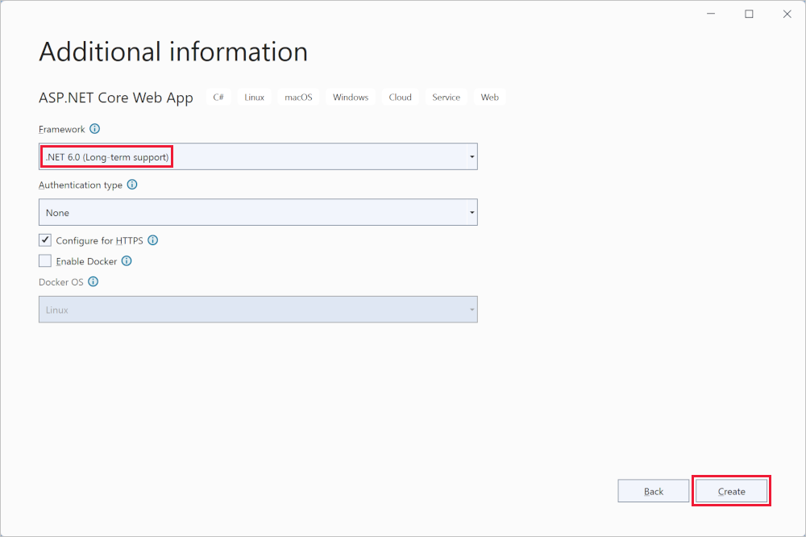
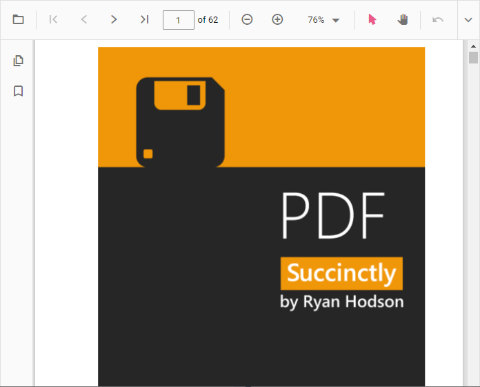

# Getting started with the ASP.NET Core standalone PDF Viewer control

The [ASP.NET Core PDF Viewer](https://www.syncfusion.com/pdf-viewer-sdk) control enables viewing and printing PDF files in web applications. It provides a rich reading experience with zooming, scrolling, text search, text selection, and text copy. Thumbnails, bookmarks, hyperlinks, and a table of contents simplify navigation within and across PDF documents.

This guide explains how to integrate the ASP.NET Core PDF Viewer control into an ASP.NET Core application using Visual Studio.

## Prerequisites

[System requirements for ASP.NET Core controls](https://help.syncfusion.com/document-processing/system-requirements)

## Integrate PDF Viewer into an ASP.NET Core application

1. Start Visual Studio and select **Create a new project**.
2. In the **Create a new project** dialog, select **ASP.NET Core Web App**.

3. In the **Configure your new project** dialog, enter the project name and select **Next**.

4. In the **Additional information** dialog, select a .NET LTS version (for example, **.NET 6.0 (Long-term Support)**) and then select **Create**.

## ASP.NET Core PDF Viewer NuGet package installation

To add the ASP.NET Core PDF Viewer control, install the following NuGet package in the ASP.NET Core application:

* [Syncfusion.EJ2.AspNet.Core](https://www.nuget.org/packages/Syncfusion.EJ2.AspNet.Core/)

## Add Syncfusion&reg; ASP.NET Core Tag Helper

Open `~/Pages/_ViewImports.cshtml` and import the `Syncfusion.EJ2` Tag Helper.




@addTagHelper *, Syncfusion.EJ2




## Add style sheet

Reference a theme using the CDN inside the `<head>` of `~/Pages/Shared/_Layout.cshtml` as shown:




<head>
    ...
    <!-- Syncfusion ASP.NET Core controls styles -->
    <link rel="stylesheet" href="https://cdn.syncfusion.com/ej2/{{ site.ej2version }}/fluent.css" />
</head>




N> Check out the [Themes topic](https://ej2.syncfusion.com/aspnetcore/documentation/appearance/theme) to learn different ways ([CDN](https://ej2.syncfusion.com/aspnetcore/documentation/common/adding-script-references#cdn-reference), [NPM package](https://ej2.syncfusion.com/aspnetcore/documentation/common/adding-script-references#node-package-manager-npm), and [CRG](https://ej2.syncfusion.com/aspnetcore/documentation/common/custom-resource-generator)) to reference styles in an ASP.NET Core application and achieve the expected appearance for Syncfusion&reg; ASP.NET Core controls.

## Add script reference

Add the required scripts using the CDN inside the `<head>` of `~/Pages/Shared/_Layout.cshtml` as follows:




<head>
    ...
    <!-- Syncfusion ASP.NET Core controls scripts -->
    
</head>




### Steps to load PDF Viewer with local script and style

To use local resources with the PDF Viewer, follow these steps:

**Step 1:** Place the `ej2.min.js` script and the required theme CSS files in the `wwwroot` folder of the ASP.NET Core application.

**Step 2:** Reference the local script and style files in the `<head>` of `_Layout.cshtml`, replacing CDN links with local paths.

By following these steps, the PDF Viewer will load the required script and style locally. See the code snippet below for reference.




<head>
    ...
    <!-- Syncfusion ASP.NET Core controls styles -->
    <link rel="stylesheet" href="~/material.min.css" />
    <!-- Syncfusion ASP.NET Core controls scripts -->
    
</head>




## Register Syncfusion&reg; Script Manager

Open the `~/Pages/Shared/_Layout.cshtml` page and register the script manager in the ASP.NET Core application as follows:




<body>
    ....
    ....
    <!-- Syncfusion ASP.NET Core Script Manager -->
    <ejs-scripts></ejs-scripts>
</body>




N> Add the script manager `<ejs-scripts>` at the end of the `<body>` element.

## Add ASP.NET Core PDF Viewer control

Add the Syncfusion&reg; ASP.NET Core PDF Viewer Tag Helper in `~/Pages/Index.cshtml`. Load a PDF by assigning the file path or URL to the `documentPath` property.




@page "{handler?}"
@model IndexModel
@{
    ViewData["Title"] = "Home page";
}

    <ejs-pdfviewer id="pdfviewer" style="height:600px" documentPath="https://cdn.syncfusion.com/content/pdf/pdf-succinctly.pdf">
    </ejs-pdfviewer>




In the above code:

- **ejs-pdfviewer** renders the PDF Viewer control with the id set to `pdfviewer`.
- **documentPath** specifies the PDF to load and accepts either an absolute URL or a relative path available to the application.

### How to configure PDF Viewer to use local resources

To use the `resourceUrl` and `documentPath` locally with the PDF Viewer, follow these steps:

**Step 1:** Ensure the application includes an `ej2-pdfviewer-lib` folder under `wwwroot` (or a publicly accessible static path). This folder must contain the `pdfium.js` and `pdfium.wasm` files, along with the PDF file to display. Keep these in the same static content area as `ej2.min.js` and related styles.

**Step 2:** Assign local paths to the `documentPath` and `resourceUrl` properties. Set `documentPath` to the PDF file and `resourceUrl` to the directory that contains the PDF Viewer’s supporting resources (`ej2-pdfviewer-lib`).

By following these steps, the PDF Viewer will load the required resources locally. See the code snippet below for reference.




@page "{handler?}"
@model IndexModel
@{
    ViewData["Title"] = "Home page";
    var originUrl = $"{Request.Scheme}://{Request.Host}{Request.PathBase}";
    var document = originUrl + "/PDF_Succinctly.pdf";
    var resourceUrl = originUrl + "/ej2-pdfviewer-lib";
}

    <ejs-pdfviewer id="pdfviewer" style="height:600px" documentPath=@document resourceUrl=@resourceUrl>
    </ejs-pdfviewer>




View the sample in GitHub to [load PDF Viewer with local resources](https://github.com/SyncfusionExamples/asp-core-pdf-viewer-examples/tree/master/How%20to/Refer%20resource%20url%20locally)

Press <kbd>Ctrl</kbd>+<kbd>F5</kbd> (Windows) or <kbd>⌘</kbd>+<kbd>F5</kbd> (macOS) to run the app. Then, the Syncfusion&reg; ASP.NET Core PDF Viewer control will be rendered in the default web browser.

N> [View Sample in GitHub](https://github.com/SyncfusionExamples/ASP-NET-Core-Getting-Started-Examples/tree/main/PDFViewer/ASP.NET%20Core%20Tag%20Helper%20Examples%20-%20Standalone%20PDF%20Viewer).

## See also

* [Getting started with Syncfusion&reg; ASP.NET Core using Server backend](https://help.syncfusion.com/document-processing/pdf/pdf-viewer/asp-net-core/getting-started-with-server-backed)