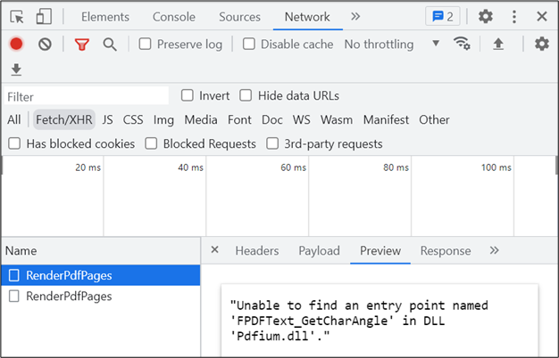

# Resolve "Unable to find an entry point named FPDFText_GetCharAngle" error

Effective with Essential Studio&reg; version 21.1.0.35 (2023 Volume 1), the Syncfusion&reg; PDF Viewer includes an updated PDFium engine to enhance text search, selection, and overall rendering performance. If an application continues to reference legacy native PDFium binaries after upgrading NuGet packages, it may trigger the exception: **"Unable to find an entry point named FPDFText_GetCharAngle"**.

This error typically results in the client displaying a **"Web-Service is not listening"** status. This can be confirmed by inspecting the **Network** tab in the browser developer tools, where the service response will indicate a failure due to missing or mismatched PDFium assemblies.

## Troubleshooting steps

To resolve this issue, ensure the deployed environment contains the correct native libraries for the host operating system:

* **Windows:** `pdfium.dll`
* **Linux:** `libpdfium.so`
* **macOS:** `libpdfium.dylib`

### Resolution procedure:

1. **Clear Build Artifacts:** Remove the `bin`, `obj`, and published output folders of the web service. This ensures that stale PDFium binaries are deleted.
2. **Rebuild Project:** Rebuild the solution to restore the native assemblies that correspond accurately with the upgraded Syncfusion NuGet packages.
3. **Republish Service:** Deploy the updated web service and verify that the latest PDFium binaries are present alongside the updated `Syncfusion.EJ2.PdfViewer` assemblies.

N> If hosting the application in cloud environments like Azure or AWS, or on Linux servers, manually delete the existing deployment files before publishing to ensure no legacy binaries remain. Confirm that the new PDFium binaries are correctly copied to the server's root or designated assembly folder.
