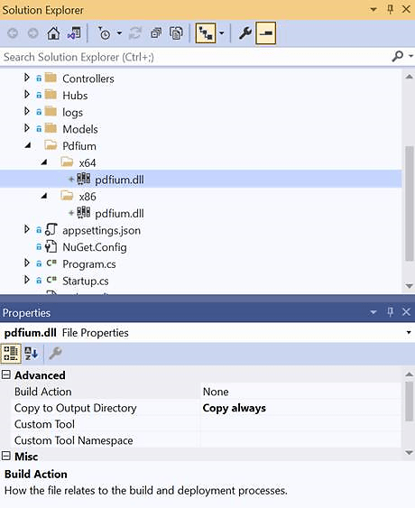

# Resolve the Pdfium issue

The error “The type initializer for `Syncfusion.EJ2.PdfViewer.PdfiumNative` threw an exception” occurs when the PDF Viewer cannot unpack the required PDFium native binaries because write access is blocked or the assemblies are missing. The viewer extracts `pdfium.dll` at runtime based on the current operating system, so ensure the application can write to the target folder or manually include the binaries by copying the x64 and x86 folders into the project.

Pdfium DLL package: [pdfium.dll](https://www.syncfusion.com/downloads/support/directtrac/general/ze/Pdfium1334927507.zip)

N> Always reference matching client- and server-side PDF Viewer versions and verify that `pdfium.dll` is generated or copied during runtime. When automatic extraction is not possible, place the native assemblies in a secure folder and point the viewer to that location by using the `ReferencePath` API.

If the PDFium assemblies reside in `C:\Pdfium\x64` or `D:\Pdfium\x86`, set `PdfRenderer.ReferencePath = "C:/Pdfium/";`. Provide the parent folder in the `ReferencePath` so that the viewer can pick the proper architecture-specific subfolder.

N> Set the `ReferencePath` inside the `Load` method in `PDFViewerController.cs`.

N> 
```
PdfRenderer pdfRenderer = new PdfRenderer();
pdfRenderer.ReferencePath = @"C:/Pdfium/";
```

## Steps to refer the PDFium.dll

1. Extract the downloaded Pdfium archive and copy the entire folder into the application’s root directory (parallel to the `Controllers` folder) so both `x64` and `x86` subfolders are available.
2. In Solution Explorer, select `pdfium.dll` within the `x64` and `x86` folders, open the Properties window, and set **Copy to Output Directory** to **Copy always**. This ensures the assemblies are packaged during publish.

3. Update the `Load` method in `PDFViewerController.cs` to point to the parent Pdfium folder. The reference should target the folder that contains the architecture folders.
N> `PdfRenderer.ReferencePath = _hostingEnvironment.ContentRootPath + "\\Pdfium\\";`
4. Build and publish the application, then confirm that the Pdfium binaries are present in the deployment output and accessible with write permission.

Install the following NuGet package before running the project. The packaged viewer includes the managed wrapper that works across Windows, Linux, and macOS.

* Syncfusion.EJ2.PdfViewer.AspNet.Core

Following these steps should resolve the issue in most environments.

## Steps to resolve the PDFium issue in Linux environment

* The error indicates that the PDFium dependency is missing in the Linux environment. Install the required native libraries by running the following commands in sequence on the Linux host or container.

```
    sudo cp -u /lib/x86_64-linux-gnu/libdl.so.2 /lib/x86_64-linux-gnu/libdl.so
    sudo apt-get update
    sudo apt install libgdiplus
```

## Steps to resolve the PDFium issue in docker environment

* The same error can appear in Docker images when the Pdfium dependency is absent. Add the corresponding commands to the Dockerfile so the container includes the required native libraries.

If you are using the PDF Viewer with Docker in .NET 6.0 framework, incorporate the following commands into your Dockerfile to install the Pdfium dependency:

```
    RUN ln -s /lib/x86_64-linux-gnu/libdl-2.24.so /lib/x86_64-linux-gnu/libdl.so
    # install System.Drawing native dependencies
    RUN apt-get update && apt-get install -y --allow-unauthenticated libgdiplus libc6-dev libx11-dev
    RUN ln -s libgdiplus.so gdiplus.dll
```

Dockerfile 6.0: [dockerfile](https://github.com/SyncfusionExamples/PdfViewer-Server/blob/master/Dockerfile)

If you are using the PDF Viewer with Docker in .NET 8.0 framework, incorporate the following commands into your Dockerfile to install the Pdfium dependency:

```
    RUN ln -s /lib/x86_64-linux-gnu/libdl.so.2 /lib/x86_64-linux-gnu/libdl.so
    # install System.Drawing native dependencies
    RUN apt-get update && apt-get install -y --allow-unauthenticated libgdiplus libc6-dev libx11-dev
    RUN ln -s libgdiplus.so gdiplus.dll
```

Dockerfile 8.0: [dockerfile](https://github.com/SyncfusionExamples/PdfViewer-Server/blob/master/Dockerfile_NET80)
