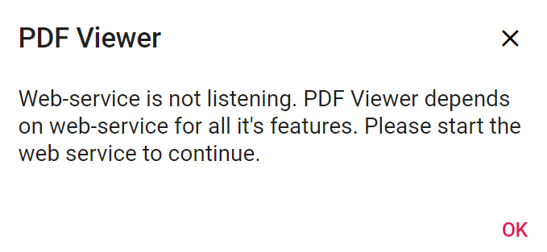
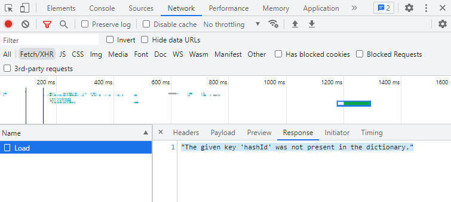

# Resolve “Web service is not listening” error

The Syncfusion&reg; ASP.NET Core PDF Viewer displays the **Web service is not listening** message when the component cannot establish a connection with the backend service or the service encounters an unhandled exception. Follow these diagnostic steps to identify and resolve the issue.

## Diagnose the service response

**Step 1:** Open the browser developer tools (press **F12** or right-click and select **Inspect**) and navigate to the **Network** tab to monitor outgoing requests.

**Step 2:** Trigger the error again and select the failed request to inspect the response status, headers, and error payload. Record the stack trace or error message for detailed analysis.

**Step 3:** Verify that the request URL, HTTP method, and payload structure match the controller action signature. Routing mismatches or incorrect endpoint configurations prevent the service from processing document requests.

N> Ensure the hosting environment has necessary network permissions, the PDF service endpoint URL is correctly configured, and all dependent resources—such as storage accounts or distributed caches—are accessible.

## Common exceptions and resolutions

### File not found errors

* Confirm that the `documentPath` and server-side file references point to valid locations.
* Ensure the deployment process includes all required PDF assets in the target directory.
* Update connection strings or environment variables if the document storage moves (e.g., from local storage to Azure Blob Storage).

### Document cache exceptions

The `Document cache not found` exception occurs when the cache directory for rendered PDF pages is missing, inaccessible, or deleted. This often happens after environment migrations or manual directory cleanup.

* **Validate Cache Path:** Ensure the directory specified in the configuration exists and has write permissions.
* **Persistent Storage:** Use a persistent storage provider if the application runs in a containerized or stateless environment.

### Multiple instances conflict

Simultaneous instances of the PDF Viewer may compete for the same cache resources, leading to locking issues. 

* **Check Processes:** Review active processes in the Task Manager to ensure no orphaned instances are locking cache files.
* **Distributed Caching:** Implement Redis or another distributed caching provider to manage document state across multiple instances or scaled environments safely.

### Network and service stability

* Verify the stability of the network connection between the client and the server.
* Restart the web service to clear transient state issues or blocked resources.

### Document pointer missing from cache

The `Document pointer does not exist in the cache` exception indicates a mismatch between the client's session state and the server's cached data.

To resolve this issue:

1. **Clear the Cache:** Manually clear the contents of the cache directory specified in the PDF Viewer settings to remove corrupted or stale data.
2. **Reload the Document:** Programmatically invoke the `Load()` method via the controller to re-initialize the document session.
3. **App Restart:** Restart the application pool or service to refresh component states and clear memory-resident metadata.

## Internal server error

Unspecified server-side failures often stem from malformed document content, missing dependencies, or permission restrictions. Review the server-side logs to capture the full exception details. If the issue persists, provide the failing document and logs to Syncfusion support for further investigation.
