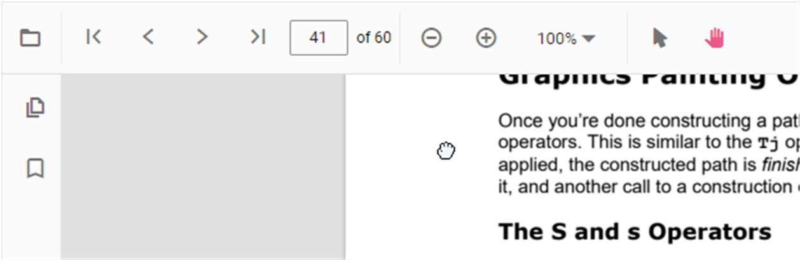

# Interaction mode in PDF Viewer

The PDF Viewer provides two interaction modes to work with the loaded PDF document: selection mode and panning mode.

## Selection mode

In this mode, users can select and copy text in the loaded PDF document. Panning and touch-based scrolling are disabled. This is useful for copying and sharing text content. Enable or disable text selection as shown in the following example.




    <ejs-pdfviewer id="pdfviewer"
                   style="height:600px"
                   documentPath="https://cdn.syncfusion.com/content/pdf/pdf-succinctly.pdf"
                   enableTextSelection="true">
    </ejs-pdfviewer>




    <ejs-pdfviewer id="pdfviewer"
                   style="height:600px"
                   serviceUrl="/api/PdfViewer"
                   documentPath="https://cdn.syncfusion.com/content/pdf/pdf-succinctly.pdf"
                   enableTextSelection="true">
    </ejs-pdfviewer>




## Panning mode

In this mode, panning and touch-based scrolling are enabled, while text selection is disabled.

Switch the interaction mode of the PDF Viewer using the following example:




    <ejs-pdfviewer id="pdfviewer"
                   style="height:600px"
                   documentPath="https://cdn.syncfusion.com/content/pdf/pdf-succinctly.pdf"
                   InteractionMode=@Syncfusion.EJ2.PdfViewer.InteractionMode.Pan>
    </ejs-pdfviewer>




    <ejs-pdfviewer id="pdfviewer"
                   style="height:600px"
                   serviceUrl="/api/PdfViewer"
                   documentPath="https://cdn.syncfusion.com/content/pdf/pdf-succinctly.pdf"
                   InteractionMode=@Syncfusion.EJ2.PdfViewer.InteractionMode.Pan>
    </ejs-pdfviewer>




## See also

* [Toolbar items](./toolbar)
* [Feature Modules](./feature-module)