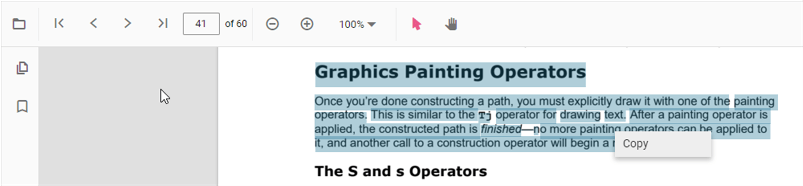
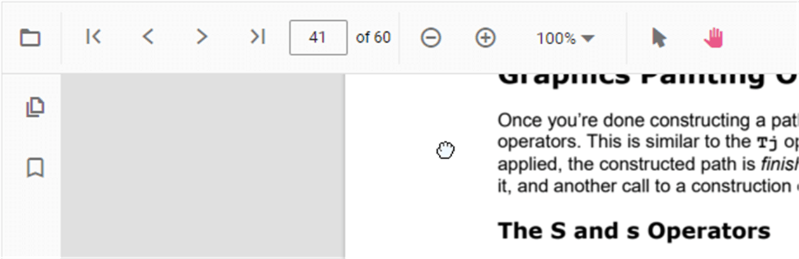

# Interaction Mode in ASP.NET Core PDF Viewer

The PDF Viewer provides two interaction modes to control how users interact with the document: **Pan** mode for document navigation and **Text Selection** mode for text selection and copying.

The [`InteractionMode`](https://help.syncfusion.com/cr/aspnetcore-js2/Syncfusion.EJ2.PdfViewer.InteractionMode.html) enum defines the available interaction modes for the PDF Viewer.

| Value | Description |
|-------|-------------|
| `TextSelection` | Enables text selection and copying. Panning is disabled. |
| `Pan` | Enables panning and document navigation. Text selection is disabled. |

## Selection Mode

In selection mode, text can be selected and copied from the loaded PDF document. Panning and touch-based scrolling are disabled. This is useful for copying and sharing text content. Text selection can be enabled or disabled as shown in the following example:




    <ejs-pdfviewer id="pdfviewer"
                   style="height:600px"
                   documentPath="https://cdn.syncfusion.com/content/pdf/pdf-succinctly.pdf"
                   enableTextSelection="true">
    </ejs-pdfviewer>




## Panning Mode

In panning mode, panning and touch-based scrolling are enabled, while text selection is disabled.

The interaction mode can be switched using the following example:




    <ejs-pdfviewer id="pdfviewer"
                   style="height:600px"
                   documentPath="https://cdn.syncfusion.com/content/pdf/pdf-succinctly.pdf"
                   InteractionMode=@Syncfusion.EJ2.PdfViewer.InteractionMode.Pan>
    </ejs-pdfviewer>




## Switch between Pan and Text Selection

Switch between Pan and Text Selection modes using the toolbar buttons in the UI or programmatically. When in Pan mode, text selection is disabled, and when in Text Selection mode, panning is disabled.

### Using Toolbar

The toolbar provides built-in buttons to switch between Pan and Text Selection modes without any code. Users can click the mode toggle button to switch.

**Pan Mode:** When Pan mode is active, the cursor changes to a hand icon, allowing users to drag and scroll through the document. Text selection is disabled in this mode.

**Selection Mode:** When Text Selection mode is active, the cursor changes to a text selection cursor, allowing users to highlight and copy text from the PDF. Panning is disabled in this mode.

### Programmatically

Use the [`InteractionMode`](https://help.syncfusion.com/cr/aspnetcore-js2/Syncfusion.EJ2.PdfViewer.PdfViewer.html#Syncfusion_EJ2_PdfViewer_PdfViewer_InteractionMode) property to switch modes programmatically. The change can be applied through the `documentLoad` event or any other user-driven action.




<button id="panMode" onclick="switchToPan()">Pan Mode</button>
<button id="textSelectionMode" onclick="switchToTextSelection()">Text Selection Mode</button>
    <ejs-pdfviewer id="pdfviewer"
                   style="height:600px"
                   documentPath="https://cdn.syncfusion.com/content/pdf/pdf-succinctly.pdf"
                   interactionMode="@Syncfusion.EJ2.PdfViewer.InteractionMode.Pan"
                   documentLoad="switchMode">
    </ejs-pdfviewer>




## Disable text selection (enable pan mode)

Disable text selection by setting [`enableTextSelection`](https://help.syncfusion.com/cr/aspnetcore-js2/syncfusion.ej2.pdfviewer.pdfviewer.html#Syncfusion_EJ2_PdfViewer_PdfViewer_EnableTextSelection) to `false` to enable pan mode for document navigation. When text selection is disabled, users can only pan through the document and cannot select or copy text.




    <ejs-pdfviewer id="pdfviewer"
                   style="height:600px"
                   documentPath="https://cdn.syncfusion.com/content/pdf/pdf-succinctly.pdf"
                   enableTextSelection="false">
    </ejs-pdfviewer>




## Programmatically toggle interaction mode at runtime

Toggle interaction modes at runtime in response to events or user actions, such as when opening annotation tools. The `interactionMode` property is fully reactive and accepts a new `InteractionMode` enum value at any time after the viewer has been initialized.




<button id="openAnnotation" onclick="openAnnotationTool()">Open Annotation Tool</button>
<button id="closeAnnotation" onclick="closeAnnotationTool()">Close Annotation Tool</button>
    <ejs-pdfviewer id="pdfviewer"
                   style="height:600px"
                   documentPath="https://cdn.syncfusion.com/content/pdf/pdf-succinctly.pdf"
                   interactionMode="@Syncfusion.EJ2.PdfViewer.InteractionMode.Pan">
    </ejs-pdfviewer>




## See also

* [Magnification](./magnification) — Control zoom and fit modes
* [Toolbar items](./toolbar)
* [Feature Modules](./feature-module)