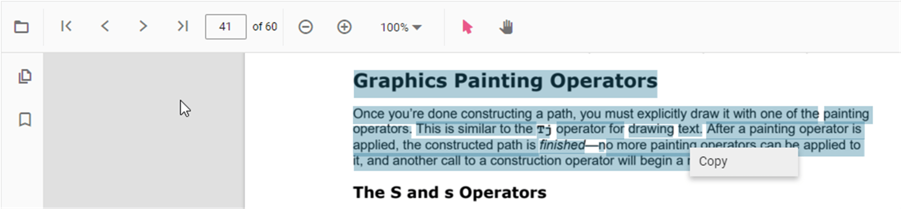

# Interaction Mode in PDF Viewer

The PDF Viewer provides two interaction modes for working with loaded PDF documents: selection mode and panning mode.

## Selection Mode

In selection mode, text can be selected and copied from the loaded PDF document. Panning and touch-based scrolling are disabled. This is useful for copying and sharing text content. Text selection can be enabled or disabled as shown in the following example:




    <ejs-pdfviewer id="pdfviewer"
                   style="height:600px"
                   documentPath="https://cdn.syncfusion.com/content/pdf/pdf-succinctly.pdf"
                   enableTextSelection="true">
    </ejs-pdfviewer>




    <ejs-pdfviewer id="pdfviewer"
                   style="height:600px"
                   serviceUrl="/api/PdfViewer"
                   documentPath="https://cdn.syncfusion.com/content/pdf/pdf-succinctly.pdf"
                   enableTextSelection="true">
    </ejs-pdfviewer>




## Panning Mode

In panning mode, panning and touch-based scrolling are enabled, while text selection is disabled.

The interaction mode can be switched using the following example:




    <ejs-pdfviewer id="pdfviewer"
                   style="height:600px"
                   documentPath="https://cdn.syncfusion.com/content/pdf/pdf-succinctly.pdf"
                   InteractionMode=@Syncfusion.EJ2.PdfViewer.InteractionMode.Pan>
    </ejs-pdfviewer>




    <ejs-pdfviewer id="pdfviewer"
                   style="height:600px"
                   serviceUrl="/api/PdfViewer"
                   documentPath="https://cdn.syncfusion.com/content/pdf/pdf-succinctly.pdf"
                   InteractionMode=@Syncfusion.EJ2.PdfViewer.InteractionMode.Pan>
    </ejs-pdfviewer>




## See also

* [Toolbar items](./toolbar)
* [Feature Modules](./feature-module)