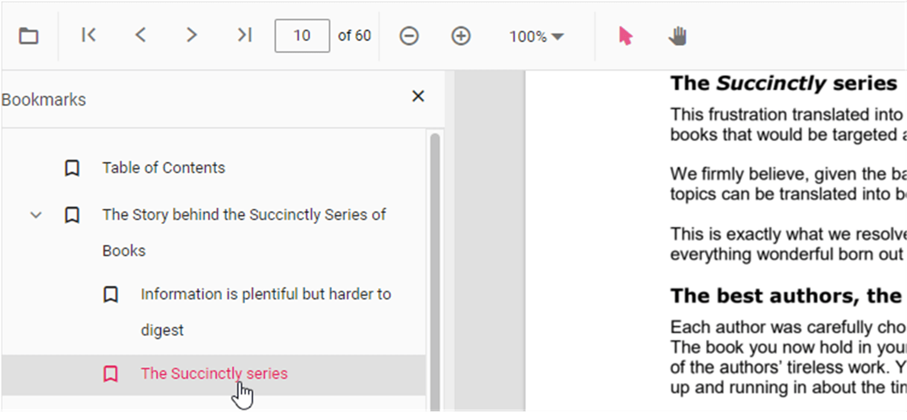

# Bookmark navigation in ASP.NET Core PDF Viewer control

The Bookmarks saved in PDF files are loaded and made ready for easy navigation.
You can enable/disable bookmark navigation by using the following code snippet.,




    <ejs-pdfviewer id="pdfviewer"
                   documentPath="https://cdn.syncfusion.com/content/pdf/pdf-succinctly.pdf"
                   enableBookmark="true">
    </ejs-pdfviewer>




    <ejs-pdfviewer id="pdfviewer"
                   serviceUrl='/Index'
                   documentPath="https://cdn.syncfusion.com/content/pdf/pdf-succinctly.pdf"
                   enableBookmark="true">
    </ejs-pdfviewer>




To perform bookmark navigation, you can use the **goToBookmark** method. It's important to note that the **goToBookmark** method will throw an error if the specified bookmark does not exist in the PDF document.

Here is an example of how to use the **goToBookmark** method:




<button id="gotobookmark" onclick="gotobookmark()">Specfic Page</button>

    <ejs-pdfviewer id="pdfviewer"
                   style="height:600px"
                   documentPath="https://cdn.syncfusion.com/content/pdf/pdf-succinctly.pdf">
    </ejs-pdfviewer>




<button id="gotobookmark" onclick="gotobookmark()">Specfic Page</button>

    <ejs-pdfviewer id="pdfviewer"
                   style="height:600px"
                   serviceUrl="/api/PdfViewer"
                   documentPath="https://cdn.syncfusion.com/content/pdf/pdf-succinctly.pdf">
    </ejs-pdfviewer>




x - Specifies the pageIndex for Navigate.

y - Specifies the Y coordinates value of the Page.

Also, you can use the **getBookmarks** method to retrieve a list of all the bookmarks in a PDF document. This method returns a List of Bookmark objects, which contain information about each bookmark.

Here is an example of how to use the getBookmarks method:




<button id="getBookmarks" onclick="getBookmarks()">Retrieve Bookmark</button>

    <ejs-pdfviewer id="pdfviewer"
                   style="height:600px"
                   documentPath="https://cdn.syncfusion.com/content/pdf/pdf-succinctly.pdf">
    </ejs-pdfviewer>




<button id="getBookmarks" onclick="getBookmarks()">Retrieve Bookmark</button>

    <ejs-pdfviewer id="pdfviewer"
                   style="height:600px"
                   serviceUrl="/api/PdfViewer"
                   documentPath="https://cdn.syncfusion.com/content/pdf/pdf-succinctly.pdf">
    </ejs-pdfviewer>




## See also

* [Toolbar items](../toolbar-customization)
* [Feature Modules](../feature-module)