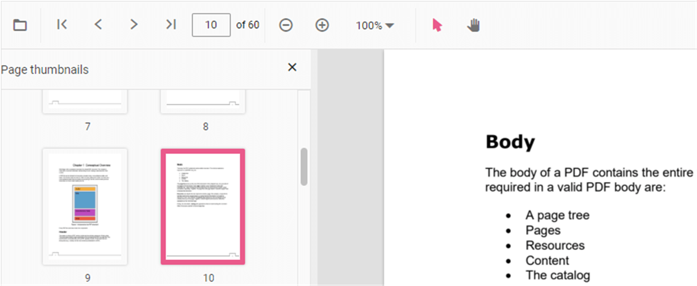

# Page Thumbnail Navigation in ASP.NET Core PDF Viewer

Page thumbnails provide miniature representations of pages and enable quick navigation. Use the thumbnail pane to jump to specific pages without scrolling.

## Enable thumbnail navigation

You can enable or disable thumbnail navigation using the `enableThumbnail` property. The example below shows how to enable thumbnails.

- **Property**: `enableThumbnail`
- **Type**: `boolean`
- **Default**: `true`

**Example: Enable thumbnails**




    <ejs-pdfviewer id="pdfviewer"
                   documentPath="https://cdn.syncfusion.com/content/pdf/pdf-succinctly.pdf"
                   enableThumbnail="true">
    </ejs-pdfviewer>




    <ejs-pdfviewer id="pdfviewer"
                   serviceUrl='/Index'
                   documentPath="https://cdn.syncfusion.com/content/pdf/pdf-succinctly.pdf"
                   enableThumbnail="true">
    </ejs-pdfviewer>




## See also

* [Toolbar items](../toolbar-customization)
* [Feature Modules](../feature-module)