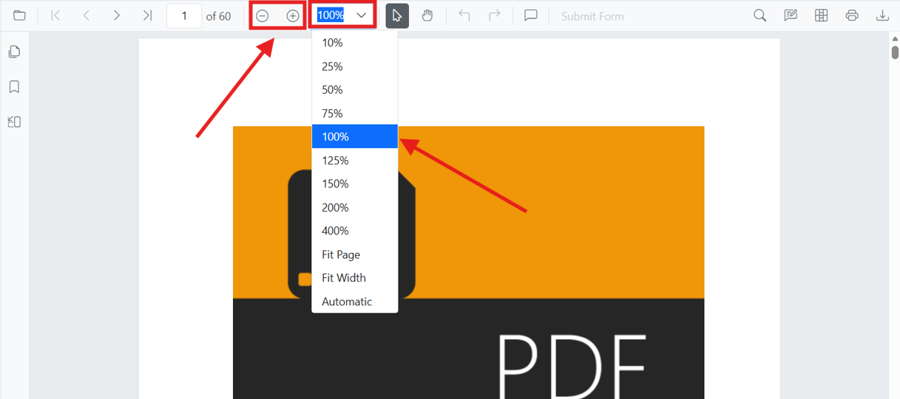

# Zoom in ASP.NET Core PDF Viewer

This how-to guide demonstrates how to work with zoom functionality in the ASP.NET Core PDF Viewer component. Learn how to enable magnification, control zoom programmatically, set default zoom levels, and respond to zoom changes.

## Enable zooming

To enable zoom functionality in the PDF Viewer, set the `enableMagnification` property to `true`.




    <ejs-pdfviewer id="pdfviewer"
                   style="height:600px"
                   documentPath="https://cdn.syncfusion.com/content/pdf/pdf-succinctly.pdf"
                   enableMagnification="true">
    </ejs-pdfviewer>




## Zoom in and out using toolbar and programmatically

The zoom controls are automatically available in the toolbar when magnification is enabled. Users can click the **Zoom In** and **Zoom Out** buttons to adjust the zoom level.

To zoom in or out programmatically, use the `zoomIn()` and `zoomOut()` methods on the PDF Viewer instance.




<button onclick="zoomIn()">Zoom In</button>
<button onclick="zoomOut()">Zoom Out</button>

    <ejs-pdfviewer id="pdfviewer"
                   style="height:600px"
                   documentPath="https://cdn.syncfusion.com/content/pdf/pdf-succinctly.pdf"
                   enableMagnification="true">
    </ejs-pdfviewer>




## Set a specific zoom value

Use the `zoomTo()` method on the PDF Viewer instance to set the PDF to a specific zoom level. You can specify the zoom level as a percentage value.




<button onclick="zoomTo(75)">75%</button>
<button onclick="zoomTo(150)">150%</button>
<button onclick="zoomTo(200)">200%</button>

    <ejs-pdfviewer id="pdfviewer"
                   style="height:600px"
                   documentPath="https://cdn.syncfusion.com/content/pdf/pdf-succinctly.pdf"
                   enableMagnification="true">
    </ejs-pdfviewer>




## Initialize the viewer with a default zoom (on load)

Set an initial zoom level when the document is first loaded by using the `documentLoad` event. Call `zoomTo()` in the event handler.




    <ejs-pdfviewer id="pdfviewer"
                   style="height:600px"
                   documentPath="https://cdn.syncfusion.com/content/pdf/pdf-succinctly.pdf"
                   enableMagnification="true"
                   documentLoad="onDocumentLoad">
    </ejs-pdfviewer>




## Disable user zoom while allowing programmatic zoom

To restrict users from zooming via the UI while still allowing your application to control zoom programmatically, customize the toolbar to exclude zoom controls. Combine this with custom application buttons to provide controlled zoom access.




<button onclick="zoomTo(150)">Zoom 150%</button>
<button onclick="zoomTo(200)">Zoom 200%</button>

Zoom level is controlled by the application.

    <ejs-pdfviewer id="pdfviewer"
                   style="height:600px"
                   documentPath="https://cdn.syncfusion.com/content/pdf/pdf-succinctly.pdf"
                   enableMagnification="true"
                   toolbarSettings="@(new Syncfusion.EJ2.PdfViewer.PdfViewerToolbarSettings { ToolbarItems = new List<string> { "OpenOption", "PageNavigationTool", "AnnotationEditTool", "PrintOption" } })">
    </ejs-pdfviewer>




## Zoom Range and Limits

The PDF Viewer supports zoom values from **10% to 400%** by default. All zoom operations are automatically clamped to this range:
- Values below 10% are adjusted to 10%
- Values above 400% are adjusted to 400%

You can override these defaults using the `minZoom` and `maxZoom` properties on the `PdfViewerControl`.

## See also

* [Magnification Overview](./magnification)
* [Fit Modes](./fitmode)
* [Toolbar Items](../toolbar)
