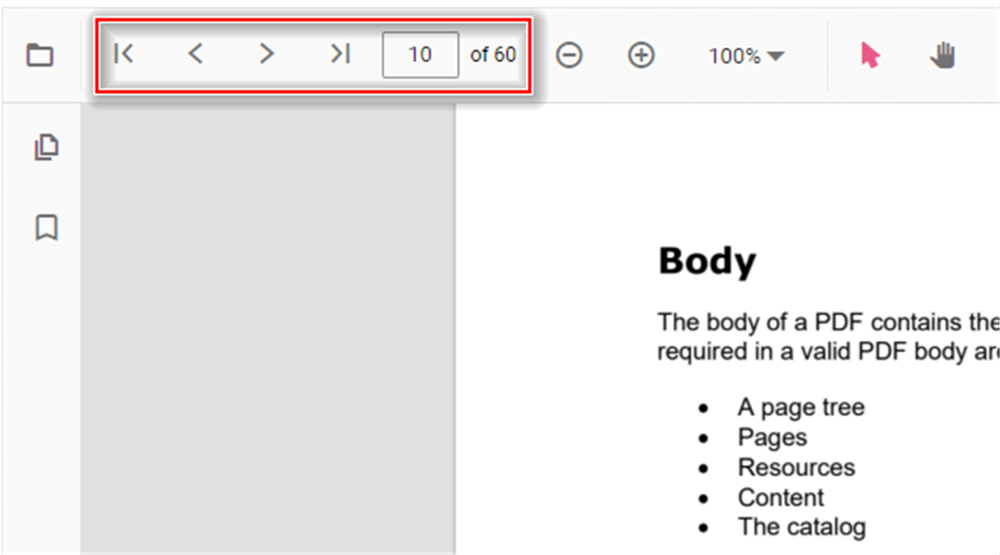
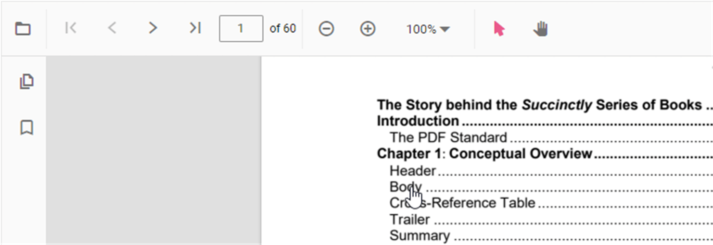

# Navigation in ASP.NET Core PDF Viewer

The ASP.NET Core PDF Viewer provides comprehensive navigation capabilities for efficient document exploration. Users can navigate through documents using the toolbar, page thumbnails, bookmarks, hyperlinks, and table of contents. These features work together to provide a seamless reading experience, allowing users to quickly locate content and move between different parts of a PDF document.

## Toolbar page navigation options

The default PDF Viewer toolbar contains intuitive page navigation buttons for basic document traversal. These options enable users to move through the document sequentially or jump directly to specific pages.

The toolbar includes the following page navigation options:

- **Go to page**: Navigate to a specific page number by entering the page number in the input field
- **Show next page**: Navigate to the next page
- **Show previous page**: Navigate to the previous page
- **Show first page**: Navigate to the first page
- **Show last page**: Navigate to the last page

### Enable or disable toolbar navigation

Page navigation can be controlled using the `enableNavigation` property. Set it to `true` (default) to display navigation buttons in the toolbar, or `false` to hide them.

**Example: Disabling toolbar page navigation**




    <ejs-pdfviewer id="pdfviewer"
                   style="height:600px"
                   documentPath="https://cdn.syncfusion.com/content/pdf/pdf-succinctly.pdf"
                   enableNavigation="false">
    </ejs-pdfviewer>




    <ejs-pdfviewer id="pdfviewer"
                   style="height:600px"
                   serviceUrl="/api/PdfViewer"
                   documentPath="https://cdn.syncfusion.com/content/pdf/pdf-succinctly.pdf"
                   enableNavigation="false">
    </ejs-pdfviewer>




## Bookmark navigation

Bookmarks (also called document outlines) are internal navigation markers stored within PDF files. They provide a structured way to navigate to important sections and subsections of a document. When bookmarks are enabled, they appear in a collapsible panel on the left side of the viewer, allowing users to quickly jump to marked sections.

### Enable or disable bookmark navigation

Bookmark navigation is controlled using the `enableBookmark` property. Set it to `true` to display bookmarks in a side panel, or `false` to hide them.

**Example: Enabling bookmark navigation**




    <ejs-pdfviewer id="pdfviewer"
                   style="height:600px"
                   documentPath="https://cdn.syncfusion.com/content/pdf/pdf-succinctly.pdf"
                   enableBookmark="true">
    </ejs-pdfviewer>




    <ejs-pdfviewer id="pdfviewer"
                   style="height:600px"
                   serviceUrl="/api/PdfViewer"
                   documentPath="https://cdn.syncfusion.com/content/pdf/pdf-succinctly.pdf"
                   enableBookmark="true">
    </ejs-pdfviewer>




## Thumbnail navigation

Thumbnails are miniature preview images of each page in the PDF document. They provide a visual overview of all pages and enable quick navigation by simply clicking on the desired page thumbnail. Thumbnails are particularly useful for document scanning and visual content identification.

### Enable or disable thumbnail navigation

Thumbnail navigation is controlled using the `enableThumbnail` property. Set it to `true` to display page thumbnails in a side panel, or `false` to hide them.

**Example: Enabling thumbnail navigation**




    <ejs-pdfviewer id="pdfviewer"
                   style="height:600px"
                   documentPath="https://cdn.syncfusion.com/content/pdf/pdf-succinctly.pdf"
                   enableThumbnail="true">
    </ejs-pdfviewer>




    <ejs-pdfviewer id="pdfviewer"
                   style="height:600px"
                   serviceUrl="/api/PdfViewer"
                   documentPath="https://cdn.syncfusion.com/content/pdf/pdf-succinctly.pdf"
                   enableThumbnail="true">
    </ejs-pdfviewer>




## Hyperlink navigation

Hyperlinks in PDF documents enable navigation to external URLs or internal PDF destinations. The PDF Viewer automatically detects hyperlinks within PDF content and allows users to interact with them by clicking.

### Enable or disable hyperlink navigation

Hyperlink navigation is controlled using the `enableHyperlink` property. Set it to `true` to allow users to click hyperlinks, or `false` to disable hyperlink interaction.

**Example: Enabling hyperlink navigation**




    <ejs-pdfviewer id="pdfviewer"
                   style="height:600px"
                   documentPath="https://cdn.syncfusion.com/content/pdf/pdf-succinctly.pdf"
                   enableHyperlink="true">
    </ejs-pdfviewer>




    <ejs-pdfviewer id="pdfviewer"
                   style="height:600px"
                   serviceUrl="/api/PdfViewer"
                   documentPath="https://cdn.syncfusion.com/content/pdf/pdf-succinctly.pdf"
                   enableHyperlink="true">
    </ejs-pdfviewer>




### Controlling hyperlink open behavior

Use the `hyperlinkOpenState` property to control whether hyperlinks open in the current window or a new tab/window. This provides better user experience by allowing users to maintain their place in the PDF while viewing external content.

**Example: Opening hyperlinks in a new tab**




    <ejs-pdfviewer id="pdfviewer"
            style="height:600px"
            documentPath="https://cdn.syncfusion.com/content/pdf/pdf-succinctly.pdf"
            hyperlinkOpenState="@(Syncfusion.EJ2.PdfViewer.LinkTarget.NewTab)">
    </ejs-pdfviewer>




    <ejs-pdfviewer id="pdfviewer"
            style="height:600px"
            serviceUrl="/api/PdfViewer"
            documentPath="https://cdn.syncfusion.com/content/pdf/pdf-succinctly.pdf"
            hyperlinkOpenState="@(Syncfusion.EJ2.PdfViewer.LinkTarget.NewTab)">
    </ejs-pdfviewer>




## Table of contents navigation

The table of contents (TOC) in a PDF document provides a structured outline of the document's hierarchy. It typically includes chapter titles, section headings, and subsections with page numbers. The PDF Viewer automatically extracts and displays the table of contents, allowing users to click on any entry to jump directly to that section in the document.

The table of contents is typically displayed in a side panel alongside bookmarks and thumbnails. If the PDF has a built-in table of contents, it will be automatically available in the outline/navigation panel.

## See also

* [Toolbar items](./toolbar)
* [Feature Modules](./feature-module)