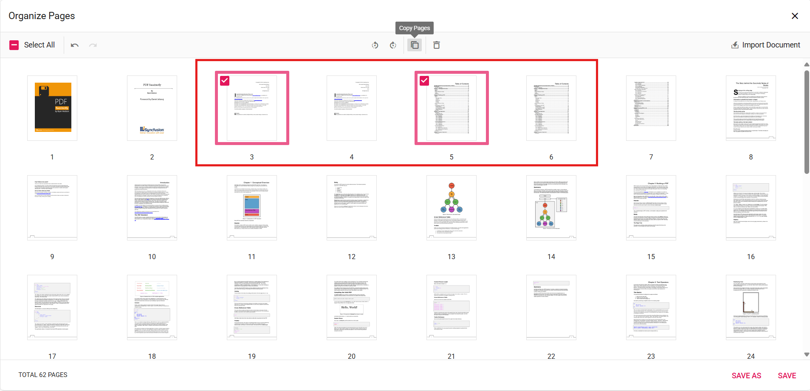

# Copy Pages in ASP.NET Core PDF Viewer

## Overview

This guide explains how to duplicate pages within the current PDF using the Organize Pages UI.

**Outcome**: Copied pages are inserted adjacent to the selection and included in exported PDFs.

## Prerequisites

- Syncfusion ASP.NET Core PDF Viewer installed and added to your project. See [getting started guide](../getting-started).
- The viewer is configured with [`resourceUrl`](https://help.syncfusion.com/cr/aspnetcore-js2/Syncfusion.EJ2.PdfViewer.PdfViewer.html#Syncfusion_EJ2_PdfViewer_PdfViewer_ResourceUrl) (standalone) or [`serviceUrl`](https://help.syncfusion.com/cr/aspnetcore-js2/Syncfusion.EJ2.PdfViewer.PdfViewer.html#Syncfusion_EJ2_PdfViewer_PdfViewer_ServiceUrl) (server-backed) as required.

## Steps

1. Open the Organize Pages view

    - Click the **Organize Pages** button in the viewer toolbar to open the Organize Pages dialog.

2. Select pages to duplicate

    - Click a single thumbnail or use Shift+click/Ctrl+click to select multiple pages.

3. Duplicate selected pages

    - Click the **Copy Pages** button in the Organize Pages toolbar; duplicated pages are inserted to the right of the selected thumbnails.

4. Duplicate multiple pages at once

    - When multiple thumbnails are selected, the Copy action duplicates every selected page in order.

    

5. Undo or redo changes

    - Use **Undo** (Ctrl+Z) or **Redo** to revert or reapply recent changes.

    

6. Persist duplicated pages

    - Click **Save** or **Save As** to include duplicated pages in the saved/downloaded PDF.

## Expected result

- Selected pages are duplicated and included in the saved PDF.

## Enable or disable Copy Pages button

To enable or disable the **Copy Pages** button in the Organize Pages toolbar, update the `pageOrganizerSettings`. See [Organize pages toolbar customization](./toolbar#show-or-hide-the-copy-option) for the guidelines.




    <ejs-pdfviewer id="pdfviewer"
                   style="height:600px"
                   documentPath="https://cdn.syncfusion.com/content/pdf/pdf-succinctly.pdf"
                   pageOrganizerSettings="@(new { canCopy= false })">
    </ejs-pdfviewer>




## Troubleshooting

- If duplicates are not created: verify that the changes are persisted using **Save**.

## Related topics

- [Organize pages toolbar customization](./toolbar)
- [Organize pages event reference](./events)
