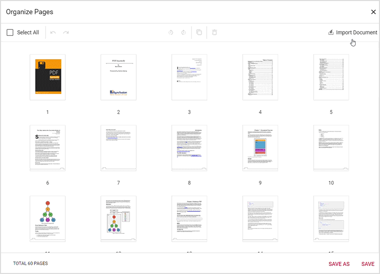

# Import Pages in ASP.NET Core PDF Viewer

## Overview

This guide explains how to import pages from another PDF into the current document using the **Organize Pages** UI in the ASP.NET Core PDF Viewer.

**Outcome**: Imported pages appear as thumbnails and are merged into the original document when saved or exported.

## Prerequisites

- Syncfusion ASP.NET Core PDF Viewer installed and added to your project. See [getting started guide](../getting-started).
- The viewer is configured with [`resourceUrl`](https://help.syncfusion.com/cr/aspnetcore-js2/Syncfusion.EJ2.PdfViewer.PdfViewer.html#Syncfusion_EJ2_PdfViewer_PdfViewer_ResourceUrl) (standalone) or [`serviceUrl`](https://help.syncfusion.com/cr/aspnetcore-js2/Syncfusion.EJ2.PdfViewer.PdfViewer.html#Syncfusion_EJ2_PdfViewer_PdfViewer_ServiceUrl) (server-backed) as required.

## Steps

1. Open the Organize Pages view

    - Click the **Organize Pages** button in the viewer navigation toolbar to open the Organize Pages dialog.

2. Start import

    - Click **Import Document** and choose a valid PDF file from your local file system.

3. Place imported pages

    - Imported pages appear as thumbnails. If a thumbnail is selected, the imported pages are inserted to the right of the selection; otherwise they are appended at the start of the document.

    

4. Persist changes

    - Click **Save** or **Save As** (or download) to persist the merged document.

## Expected result

- Imported pages display as thumbnails in Organize Pages and are merged into the original PDF when saved or exported.

## Enable or disable Import Pages button

To enable or disable the **Import Pages** button in the Organize Pages toolbar, update the `pageOrganizerSettings`. See [Organize pages toolbar customization](./toolbar#show-or-hide-the-import-option) for the guidelines.




    <ejs-pdfviewer id="pdfviewer"
                   style="height:600px"
                   documentPath="https://cdn.syncfusion.com/content/pdf/pdf-succinctly.pdf"
                   pageOrganizerSettings="@(new { canImport= false })">
    </ejs-pdfviewer>




## Troubleshooting

- **Import fails**: Ensure the selected file is a valid PDF and the browser file picker is permitted.
- **Imported pages not visible**: Confirm that the import is persisted using **Save** or **Save As**.
- **Import option disabled**: Ensure `pageOrganizerSettings.canImport` is set to `true` to enable import option.

## Related topics

- [Organize pages toolbar customization](./toolbar)
- [Organize pages event reference](./events)
