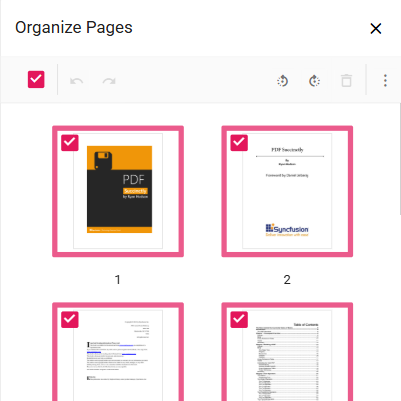

# Organize Pages in Mobile PDF Viewer ASP.NET Core

The PDF Viewer provides a mobile-responsive layout for `Organize Pages`, optimized for touch interactions. Controls adapt to device viewport for phones and tablets.

## Mobile-Friendly Toolbar

In mobile view, the `Organize Pages` toolbar appears at the bottom for one-handed access. Tools include insert, delete, and rotate functions in a touch-optimized arrangement.

## Context Menu for Page Operations

To perform actions on a page thumbnail, tap and hold on the thumbnail to open a context menu. This menu contains all the available page operations:

* **Rotate Clockwise:** Rotates the selected page 90 degrees clockwise.
* **Rotate Counter-Clockwise:** Rotates the selected page 90 degrees counter-clockwise.
* **Insert Page:** Inserts a new page.
* **Copy Page:** Duplicates the selected page.
* **Delete Page:** Removes the selected page.
* **Select All:** Selects all pages in the document.

## Rearranging Pages on Mobile

Tap and hold a page thumbnail to select, then drag to the desired position. A blue line indicates drop location.

The mobile interface enables efficient page management on phones and tablets with full feature parity to desktop.
