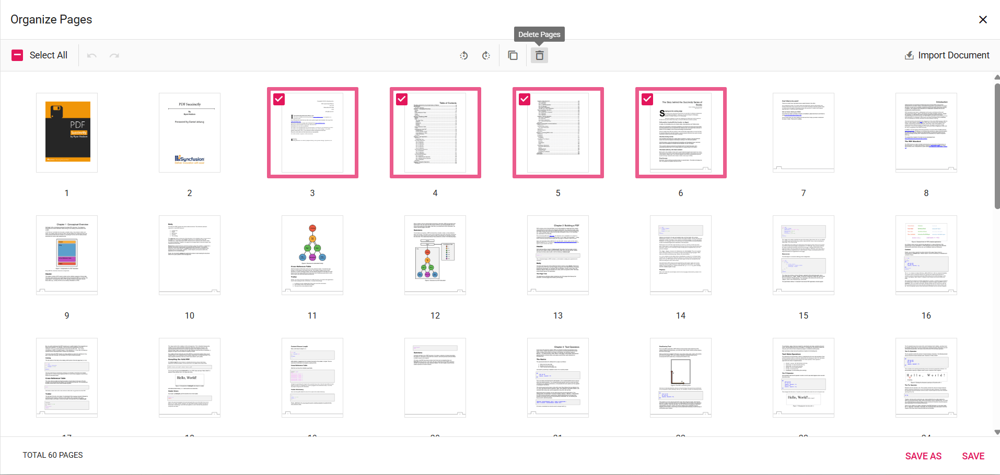

# Remove Pages in ASP.NET Core PDF Viewer

## Overview

This guide shows how to delete single or multiple pages from a PDF using the **Organize Pages** UI in the ASP.NET Core PDF Viewer.

**Outcome**: You will remove unwanted pages and save or download the updated PDF.

## Prerequisites

- Syncfusion ASP.NET Core PDF Viewer installed and added to your project. See [getting started guide](../getting-started).
- Basic PDF Viewer setup ([`resourceUrl`](https://help.syncfusion.com/cr/aspnetcore-js2/Syncfusion.EJ2.PdfViewer.PdfViewer.html#Syncfusion_EJ2_PdfViewer_PdfViewer_ResourceUrl) for standalone mode or [`serviceUrl`](https://help.syncfusion.com/cr/aspnetcore-js2/Syncfusion.EJ2.PdfViewer.PdfViewer.html#Syncfusion_EJ2_PdfViewer_PdfViewer_ServiceUrl) for server-backed mode).

## Steps

1. Open the Organize Pages view

    - Click the **Organize Pages** button in the viewer navigation toolbar to open the Organize Pages dialog.

2. Select pages to remove

    - Click a thumbnail to select a page. Use Shift+click or Ctrl+click to select multiple pages. Use the **Select all** button to select every page.

3. Delete selected pages

    - Click the **Delete Pages** icon in the Organize Pages toolbar to remove the selected pages. The thumbnails update immediately to reflect the deletion.

    - Delete a single page directly from its thumbnail: hover over the page thumbnail to reveal the per-page delete icon, then click that icon to remove only that page.

    

4. Multi-page deletion

    - When multiple thumbnails are selected, the Delete action removes all selected pages at once.

5. Undo or redo deletion

    - Use **Undo** (Ctrl+Z) to revert the last deletion.
    - Use **Redo** (Ctrl+Y) to revert the last undone deletion.

    

6. Save the PDF after deletion

    - Click **Save** to apply changes to the currently loaded document, or **Save As** / **Download** to download a copy with the removed pages permanently applied.

## Expected result

- Selected pages are removed from the document immediately in the Organize Pages dialog.
- After clicking **Save** or **Save As**, the resulting PDF reflects the deletions.

## Enable or disable Remove Pages button

To enable or disable the **Remove Pages** button in the Organize Pages toolbar, update the `pageOrganizerSettings`. See [Organize pages toolbar customization](./toolbar#show-or-hide-the-delete-option) for the guidelines.




    <ejs-pdfviewer id="pdfviewer"
                   style="height:600px"
                   documentPath="https://cdn.syncfusion.com/content/pdf/pdf-succinctly.pdf"
                   pageOrganizerSettings="@(new { canDelete= false })">
    </ejs-pdfviewer>




## Troubleshooting

- **Delete button disabled**: Ensure the page organizer is enabled and `pageOrganizerSettings.canDelete` is not set to `false`.
- **Selection not working**: Verify that the Organize Pages dialog has focus; use Shift+click for range selection.

## Related topics

- [Organize pages toolbar customization](./toolbar)
- [Organize pages event reference](./events)
