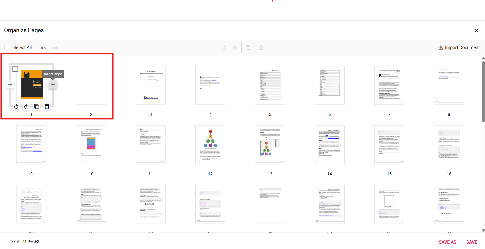

# UI Interactions for Organizing Pages in ASP.NET Core PDF Viewer

The PDF Viewer provides an intuitive interface for organizing pages with the following UI interactions.

## Rotating PDF pages

Adjust page orientation using the rotate controls in the Organize Pages dialog.

* **Rotate clockwise:** Rotates selected pages 90 degrees clockwise.
* **Rotate counter-clockwise:** Rotates selected pages 90 degrees counter-clockwise.

## Rearranging PDF pages

Change page sequence with drag-and-drop.

* **Drag and drop:** Drag a thumbnail to the desired position and release to reorder.

## Inserting new pages

Add blank pages at the required position.

* **Insert blank page left** Inserts a blank page to the left of the selected page.
* **Insert blank page right** Inserts a blank page to the right of the selected page.

## Deleting PDF pages

Remove unwanted pages from the document:

1. **Select pages to delete:** Click or tap thumbnails to select pages; multiple selection is supported.
2. **Delete selected pages:** Use the delete option to remove selected pages.

## Copying PDF pages

Duplicate pages within your PDF document effortlessly:

* **Select pages to copy:** Click or tap thumbnails to select pages to duplicate.
* **Copy selected pages:** Copied pages insert to the right of the selection.

## Importing a PDF document

Import another PDF document into the current document:

* **Import PDF Document:** Click **Import Document** to select and import a PDF. Imported pages appear as thumbnails and insert to the right of selection (or at start if none selected). Pages merge when saved.

## Selecting all pages

Select all pages for bulk operations such as rotation or deletion.

## Zooming page thumbnails

Adjust thumbnail size for better visibility:

* Use the zoom slider to adjust thumbnail size.
* Zoom in for detailed page view.
* Zoom out to display more pages simultaneously.

## Real-time updates and saving

Changes display instantly. Click **Save** to apply changes or **Save As** to download an updated copy.

## Keyboard shortcuts

The following keyboard shortcuts are available:

* **Ctrl+Z:** Undo the previous action.
* **Ctrl+Y:** Redo the last undone action.
* **Ctrl+Scroll:** Zoom thumbnails in or out.

