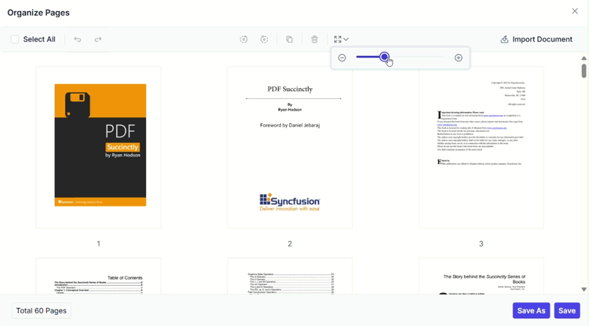

# Zoom Pages in Organize Pages in ASP.NET Core PDF Viewer

## Overview

This guide explains how to change the thumbnail zoom level in the **Organize Pages** UI so you can view more detail or an overview of more pages.

**Outcome**: Page thumbnails resize interactively to suit your task.

## Prerequisites

- Syncfusion ASP.NET Core PDF Viewer installed and added to your project. See [getting started guide](../getting-started).
- The viewer is configured with [`resourceUrl`](https://help.syncfusion.com/cr/aspnetcore-js2/Syncfusion.EJ2.PdfViewer.PdfViewer.html#Syncfusion_EJ2_PdfViewer_PdfViewer_ResourceUrl) (standalone) or [`serviceUrl`](https://help.syncfusion.com/cr/aspnetcore-js2/Syncfusion.EJ2.PdfViewer.PdfViewer.html#Syncfusion_EJ2_PdfViewer_PdfViewer_ServiceUrl) (server-backed).
- `pageOrganizerSettings.showImageZoomingSlider` is set to `true`.

## Steps

1. Open the Organize Pages view

    - Click the **Organize Pages** button in the viewer toolbar to open the thumbnails panel.

2. Locate the zoom control

    - Find the thumbnail zoom slider in the Organize Pages toolbar.

3. Adjust zoom

    - Drag the slider to increase or decrease thumbnail size.

    

4. Choose an optimal zoom level

    - Select a zoom level that balances page detail and the number of visible thumbnails for your task.

## Expected result

- Thumbnails resize interactively; larger thumbnails show more detail while smaller thumbnails allow viewing more pages at once.

## Show or hide Zoom Pages slider

To enable or disable the **Zoom Pages** slider in the Organize Pages toolbar, update the `pageOrganizerSettings`. See [Organize pages toolbar customization](./toolbar#show-or-hide-the-zoom-pages-option) for the guidelines.




    <ejs-pdfviewer id="pdfviewer"
                   style="height:600px"
                   documentPath="https://cdn.syncfusion.com/content/pdf/pdf-succinctly.pdf"
                   pageOrganizerSettings="@(new { showImageZoomingSlider= false })">
    </ejs-pdfviewer>




## Troubleshooting

- **Zoom control not visible**: Confirm `pageOrganizerSettings.showImageZoomingSlider` is set to `true`.

## Related topics

- [Organize pages toolbar customization](./toolbar)
- [Organize pages event reference](./events)
