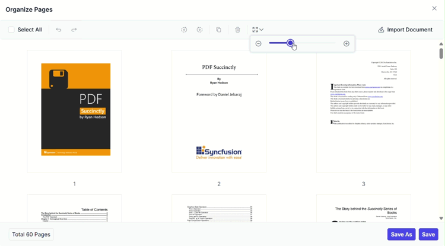

# Organize Pages in PDF Viewer

The ASP.NET Core PDF Viewer provides comprehensive page organization capabilities for efficient document management. Users can seamlessly modify PDF documents by rotating pages, rearranging their order, inserting new pages, deleting unwanted pages, copying and duplicating pages, and importing additional PDF documents. These features empower users to customize and restructure PDF documents directly within the viewer without requiring external tools.

## Getting started

The page organizer is accessed through the left vertical toolbar of the PDF Viewer. When opened, it displays a panel with thumbnail representations of all pages in the document, along with tools for performing various page management operations.

**To access the page organizer:**

1. Open a PDF document in the PDF Viewer
2. Navigate to the left vertical toolbar
3. Click the **Organize Pages** icon to open the page organizer panel
4. The organizer displays page thumbnails with options for managing pages

The page organizer supports comprehensive page management operations. All actions are performed on page thumbnails within the organizer panel and can be saved to create a modified version of the PDF document.

### Rotating PDF pages

Rotate page orientation to ensure proper alignment and readability. This is useful for pages scanned at incorrect angles or documents with mixed orientations.

**Rotation options:**
- **Rotate clockwise**: Rotate selected pages 90 degrees clockwise
- **Rotate counter-clockwise**: Rotate selected pages 90 degrees counter-clockwise

You can rotate single or multiple pages at once. Simply select the pages and use the rotation buttons in the organizer toolbar.

### Rearranging PDF pages

Change the sequence of pages within your document using intuitive drag-and-drop functionality.

**To rearrange pages:**
1. Click and hold on a page thumbnail
2. Drag it to the desired position within the document
3. Release the mouse to drop the page in its new location

### Inserting new pages

Add blank pages to your document at specific locations. This is useful for adding cover pages, separators, or additional content.

**Insert page options:**
- **Insert blank page left**: Add a blank page to the left of the selected page
- **Insert blank page right**: Add a blank page to the right of the selected page

### Deleting PDF pages

Remove unwanted pages from your document efficiently.

**To delete pages:**
1. Click on the page thumbnails you wish to remove
2. Click the **Delete** button in the organizer toolbar
3. The selected pages are immediately removed from the document

You can select and delete single or multiple pages at once, making bulk cleanup operations fast and efficient.

### Copying PDF pages

Duplicate pages within your PDF document to reuse content.

**To copy pages:**
1. Click on the page thumbnails you wish to duplicate
2. Click the **Copy** button in the organizer toolbar
3. The duplicated page automatically appears to the right of the selected page
4. Multiple copies can be created by repeating the process

This feature is useful for creating variations of pages or duplicating important content within the same document.

### Importing a PDF Document

Merge multiple PDF documents by importing one into another:

**To import a PDF document:**
1. Click the **Import Document** button in the organizer toolbar
2. Select the PDF file to import from your file system
3. The imported document's pages are inserted based on page selection:
   - If a page is selected: imported pages appear to the right of the selected page
   - If multiple pages or no pages are selected: imported pages become the first pages
4. Use drag-and-drop to reposition imported pages as needed
5. Click **Save** or **Save As** to merge the documents permanently

After import, you can manage the imported pages just like any other pages in the document—rotate them, delete unwanted pages, or rearrange them.

### Selecting all pages

Perform bulk operations on all pages simultaneously. This is especially useful for applying operations to the entire document.

**To select all pages:**
- Click the **Select All** button in the organizer toolbar, or
- Press <kbd>Ctrl+A</kbd> to select all pages at once

After selecting all pages, you can perform actions like rotating, copying, or deleting all pages in one operation.

### Zooming page thumbnails

Adjust the size of page thumbnails for better visibility and precision when organizing pages. This is particularly useful for documents with complex layouts or small details.

* Increase or decrease the size of page thumbnails using the zoom slider
* See more details on pages when zoomed in
* View more pages simultaneously when zoomed out

Zooming helps you identify pages accurately, especially in large documents, and makes it easier to select and manipulate specific pages.

### Real-time updates

After organizing your PDF pages, save your modifications to preserve the changes.

**Save options:**
- **Save**: Update the current document with the page changes
- **Save As**: Download a new copy of the modified PDF document with a different filename

Real-time updates reflect all your page organization changes (rotations, rearrangements, deletions, insertions, etc.) immediately in the PDF Viewer. Simply click **Save** or **Save As** when you're ready to finalize your changes.

## API's supported

The page organizer feature provides several APIs for programmatic control and configuration of page organization capabilities.

### enablePageOrganizer

Enables or disables the page organizer feature in the PDF Viewer. When disabled, users cannot access page organization tools.

**Default value:** `true` (page organizer is enabled)

**Example: Enabling page organizer**




    <ejs-pdfviewer id="pdfviewer"
                   style="height:600px"
                   documentPath="https://cdn.syncfusion.com/content/pdf/pdf-succinctly.pdf"
                   enablePageOrganizer="true">
    </ejs-pdfviewer>




    <ejs-pdfviewer id="pdfviewer"
                   style="height:600px"
                   serviceUrl="/api/PdfViewer"
                   documentPath="https://cdn.syncfusion.com/content/pdf/pdf-succinctly.pdf"
                   enablePageOrganizer="true">
    </ejs-pdfviewer>




### isPageOrganizerOpen

Determines whether the page organizer panel is displayed automatically when a document is loaded into the PDF Viewer. This setting controls the initial state of the organizer panel.

**Default value:** `false`

**Example: Opening page organizer automatically**




    <ejs-pdfviewer id="pdfviewer"
                   style="height:600px"
                   documentPath="https://cdn.syncfusion.com/content/pdf/pdf-succinctly.pdf"
                   isPageOrganizerOpen="true">
    </ejs-pdfviewer>




    <ejs-pdfviewer id="pdfviewer"
                   style="height:600px"
                   serviceUrl="/api/PdfViewer"
                   documentPath="https://cdn.syncfusion.com/content/pdf/pdf-succinctly.pdf"
                   isPageOrganizerOpen="true">
    </ejs-pdfviewer>




### pageOrganizerSettings

Provides granular control over page organizer features and thumbnail display. This API allows you to enable/disable specific page management actions and configure thumbnail zoom behavior.

**Example: Configuring page organizer settings**




    <ejs-pdfviewer id="pdfviewer"
                   style="height:600px"
                   documentPath="https://cdn.syncfusion.com/content/pdf/pdf-succinctly.pdf"
                   pageOrganizerSettings= pageOrganizerSettings="@(new Syncfusion.EJ2.PdfViewer.PdfViewerPageOrganizerSettings
                   {canDelete: true, canInsert: true, canRotate: true, canCopy: true, canRearrange: true, canImport: true, imageZoom: 1, showImageZoomingSlider: true, imageZoomMin: 1, imageZoomMax: 5 })">
    </ejs-pdfviewer>




    <ejs-pdfviewer id="pdfviewer"
                   style="height:600px"
                   serviceUrl="/api/PdfViewer"
                   documentPath="https://cdn.syncfusion.com/content/pdf/pdf-succinctly.pdf"
                   pageOrganizerSettings= pageOrganizerSettings="@(new Syncfusion.EJ2.PdfViewer.PdfViewerPageOrganizerSettings
                   {canDelete: true, canInsert: true, canRotate: true, canCopy: true, canRearrange: true, canImport: true, imageZoom: 1, showImageZoomingSlider: true, imageZoomMin: 1, imageZoomMax: 5 })">
    </ejs-pdfviewer>




### openPageOrganizer

Programmatically opens the page organizer panel. Use this API to provide users with a way to open the organizer from custom UI elements or based on application logic.

**Example: Opening page organizer from a button**




<button type="button" onclick="closePageOrganizer()">Close PageOrganizer Pane</button>

    <ejs-pdfviewer id="pdfviewer"
                   style="height:600px"
                   documentPath="https://cdn.syncfusion.com/content/pdf/pdf-succinctly.pdf"
                   resourceUrl="https://cdn.syncfusion.com/ej2/24.1.41/dist/ej2-pdfviewer-lib">
    </ejs-pdfviewer>




<button type="button" onclick="closePageOrganizer()">Close PageOrganizer Pane</button>

    <ejs-pdfviewer id="pdfviewer"
                   style="height:600px"
                   serviceUrl='/Index'
                   documentPath="https://cdn.syncfusion.com/content/pdf/pdf-succinctly.pdf">
    </ejs-pdfviewer>







<button type="button" onclick="openPageOrganizer()">Open PageOrganizer Pane</button>

    @Html.EJS().PdfViewer("pdfviewer").DocumentPath("https://cdn.syncfusion.com/content/pdf/hive-succinctly.pdf").Render()




<button type="button" onclick="openPageOrganizer()">Open PageOrganizer Pane</button>

    @Html.EJS().PdfViewer("pdfviewer").ServiceUrl(VirtualPathUtility.ToAbsolute("~/api/PdfViewer/")).DocumentPath("https://cdn.syncfusion.com/content/pdf/hive-succinctly.pdf").Render()




### closePageOrganizer

Programmatically closes the page organizer panel. Use this API to dismiss the organizer when users are done managing pages or to control the UI based on application logic.

**Example: Closing page organizer from a button**




<button type="button" onclick="closePageOrganizer()">Close PageOrganizer Pane</button>

    <ejs-pdfviewer id="pdfviewer"
                   style="height:600px"
                   documentPath="https://cdn.syncfusion.com/content/pdf/pdf-succinctly.pdf"
                   resourceUrl="https://cdn.syncfusion.com/ej2/24.1.41/dist/ej2-pdfviewer-lib">
    </ejs-pdfviewer>




<button type="button" onclick="closePageOrganizer()">Close PageOrganizer Pane</button>

    <ejs-pdfviewer id="pdfviewer"
                   style="height:600px"
                   serviceUrl='/Index'
                   documentPath="https://cdn.syncfusion.com/content/pdf/pdf-succinctly.pdf">
    </ejs-pdfviewer>




## Keyboard shortcuts

Keyboard shortcuts are available in the page organizer to improve productivity and accessibility.

* **Ctrl+Z** : Undo the last action performed.
* **Ctrl+Y** : Redo the action that was undone
* **Ctrl+Scroll** : Zoom in and zoom out page thumbnails for better visibility.

These shortcuts enable efficient keyboard-based navigation and operations, making the page organizer accessible to power users and those who prefer keyboard interaction.

#### Conclusion

With the Organize Pages feature in the PDF Viewer, managing your PDF documents has never been easier. Whether you are adding new content, adjusting page orientation, moving the pages, duplicating the pages, or removing unnecessary pages, this feature provides the tools you need to streamline your document management workflow. Explore these capabilities today and take control of your PDF documents with ease!

[View sample in GitHub](https://github.com/SyncfusionExamples/asp-core-pdf-viewer-examples/tree/master/How%20to/Organize%20pdf)