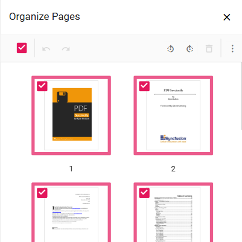

# Organize Pages in Mobile PDF Viewer

The PDF Viewer offers a mobile-responsive layout for the `Organize Pages` feature, ensuring a seamless experience on smaller devices. When viewed on a mobile device, the toolbar and navigation elements adapt to the screen size, providing easy access to all page management tools.

## Mobile-Friendly Toolbar

In the mobile view, the `Organize Pages` toolbar is displayed at the bottom of the screen for easy one-handed access. The toolbar includes the same set of tools as the desktop version, such as insert, delete, and rotate, but with a mobile-optimized layout.

## Context Menu for Page Operations

To perform actions on a page thumbnail, tap and hold on the thumbnail to open a context menu. This menu contains all the available page operations:

*   **Rotate Clockwise**: Rotate the selected page 90 degrees clockwise.
*   **Rotate Counter-Clockwise**: Rotate the selected page 90 degrees counter-clockwise.
*   **Insert Page**: Insert a new page.
*   **Copy Page**: Duplicate the selected page.
*   **Delete Page**: Remove the selected page.
*   **Select All**: Select all pages in the document.

## Rearranging Pages on Mobile

To rearrange pages, tap and hold a page thumbnail to select it, then drag it to the desired position. A blue line will indicate the drop location.

By providing a mobile-friendly interface, the PDF Viewer ensures that users can efficiently manage their PDF documents from any device, anywhere.
