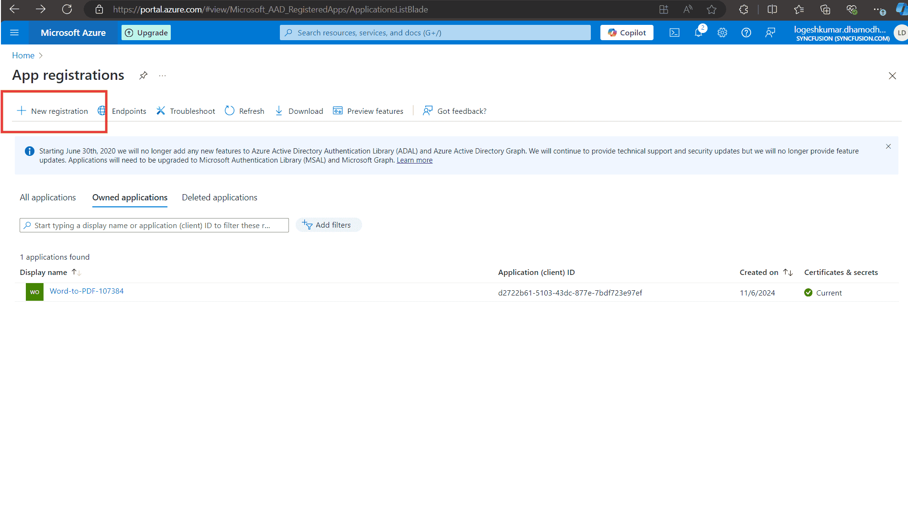

# Save PDF files to Azure Active Directory (AAD)

### **Overview**

The ASP.NET Core PDF Viewer component supports loading and saving PDF files with Azure Active Directory (AAD). The following steps describe how to securely load and store PDF documents using a server-backed web service.

### **Step 1: Register an application in Azure Active Directory (AAD)**

1. **Go to the Azure portal**:
   - Navigate to [Azure Portal](https://portal.azure.com).

2. **Register the application**:
   - In the Azure portal, go to **Azure Active Directory** > **App registrations** > **New registration**.
   - Register your application and note down the **Application (client) ID** and **Directory (tenant) ID**.

   

3. **Create a client secret**:
   - In the registered application, go to **Certificates & secrets**.
   - Click **New client secret**.
   - Provide a description and set an expiration period.
   - Click **Add**.
   - Copy the client secret value immediately, as it will be hidden later. Store it securely.

   

### **Step 2: Create the Azure Storage account**

1. **Create a storage account**:
   - In the Azure portal, use the search bar to search for **Storage accounts**.
   - Create a new storage account by filling in the required details (e.g., name, location, resource group, etc.).

    

### **Step 3: Assign a role to the application**

1. **Go to the storage account**:
   - Navigate to **Access control (IAM)** > **Add role assignment** in your Azure Storage Account.

2. **Assign a role**:
   - Assign the **Storage Blob Data Contributor** role to your registered application.
   - In the **Assign access to** dropdown, select **User, group, or service principal**.
   - Click on **Select members** and search for your registered application by name or client ID.
   - Select your application and click **Select**.
   - Click **Review + assign** to finalize the role assignment.

    

### **Step 4: Upload the PDF document to Azure Storage**

1. **Navigate to Data storage**:
   - In the Azure portal, go to **Data storage** > **Containers**.

2. **Upload the PDF file**:
   - Create a new container and upload the PDF document you want to access in the PDF Viewer.

    

### **Step 5: Server-side configuration**

1. **Configure server-side code**:
   - Open the server-side application (e.g., ASP.NET Core) and configure the following details in the `PdfViewerController` file:
     - `tenantId` (your Azure AD tenant ID),
     - `clientId` (your registered application client ID),
     - `clientSecret` (your registered application client secret),
     - `blobServiceEndpoint` (your storage account blob service URL),
     - `containerName` (your container name in Azure Blob Storage).

2. **Run the web service**:
   - After configuring the necessary details, run the web service to make it accessible.

### **Client-side configuration**

1. **Run the ASP.NET Core sample**:
   - Start the ASP.NET Core (Razor) sample that includes the Syncfusion PDF Viewer.

2. **Load a PDF from AAD**:
   - When the user clicks the **Load from AAD** button, the client-side JavaScript will make an HTTP request to the server-side API to fetch the PDF from Azure Blob Storage.
   - The server will retrieve the PDF from Azure, convert it to a Base64 string, and return it to the client.

3. **Display the PDF in the PDF Viewer**:
   - Once the Base64 string is received, the PDF Viewer will load the PDF using the `viewer.load()` method.

### **Save the PDF document to Azure**

1. Save PDF to AAD:
   - The user can click the **Save to AAD** button to upload any modifications to the PDF back to Azure Blob Storage.
   - This action sends the modified PDF to the server, where it is converted into a byte array and saved to the specified Azure Blob container.

### **Server-side code snippets**




using Azure.Identity;
using Azure.Storage.Blobs;

string tenantId = "YOUR_TENANT_ID";
string clientId = "YOUR_CLIENT_ID";
string clientSecret = "YOUR_CLIENT_SECRET";
string blobServiceEndpoint = "https://your-storage-account.blob.core.windows.net";
string containerName = "your-container-name";

 public async Task<IActionResult> OnGetLoadFromAAD(string fileName)
 {
     var clientSecretCredential = new ClientSecretCredential(tenantId, clientId, clientSecret);
     var blobServiceClient = new BlobServiceClient(new Uri(blobServiceEndpoint), clientSecretCredential);
     var containerClient = blobServiceClient.GetBlobContainerClient(containerName);
     var blobClient = containerClient.GetBlobClient(fileName);

     // Download the PDF file to a local stream
     using MemoryStream pdfStream = new MemoryStream();
     await blobClient.DownloadToAsync(pdfStream);
     var base64 = Convert.ToBase64String(pdfStream.ToArray());
     return Content("data:application/pdf;base64," + base64);
 }

 public async Task<IActionResult> OnPostSaveToAAD([FromBody]jsonObjects responseData)
 {
     var jsonObject = JsonConverterstring(responseData);
     PdfRenderer pdfviewer = new PdfRenderer(_cache);
     var fileName = jsonObject.ContainsKey("documentId") ? jsonObject["documentId"] : "Test.pdf";
     string documentBase = pdfviewer.GetDocumentAsBase64(jsonObject);
     string convertedBase = documentBase.Substring(documentBase.LastIndexOf(',') + 1);
     // Decode the Base64 string to a byte array
     byte[] byteArray = Convert.FromBase64String(convertedBase);
     // Create a MemoryStream from the byte array
     MemoryStream stream = new MemoryStream(byteArray);
     // Create a new BlobServiceClient using the DefaultAzureCredential
     var clientSecretCredential = new ClientSecretCredential(tenantId, clientId, clientSecret);
     var blobServiceClient = new BlobServiceClient(new Uri(blobServiceEndpoint), clientSecretCredential);
     // Get a reference to the container
     var containerClient = blobServiceClient.GetBlobContainerClient(containerName);
     // Get a reference to the blob
     var blobClient = containerClient.GetBlobClient(fileName);
     //FileStream uploadFileStream = new FileStream();
     await blobClient.UploadAsync(stream, true);
     stream.Close();
     return Content(string.Empty);
 }







@page "{handler?}"
@model IndexModel
@{
    ViewData["Title"] = "Home page";
}

    <!-- Custom buttons for Load and Save -->
    

        <button id="loadFromAADButton" class="e-btn" style="margin-right: 10px;">Load From AAD</button>
        <button id="saveToAADButton" class="e-btn">Save To AAD</button>
    

    <ejs-pdfviewer id="pdfviewer" style="height:600px" serviceUrl="/Index" documentPath="https://cdn.syncfusion.com/content/pdf/pdf-succinctly.pdf">
    </ejs-pdfviewer>




[View sample in GitHub](https://github.com/SyncfusionExamples/open-save-pdf-documents-in-aad).
