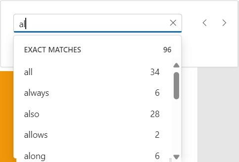
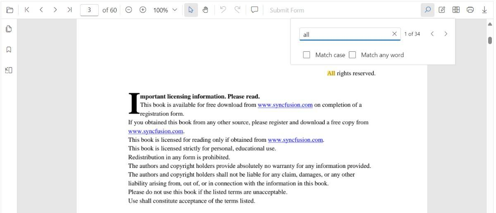

# Text Search in ASP.NET Core PDF Viewer

The Text Search feature in the PDF Viewer allows users to find and highlight text content across document pages.

## Enable text search

Text search can be enabled or disabled using the `enableTextSearch` property. The following code snippet shows how to enable text search functionality:




<div style="width:100%;height:600px">
    <ejs-pdfviewer id="pdfviewer"
                   style="height:600px"
                   documentPath="https://cdn.syncfusion.com/content/pdf/pdf-succinctly.pdf"
                   enableTextSearch="true">
    </ejs-pdfviewer>
</div>




<div style="width:100%;height:600px">
    <ejs-pdfviewer id="pdfviewer"
                   style="height:600px"
                   serviceUrl="/api/PdfViewer"
                   documentPath="https://cdn.syncfusion.com/content/pdf/pdf-succinctly.pdf"
                   enableTextSearch="true">
    </ejs-pdfviewer>
</div>





## Text search features

The PDF Viewer includes comprehensive text search capabilities designed to help users quickly locate and navigate through document content.

### Real-time search suggestions

As you type into the search input, the PDF Viewer dynamically displays search suggestions based on the current input. Suggestions are updated in real-time, providing quick access to potential matches from the available content.



### Search result navigation

After entering text into the search input, the search popup displays all relevant suggestions. Select any suggestion to navigate directly to that occurrence in the document, with the matched text highlighted for easy visibility.



### Case-sensitive search

The **Match Case** option enables case-sensitive searching. When enabled, only exact case-sensitive matches are highlighted in the document.


### Case-insensitive search

By default, without the **Match Case** option enabled, all instances of the search text are highlighted regardless of case. This allows you to find every occurrence of a term.


### Match any word in a phrase

The **Match Any Word** option splits the entered text into individual words based on spaces. As you type, the search popup displays suggestions for each individual word in real-time, highlighting potential matches within the document.


## Programmatic search with settings

While the PDF Viewer's toolbar provides a user-friendly search interface, you can also trigger and customize searches programmatically using the `textSearch.searchText()` method.

#### Using `searchText`

The `searchText` method allows you to initiate a search with specific criteria.

**Example: Basic programmatic search**

```typescript
// searchText(text: string, isMatchCase?: boolean, isMatchWholeWord?: boolean)
pdfviewer.textSearch.searchText('search text', false, false);
```

### Case-sensitive programmatic search

To perform a case-sensitive search, set the `isMatchCase` parameter to `true`. This searches for exact case matches only, corresponding to the **Match Case** checkbox in the search panel.




<button type="button" onclick="searchText()">Search Text</button>
<div style="width:100%;height:600px">
    <ejs-pdfviewer id="pdfviewer"
                   style="height:600px"
                   documentPath="https://cdn.syncfusion.com/content/pdf/pdf-succinctly.pdf"
                   resourceUrl="https://cdn.syncfusion.com/ej2/31.1.17/dist/ej2-pdfviewer-lib"">
    </ejs-pdfviewer>
</div>

<script>
    function searchText() {
        var pdfViewer = document.getElementById('pdfviewer').ej2_instances[0];
        pdfViewer.textSearch.searchText('PDF', true);
    }
</script>




<button type="button" onclick="searchText()">Search Text</button>
<div style="width:100%;height:600px">
    <ejs-pdfviewer id="pdfviewer"
                   style="height:600px"
                   documentPath="https://cdn.syncfusion.com/content/pdf/pdf-succinctly.pdf"
                   resourceUrl="https://cdn.syncfusion.com/ej2/31.1.17/dist/ej2-pdfviewer-lib""
                   serviceUrl="/api/PdfViewer">
    </ejs-pdfviewer>
</div>

<script>
    function searchText() {
        var pdfViewer = document.getElementById('pdfviewer').ej2_instances[0];
        pdfViewer.textSearch.searchText('PDF', true);
    }
</script>




#### Match Whole Word

You can search for complete words only by setting the `isMatchWholeWord` parameter to `true`. When enabled, the search matches only when the search term appears as a complete word, not as part of a larger word.




<button type="button" onclick="searchText()">Search Text</button>
<div style="width:100%;height:600px">
    <ejs-pdfviewer id="pdfviewer"
                   style="height:600px"
                   documentPath="https://cdn.syncfusion.com/content/pdf/pdf-succinctly.pdf"
                   resourceUrl="https://cdn.syncfusion.com/ej2/31.1.17/dist/ej2-pdfviewer-lib"">
    </ejs-pdfviewer>
</div>

<script>
    function searchText() {
        var pdfViewer = document.getElementById('pdfviewer').ej2_instances[0];
        pdfViewer.textSearch.searchText('pdf', false, true);
    }
</script>




<button type="button" onclick="searchText()">Search Text</button>
<div style="width:100%;height:600px">
    <ejs-pdfviewer id="pdfviewer"
                   style="height:600px"
                   documentPath="https://cdn.syncfusion.com/content/pdf/pdf-succinctly.pdf"
                   resourceUrl="https://cdn.syncfusion.com/ej2/31.1.17/dist/ej2-pdfviewer-lib""
                   serviceUrl="/api/PdfViewer">
    </ejs-pdfviewer>
</div>

<script>
    function searchText() {
        var pdfViewer = document.getElementById('pdfviewer').ej2_instances[0];
        pdfViewer.textSearch.searchText('pdf', false, true);
    }
</script>




**Note on 'Match Any Word':**

The **Match Any Word** UI option differs from the `isMatchWholeWord` parameter:
- **Match Any Word (UI only):** Splits input into individual words and searches for each separately.
- **isMatchWholeWord (API):** Enforces whole-word matching for the complete search string provided.

The following text search methods are available in the PDF Viewer,

* **Search text** - Searches the target text in the PDF document and highlights the occurrences in the pages.
* **Search next** - Searches the next occurrence of the searched text from the current occurrence of the PdfViewer.
* **Search previous** - Searches the previous occurrence of the searched text from the current occurrence of the PdfViewer.
* **Cancel text search** - The text search can be canceled and the highlighted occurrences from the PDF Viewer can be removed .


## Find text method

The `findText` method searches for specified text or an array of strings within the document and returns bounding rectangle coordinates for each occurrence.

### Finding text bounds across the entire document

Searches for the specified text and returns bounding rectangles for all occurrences across all pages in the document. The search can be case-sensitive based on the provided parameter.

**Example: Finding text bounds in all pages**




<button type="button" onclick="findTextBounds()">FindTextBounds</button>

<div style="width:100%;height:600px">
    <ejs-pdfviewer id="pdfviewer"
                   style="height:600px"
                   documentPath="https://cdn.syncfusion.com/content/pdf/pdf-succinctly.pdf"
                   resourceUrl="https://cdn.syncfusion.com/ej2/31.1.17/dist/ej2-pdfviewer-lib"">
    </ejs-pdfviewer>
</div>

<script>
    function findTextBounds() {
        var pdfViewer = document.getElementById('pdfviewer').ej2_instances[0];
        console.log(viewer.textSearch.findText('pdf', false));
    }
</script>




<button type="button" onclick="findTextBounds()">FindTextBounds</button>

<div style="width:100%;height:600px">
    <ejs-pdfviewer id="pdfviewer"
                   style="height:600px"
                   documentPath="https://cdn.syncfusion.com/content/pdf/pdf-succinctly.pdf"
                   serviceUrl="/api/PdfViewer">
    </ejs-pdfviewer>
</div>

<script>
    function findTextBounds() {
        var pdfViewer = document.getElementById('pdfviewer').ej2_instances[0];
        console.log(viewer.textSearch.findText('pdf', false));
    }
</script>




### Finding text bounds on a specific page

Searches for the specified text and returns bounding rectangles only for occurrences on a specific page.

**Example: Finding text bounds on a specific page**




<button type="button" onclick="findTextBounds()">FindTextBounds</button>

<div style="width:100%;height:600px">
    <ejs-pdfviewer id="pdfviewer"
                   style="height:600px"
                   documentPath="https://cdn.syncfusion.com/content/pdf/pdf-succinctly.pdf"
                   resourceUrl="https://cdn.syncfusion.com/ej2/31.1.17/dist/ej2-pdfviewer-lib"">
    </ejs-pdfviewer>
</div>

<script>
    function findTextBounds() {
        var pdfViewer = document.getElementById('pdfviewer').ej2_instances[0];
        console.log(viewer.textSearch.findText('pdf', false, 7));
    }
</script>




<button type="button" onclick="findTextBounds()">FindTextBounds</button>

<div style="width:100%;height:600px">
    <ejs-pdfviewer id="pdfviewer"
                   style="height:600px"
                   documentPath="https://cdn.syncfusion.com/content/pdf/pdf-succinctly.pdf"
                   serviceUrl="/api/PdfViewer">
    </ejs-pdfviewer>
</div>

<script>
    function findTextBounds() {
        var pdfViewer = document.getElementById('pdfviewer').ej2_instances[0];
        console.log(viewer.textSearch.findText('pdf', false, 7));
    }
</script>




### Finding bounds for multiple text strings

Searches for an array of text strings and returns bounding rectangles for all occurrences of each string across the entire document.

**Example: Finding bounds for multiple search terms**




<button type="button" onclick="findTextBounds()">FindTextBounds</button>

<div style="width:100%;height:600px">
    <ejs-pdfviewer id="pdfviewer"
                   style="height:600px"
                   documentPath="https://cdn.syncfusion.com/content/pdf/pdf-succinctly.pdf"
                   resourceUrl="https://cdn.syncfusion.com/ej2/31.1.17/dist/ej2-pdfviewer-lib"">
    </ejs-pdfviewer>
</div>

<script>
    function findTextBounds() {
        var pdfViewer = document.getElementById('pdfviewer').ej2_instances[0];
        console.log(viewer.textSearch.findText(['pdf', 'adobe'], false));
    }
</script>




<button type="button" onclick="findTextBounds()">FindTextBounds</button>

<div style="width:100%;height:600px">
    <ejs-pdfviewer id="pdfviewer"
                   style="height:600px"
                   documentPath="https://cdn.syncfusion.com/content/pdf/pdf-succinctly.pdf"
                   serviceUrl="/api/PdfViewer">
    </ejs-pdfviewer>
</div>

<script>
    function findTextBounds() {
        var pdfViewer = document.getElementById('pdfviewer').ej2_instances[0];
        console.log(viewer.textSearch.findText(['pdf', 'adobe'], false));
    }
</script>




### Finding bounds for multiple text strings on a specific page

Searches for an array of text strings and returns bounding rectangles only for occurrences on a specified page. This combines the efficiency of page-specific searching with the capability to search for multiple terms.

**Example: Finding multiple text bounds on a specific page**




<button type="button" onclick="findTextBounds()">FindTextBounds</button>

<div style="width:100%;height:600px">
    <ejs-pdfviewer id="pdfviewer"
                   style="height:600px"
                   documentPath="https://cdn.syncfusion.com/content/pdf/pdf-succinctly.pdf"
                   resourceUrl="https://cdn.syncfusion.com/ej2/31.1.17/dist/ej2-pdfviewer-lib"">
    </ejs-pdfviewer>
</div>

<script>
    function findTextBounds() {
        var pdfViewer = document.getElementById('pdfviewer').ej2_instances[0];
        console.log(viewer.textSearch.findText(['pdf', 'adobe'], false, 7));
    }
</script>




<button type="button" onclick="findTextBounds()">FindTextBounds</button>

<div style="width:100%;height:600px">
    <ejs-pdfviewer id="pdfviewer"
                   style="height:600px"
                   documentPath="https://cdn.syncfusion.com/content/pdf/pdf-succinctly.pdf"
                   serviceUrl="/api/PdfViewer">
    </ejs-pdfviewer>
</div>

<script>
    function findTextBounds() {
        var pdfViewer = document.getElementById('pdfviewer').ej2_instances[0];
        console.log(viewer.textSearch.findText(['pdf', 'adobe'], false, 7));
    }
</script>




[View sample in GitHub](https://github.com/SyncfusionExamples/asp-core-pdf-viewer-examples/tree/master/How%20to/TextSearch)

## Text search events

The PDF Viewer provides events that allow you to monitor and respond to different stages of the text search lifecycle. Use these events to customize search behavior, validate queries, track search analytics, or implement conditional logic based on search results.

### Text search start event

The [`textSearchStart`]((https://help.syncfusion.com/cr/aspnetcore-js2/syncfusion.ej2.pdfviewer.pdfviewer.html#Syncfusion_EJ2_PdfViewer_PdfViewer_TextSearchStart)) event fires when a search is initiated either from the toolbar UI or by programmatically calling `textSearch.searchText()`. This event occurs before the search engine processes the query, allowing you to intercept, validate, or modify the search request.

**Event arguments (TextSearchStartEventArgs):**
- `searchText` (string): The text being searched
- `matchCase` (boolean): Whether case-sensitive search is enabled
- `isMatchWholeWord` (boolean): Whether whole-word matching is enabled
- `cancel` (boolean): Set to `true` to prevent the search from executing

**Example: Handling the search start event**




<div style="width:100%;height:600px">
    <ejs-pdfviewer id="pdfviewer"
                   style="height:600px"
                   documentPath="https://cdn.syncfusion.com/content/pdf/pdf-succinctly.pdf"
                   resourceUrl="https://cdn.syncfusion.com/ej2/31.1.17/dist/ej2-pdfviewer-lib""
                   textSearchStart="textSearchStarted">
    </ejs-pdfviewer>
</div>

<script>
    function textSearchStarted(args) {
        // args.searchText contains the term being searched
        // args.cancel can be set to true to stop the default search
        console.log(`Text search started for: "${args.searchText}"`);
    }
</script>




<div style="width:100%;height:600px">
    <ejs-pdfviewer id="pdfviewer"
                   style="height:600px"
                   documentPath="https://cdn.syncfusion.com/content/pdf/pdf-succinctly.pdf"
                   resourceUrl="https://cdn.syncfusion.com/ej2/31.1.17/dist/ej2-pdfviewer-lib""
                   textSearchStart="textSearchStarted"
                   serviceUrl="/api/PdfViewer">
    </ejs-pdfviewer>
</div>

<script>
    function textSearchStarted(args) {
        // args.searchText contains the term being searched
        // args.cancel can be set to true to stop the default search
        console.log(`Text search started for: "${args.searchText}"`);
    }
</script>




### Text search highlight event

The [`textSearchHighlight`](https://help.syncfusion.com/cr/aspnetcore-js2/syncfusion.ej2.pdfviewer.pdfviewer.html#Syncfusion_EJ2_PdfViewer_PdfViewer_TextSearchHighlight) event fires whenever a search match is highlighted on the page. This includes both the initial search result and when navigating between matches using the next/previous buttons.

**Event arguments (TextSearchHighlightEventArgs):**
- `bounds` (RectangleBoundsModel | RectangleBoundsModel[]): Rectangle coordinates of the highlighted match(es)
- `pageNumber` (number): Page index where the match is highlighted
- `searchText` (string): The search term that was matched
- `matchCase` (boolean): Whether case-sensitive search was used

**Example: Handling the search highlight event**




<div style="width:100%;height:600px">
    <ejs-pdfviewer id="pdfviewer"
                   style="height:600px"
                   documentPath="https://cdn.syncfusion.com/content/pdf/pdf-succinctly.pdf"
                   resourceUrl="https://cdn.syncfusion.com/ej2/31.1.17/dist/ej2-pdfviewer-lib""
                   textSearchHighlight="textSearchHighlighted">
    </ejs-pdfviewer>
</div>

<script>
    function textSearchHighlighted(args) {
        // args.bounds provides the rectangle(s) of the current match
        console.log('Highlighted match bounds:', args.bounds);
    }
</script>




<div style="width:100%;height:600px">
    <ejs-pdfviewer id="pdfviewer"
                   style="height:600px"
                   documentPath="https://cdn.syncfusion.com/content/pdf/pdf-succinctly.pdf"
                   resourceUrl="https://cdn.syncfusion.com/ej2/31.1.17/dist/ej2-pdfviewer-lib""
                   textSearchHighlight="textSearchHighlighted"
                   serviceUrl="/api/PdfViewer">
    </ejs-pdfviewer>
</div>

<script>
    function textSearchHighlighted(args) {
        // args.bounds provides the rectangle(s) of the current match
        console.log('Highlighted match bounds:', args.bounds);
    }
</script>




### Text search completion event

The [`textSearchComplete`](https://help.syncfusion.com/cr/aspnetcore-js2/syncfusion.ej2.pdfviewer.pdfviewer.html#Syncfusion_EJ2_PdfViewer_PdfViewer_TextSearchComplete) event fires after the search engine has finished scanning the entire document and resolved all matches for the current query. This event indicates that all search results are now available.

**Event arguments (TextSearchCompleteEventArgs):**
- `totalMatches` (number): Total number of matches found in the document
- `isMatchFound` (boolean): `true` if at least one match was found, `false` if no matches
- `searchText` (string): The search term that was processed
- `matchCase` (boolean): Whether case-sensitive search was used

**Example: Handling the search completion event**




<div style="width:100%;height:600px">
    <ejs-pdfviewer id="pdfviewer"
                   style="height:600px"
                   documentPath="https://cdn.syncfusion.com/content/pdf/pdf-succinctly.pdf"
                   resourceUrl="https://cdn.syncfusion.com/ej2/31.1.17/dist/ej2-pdfviewer-lib""
                   textSearchComplete="textSearchCompleted">
    </ejs-pdfviewer>
</div>

<script>
    function textSearchCompleted(args) {
        // args.totalMatches may indicate how many results were found (when available)
        console.log('Text search completed.', args);
    }
</script>




<div style="width:100%;height:600px">
    <ejs-pdfviewer id="pdfviewer"
                   style="height:600px"
                   documentPath="https://cdn.syncfusion.com/content/pdf/pdf-succinctly.pdf"
                   resourceUrl="https://cdn.syncfusion.com/ej2/31.1.17/dist/ej2-pdfviewer-lib""
                   textSearchComplete="textSearchCompleted"
                   serviceUrl="/api/PdfViewer">
    </ejs-pdfviewer>
</div>

<script>
    function textSearchCompleted(args) {
        // args.totalMatches may indicate how many results were found (when available)
        console.log('Text search completed.', args);
    }
</script>




## See also

* [Toolbar items](./toolbar)
* [Feature Modules](./feature-module)