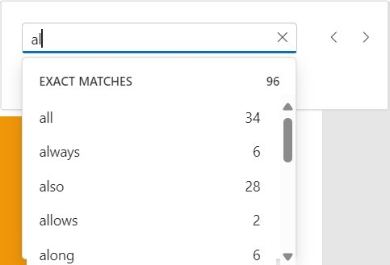
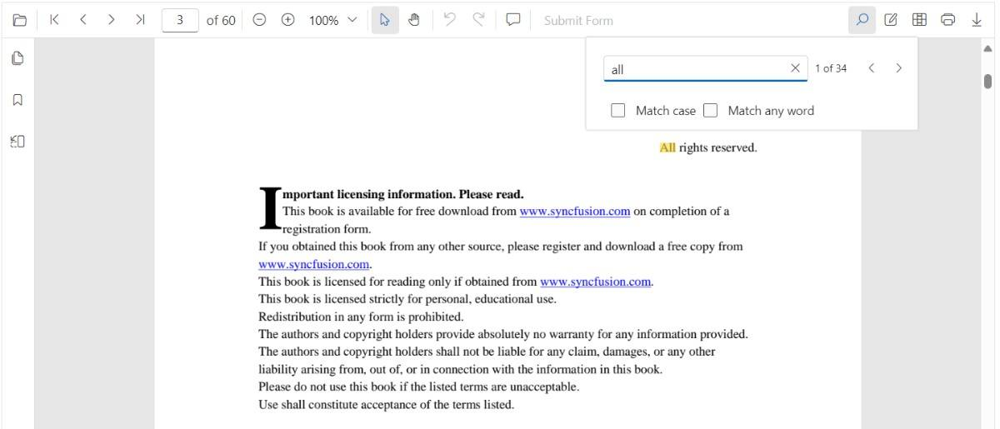
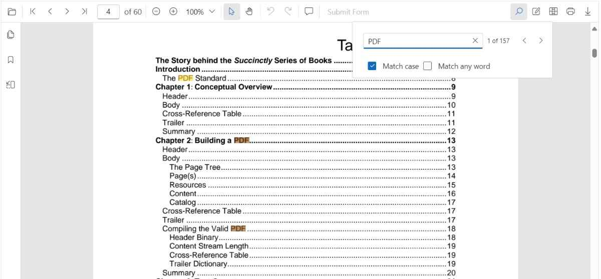
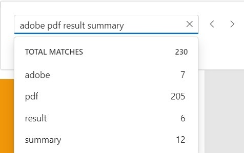

# Text Search in ASP.NET Core PDF Viewer

The text search feature in the ASP.NET Core PDF Viewer locates and highlights matching content within a document. Toggle the feature using the [`enableTextSearch`](https://help.syncfusion.com/cr/aspnetcore-js/Syncfusion.EJ2.PdfViewer.PdfViewer.html#Syncfusion_EJ2_PdfViewer_PdfViewer_EnableTextSearch) property (default: `true`), as shown in the snippet below.


N> The text search functionality is built into the EJ2 PDF Viewer component for ASP.NET Core. Ensure that the PDF Viewer is properly initialized with the required services and that the search feature is enabled.

## Text search features in UI

### Real-time search suggestions while typing

Typing in the search box immediately surfaces suggestions that match the entered text. The list refreshes on every keystroke so users can quickly jump to likely results without completing the entire term.



### Select search suggestions from the popup

After typing in the search box, the popup lists relevant matches. Selecting an item jumps directly to the corresponding occurrence in the PDF.



### Dynamic Text Search for Large PDF Documents

Dynamic text search is enabled during the initial loading of the document when the document text collection has not yet been fully loaded in the background.


### Search text with the Match Case option

Enable the Match Case checkbox to limit results to case-sensitive matches. Navigation commands then step through each exact match in sequence.



### Search text without Match Case

Leave the Match Case option cleared to highlight every occurrence of the query, regardless of capitalization, and navigate through each result.


### Search a list of words with Match Any Word

Enable Match Any Word to split the query into separate words. The popup proposes matches for each word and highlights them throughout the document.



## Programmatic text Search

The ASP.NET Core PDF Viewer provides options to toggle text search feature and APIs to customize the text search behavior programmatically.

### Enable or Disable Text Search 

Use the following snippet to enable or disable text search features:




<div style="width:100%;height:600px">
    <ejs-pdfviewer id="pdfViewer"
                   enableTextSearch="true"
                   documentPath="https://cdn.syncfusion.com/content/pdf/pdf-succinctly.pdf"
                   style="height:600px">
    </ejs-pdfviewer>
</div>




### Programmatic text search

While the PDF Viewer toolbar offers an interactive search experience, you can also trigger and customize searches programmatically by calling the following APIs in the textSearch module.

#### `searchText`

Use the `searchText` method to start a search. The method highlights every match in the document and brings the first match into view.

```js
// searchText(text: string, isMatchCase?: boolean)
pdfViewer.textSearch.searchText('search text', false);
```

**Parameters**

- `text` (string) — The text to search for in the document.
- `isMatchCase` (boolean, optional) — When `true`, performs a case-sensitive search that mirrors the **Match Case** option in the search panel. Defaults to `false`.

```js
// This will only find instances of "PDF" in uppercase.
pdfViewer.textSearch.searchText('PDF', true);
```

#### `searchNext`

The `searchNext` method searches for the next occurrence of the current query from the active match.

```js
pdfViewer.textSearch.searchNext();
```

#### `searchPrevious`

The `searchPrevious` API searches for the previous occurrence of the current query from the active match.

```js
pdfViewer.textSearch.searchPrevious();
```

#### `cancelTextSearch`

The `cancelTextSearch` method cancels the current text search and removes the highlighted occurrences from the PDF Viewer.

```js
pdfViewer.textSearch.cancelTextSearch();
```

#### Complete Example

Use the following code snippet to implement text search using the searchText API:




<div>
    <button id="searchBtn">Search Text</button>
    <button id="nextBtn">Next Search</button>
    <button id="previousBtn">Previous Search</button>
    <button id="cancelBtn">Cancel Search</button>
</div>

<div style="width:100%;height:600px">
    <ejs-pdfviewer id="pdfViewer"
                   documentPath="https://cdn.syncfusion.com/content/pdf/pdf-succinctly.pdf"
                   style="height:600px">
    </ejs-pdfviewer>
</div>

<script>
    var pdfViewer = null;
    var viewer = document.getElementById('pdfViewer');
    
    viewer.addEventListener('load', function() {
        pdfViewer = viewer.ej2_instances[0];
        
        document.getElementById('searchBtn').addEventListener('click', function() {
            pdfViewer.textSearch.searchText('pdf', false);
        });
        
        document.getElementById('nextBtn').addEventListener('click', function() {
            pdfViewer.textSearch.searchNext();
        });
        
        document.getElementById('previousBtn').addEventListener('click', function() {
            pdfViewer.textSearch.searchPrevious();
        });
        
        document.getElementById('cancelBtn').addEventListener('click', function() {
            pdfViewer.textSearch.cancelTextSearch();
        });
    });
</script>



