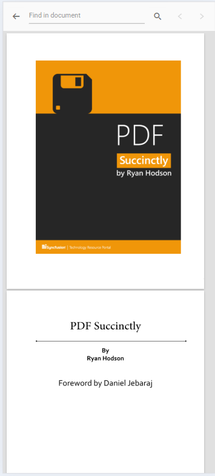
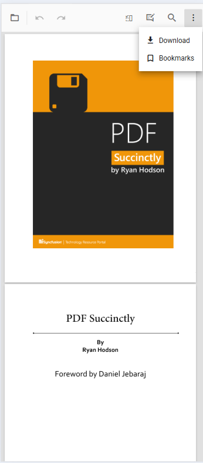

# Mobile Toolbar Interface in ASP.NET Core PDF Viewer control

The mobile PDF Viewer provides features for viewing, searching, annotating, and managing PDF documents on mobile devices. It includes tools such as search, download, bookmarking, annotation, and page organization. The viewer can enable desktop toolbar features in mobile mode to expose a broader set of actions.

## Mobile Mode Toolbar Configuration
In mobile mode, the toolbar is optimized for small screens and presents the most common actions for interacting with a PDF document. Below are the key features available in mobile mode:

### Main toolbar options

**OpenOption:** Loads a PDF document.

**SearchOption:** Opens the search bar to locate text within the document.

**UndoRedoTool:** Undoes or redoes recent annotation changes.

**OrganizePagesTool:** Toggles page organization features to modify document pages.

**AnnotationEditTool:** Enables or disables annotation editing for adding or modifying annotations.

N> In mobile mode, the annotation toolbar is displayed at the bottom of the viewer.

### More options menu
Opening the "more options" menu reveals additional actions such as:

**DownloadOption:** Downloads the currently opened PDF document.

**BookmarkOption:** Displays bookmarks within the document.

## Enabling Desktop Mode in Mobile

Enable desktop mode on mobile devices by setting the `enableDesktopMode` API to `true`. Enabling desktop mode replaces the mobile toolbar with the desktop toolbar layout and exposes additional toolbar actions.

### Steps to Enable Desktop Mode:

**Step 1:** Set `enableDesktopMode` to true in the API configuration.

**Step 2:** This will replace the mobile toolbar with the desktop toolbar layout, allowing access to more actions and controls.




    <ejs-pdfviewer id="pdfviewer"
                   documentPath="https://cdn.syncfusion.com/content/pdf/pdf-succinctly.pdf"
                   enableDesktopMode="true">
    </ejs-pdfviewer>




    <ejs-pdfviewer id="pdfviewer"
                   serviceUrl='/Index'
                   documentPath="https://cdn.syncfusion.com/content/pdf/pdf-succinctly.pdf"
                   enableDesktopMode="true">
    </ejs-pdfviewer>




## Enable Scrolling in Desktop Mode with Touch Gestures

To ensure smooth scrolling of PDF documents on a mobile device in desktop mode, enable touch gesture scrolling by setting the `enableTextSelection` option to **false**.




    <ejs-pdfviewer id="pdfviewer"
                   documentPath="https://cdn.syncfusion.com/content/pdf/pdf-succinctly.pdf"
                   enableTextSelection="false">
    </ejs-pdfviewer>




    <ejs-pdfviewer id="pdfviewer"
                   serviceUrl='/Index'
                   documentPath="https://cdn.syncfusion.com/content/pdf/pdf-succinctly.pdf"
                   enableTextSelection="false">
    </ejs-pdfviewer>




## Print Option Not Available

The Print option is not available in mobile mode by default. Enable desktop mode on mobile using the `enableDesktopMode` API to access the print option.

### How to Use Print on Mobile:

**Enable Desktop Mode:** Set `enableDesktopMode` to true to load the desktop version of the toolbar on your mobile device.

**Print Option:** Once desktop mode is enabled, the print option will be available, allowing you to print the document directly from your mobile device.

N> In mobile mode, print functionality remains unavailable unless desktop mode is enabled.