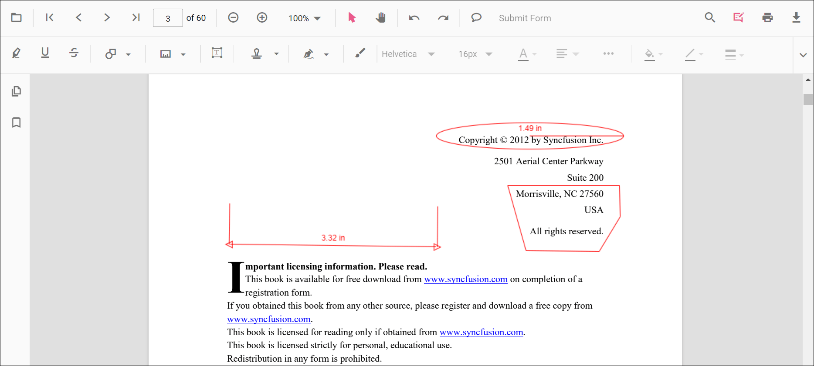
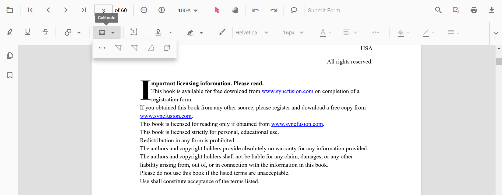
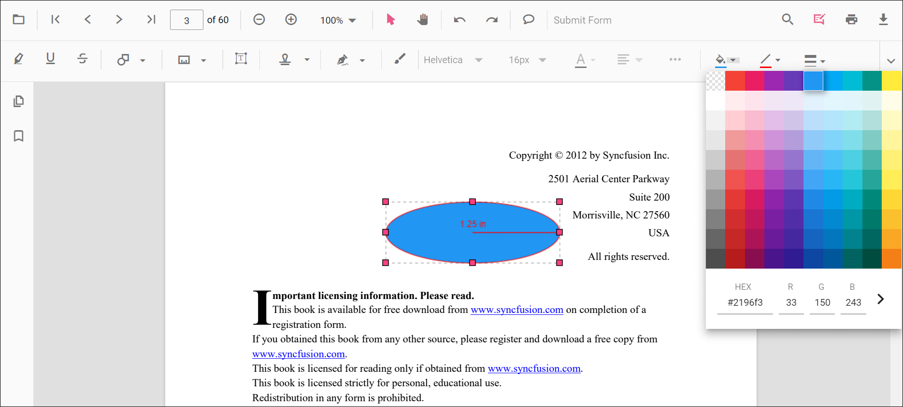
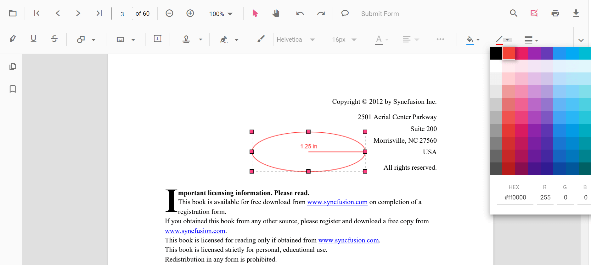
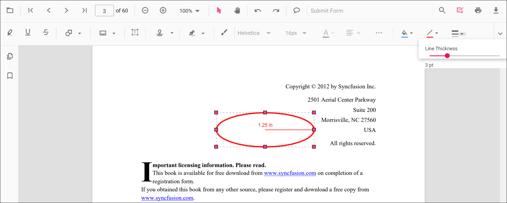
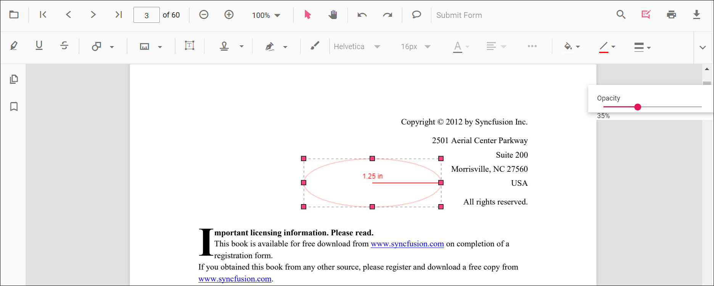
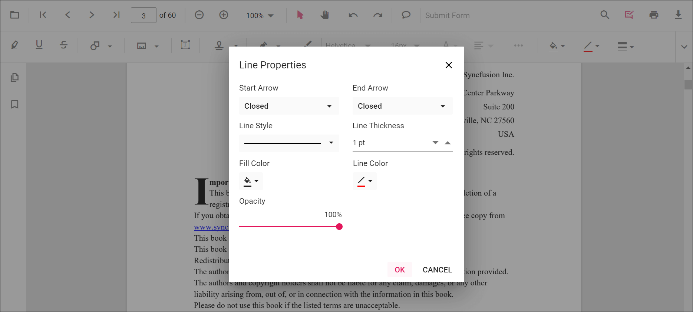
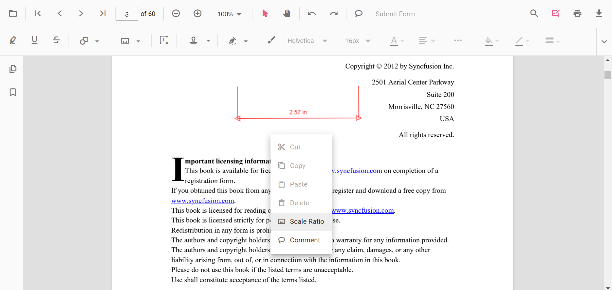
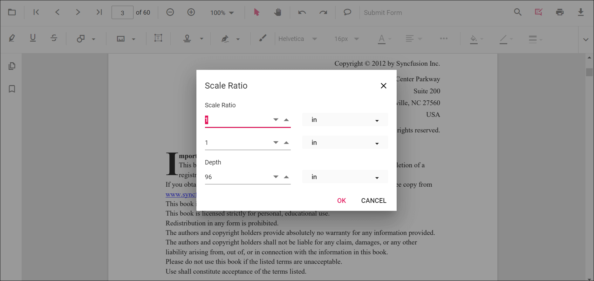

# Area Annotation in ASP.NET MVC PDF Viewer

Area is a measurement annotation used to calculate the surface of a closed region on a PDF page—ideal for engineering, construction, or design reviews.

## Enable Area Measurement

To enable Area annotations, inject the **PdfViewer** with the **Annotation** module.




    @Html.EJS().PdfViewer("pdfviewer").DocumentPath("https://cdn.syncfusion.com/content/pdf/pdf-succinctly.pdf").Render()




    @Html.EJS().PdfViewer("pdfviewer").ServiceUrl(VirtualPathUtility.ToAbsolute("~/PdfViewer/")).DocumentPath("https://cdn.syncfusion.com/content/pdf/pdf-succinctly.pdf").Render()




## Add Area Annotation

### Add Area Using the Toolbar

1. Open the **Annotation Toolbar**.
2. Select **Measurement** → **Area**.
3. Click points to define the polygon; double-click to close and finalize the area.

N> If Pan mode is active, choosing a measurement tool switches the viewer into the appropriate interaction mode for a smoother workflow.

### Enable Area Mode
Programmatically switch the viewer into Area mode.




<button id="enableArea" onclick="enableAreaMode()">Enable Area Mode</button>

    @Html.EJS().PdfViewer("pdfviewer").DocumentPath("https://cdn.syncfusion.com/content/pdf/pdf-succinctly.pdf").Render()




<button id="enableArea" onclick="enableAreaMode()">Enable Area Mode</button>

    @Html.EJS().PdfViewer("pdfviewer").ServiceUrl(VirtualPathUtility.ToAbsolute("~/PdfViewer/")).DocumentPath("https://cdn.syncfusion.com/content/pdf/pdf-succinctly.pdf").Render()




#### Exit Area Mode




<button id="exitArea" onclick="exitAreaMode()">Exit Area Mode</button>

    @Html.EJS().PdfViewer("pdfviewer").DocumentPath("https://cdn.syncfusion.com/content/pdf/pdf-succinctly.pdf").Render()




<button id="exitArea" onclick="exitAreaMode()">Exit Area Mode</button>

    @Html.EJS().PdfViewer("pdfviewer").ServiceUrl(VirtualPathUtility.ToAbsolute("~/PdfViewer/")).DocumentPath("https://cdn.syncfusion.com/content/pdf/pdf-succinctly.pdf").Render()




### Add Area Programmatically
Use the **addAnnotation** method to draw an area by providing **vertexPoints** for a closed region.




<button id="addArea" onclick="addArea()">Add Area Annotation programmatically</button>

    @Html.EJS().PdfViewer("pdfviewer").DocumentPath("https://cdn.syncfusion.com/content/pdf/pdf-succinctly.pdf").Render()




<button id="addArea" onclick="addArea()">Add Area Annotation programmatically</button>

    @Html.EJS().PdfViewer("pdfviewer").ServiceUrl(VirtualPathUtility.ToAbsolute("~/PdfViewer/")).DocumentPath("https://cdn.syncfusion.com/content/pdf/pdf-succinctly.pdf").Render()




## Customize Area Appearance
Configure default properties using the **areaSettings** property (for example, default **fill color**, **stroke color**, **opacity**).




    @Html.EJS().PdfViewer("pdfviewer").DocumentPath("https://cdn.syncfusion.com/content/pdf/pdf-succinctly.pdf").AreaSettings(new Syncfusion.EJ2.PdfViewer.PdfViewerAreaSettings { FillColor = "yellow", StrokeColor = "orange", Opacity = 0.6 }).Render()




    @Html.EJS().PdfViewer("pdfviewer").ServiceUrl(VirtualPathUtility.ToAbsolute("~/PdfViewer/")).DocumentPath("https://cdn.syncfusion.com/content/pdf/pdf-succinctly.pdf").AreaSettings(new Syncfusion.EJ2.PdfViewer.PdfViewerAreaSettings { FillColor = "yellow", StrokeColor = "orange", Opacity = 0.6 }).Render()




## Manage Area (Move, Reshape, Edit, Delete)
- **Move**: Drag inside the polygon to reposition it.
- **Reshape**: Drag any vertex handle to adjust points and shape.

### Edit Perimeter

#### Edit Perimeter (UI)

- Edit the **fill color** using the Edit Color tool.  
  
- Edit the **stroke color** using the Edit Stroke Color tool.  
  
- Edit the **border thickness** using the Edit Thickness tool.  
  
- Edit the **opacity** using the Edit Opacity tool.  
  
- Open **Right Click → Properties** for additional line-based options.  
  

#### Edit Area Programmatically

Update properties and call **editAnnotation()**.




<button id="editArea" onclick="editArea()">Edit Area Annotation programmatically</button>

    @Html.EJS().PdfViewer("pdfviewer").DocumentPath("https://cdn.syncfusion.com/content/pdf/pdf-succinctly.pdf").Render()




<button id="editArea" onclick="editArea()">Edit Area Annotation programmatically</button>

    @Html.EJS().PdfViewer("pdfviewer").ServiceUrl(VirtualPathUtility.ToAbsolute("~/PdfViewer/")).DocumentPath("https://cdn.syncfusion.com/content/pdf/pdf-succinctly.pdf").Render()




### Delete Area Annotation

Delete Area Annotation via UI (toolbar/context menu) or programmatically. For supported workflows and APIs, see [**Delete Annotation**](../delete-annotation).

## Set Default Properties During Initialization
Apply defaults for Area using the **areaSettings** property.




    @Html.EJS().PdfViewer("pdfviewer").DocumentPath("https://cdn.syncfusion.com/content/pdf/pdf-succinctly.pdf").AreaSettings(new Syncfusion.EJ2.PdfViewer.PdfViewerAreaSettings { FillColor = "yellow", StrokeColor = "orange", Opacity = 0.6 }).Render()




    @Html.EJS().PdfViewer("pdfviewer").ServiceUrl(VirtualPathUtility.ToAbsolute("~/PdfViewer/")).DocumentPath("https://cdn.syncfusion.com/content/pdf/pdf-succinctly.pdf").AreaSettings(new Syncfusion.EJ2.PdfViewer.PdfViewerAreaSettings { FillColor = "yellow", StrokeColor = "orange", Opacity = 0.6 }).Render()




## Set Properties While Adding Individual Annotation
Pass per-annotation values directly when calling **addAnnotation**.




<button id="addStyledArea" onclick="addStyledArea()">Add styled Area programmatically</button>

    @Html.EJS().PdfViewer("pdfviewer").DocumentPath("https://cdn.syncfusion.com/content/pdf/pdf-succinctly.pdf").Render()




<button id="addStyledArea" onclick="addStyledArea()">Add styled Area programmatically</button>

    @Html.EJS().PdfViewer("pdfviewer").ServiceUrl(VirtualPathUtility.ToAbsolute("~/PdfViewer/")).DocumentPath("https://cdn.syncfusion.com/content/pdf/pdf-succinctly.pdf").Render()




## Scale Ratio and Units
- Use **Scale Ratio** from the context menu to set the actual-to-page scale.  
  
- Supported units include **Inch, Millimeter, Centimeter, Point, Pica, Feet**.  
  

### Set Default Scale Ratio During Initialization
Configure scale defaults using **measurementSettings**.




    @Html.EJS().PdfViewer("pdfviewer").DocumentPath("https://cdn.syncfusion.com/content/pdf/pdf-succinctly.pdf").MeasurementSettings(new Syncfusion.EJ2.PdfViewer.PdfViewerMeasurementSettings { ScaleRatio = 2, ConversionUnit = "cm", DisplayUnit = "cm" }).Render()




    @Html.EJS().PdfViewer("pdfviewer").ServiceUrl(VirtualPathUtility.ToAbsolute("~/PdfViewer/")).DocumentPath("https://cdn.syncfusion.com/content/pdf/pdf-succinctly.pdf").MeasurementSettings(new Syncfusion.EJ2.PdfViewer.PdfViewerMeasurementSettings { ScaleRatio = 2, ConversionUnit = "cm", DisplayUnit = "cm" }).Render()




## Handle Area Events

Listen to annotation life-cycle events (add/modify/select/remove). For the full list and parameters, see [**Annotation Events**](../annotation-event).

## Export and Import
Area measurements can be exported or imported with other annotations. For workflows and supported formats, see [**Export and Import annotations**](../export-import/export-annotation).

## See Also
- [Annotation Toolbar](../../toolbar-customization/annotation-toolbar)
- [Customize Context Menu](../../context-menu/custom-context-menu)
- [Comments Panel](../comments)
- [Annotation Events](../annotation-event)
- [Export and Import annotations](../export-import/export-annotation)
- [Delete Annotations](../delete-annotation)
