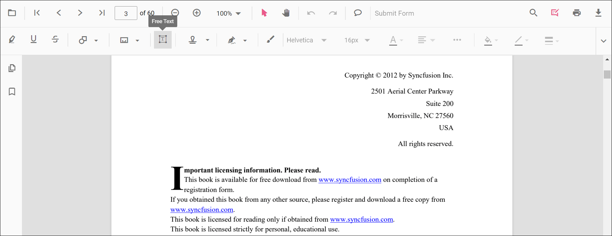
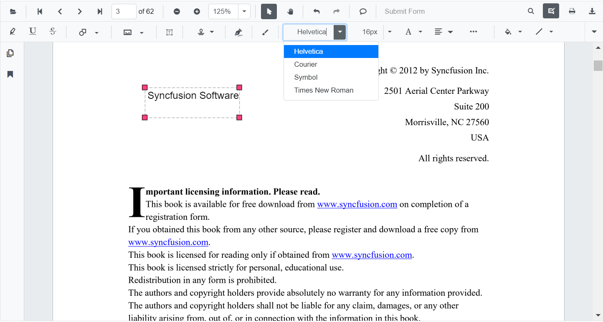
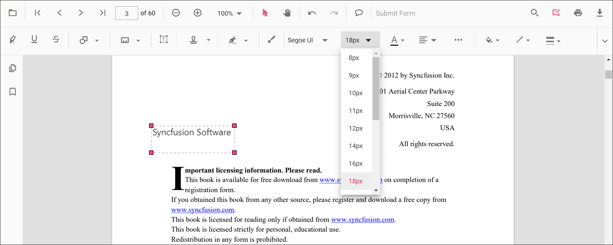
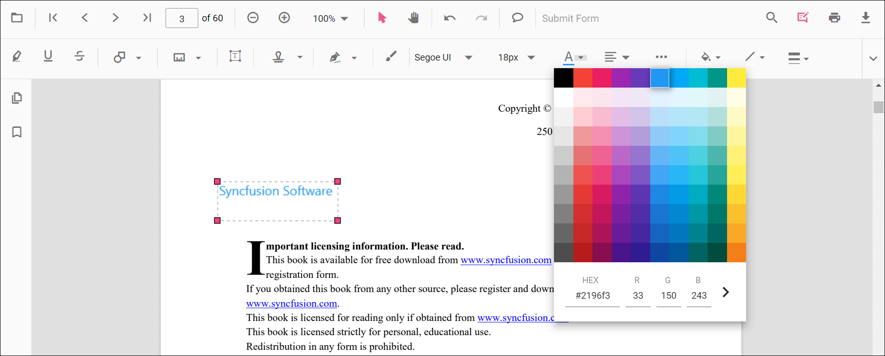
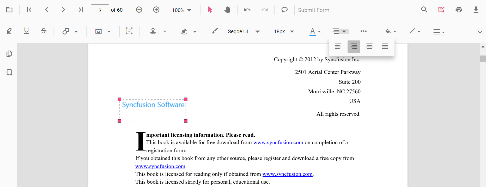
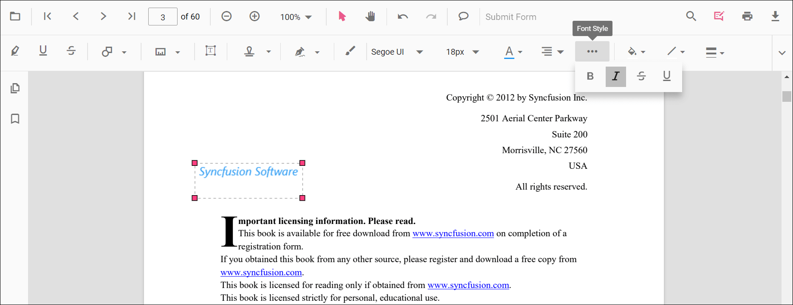
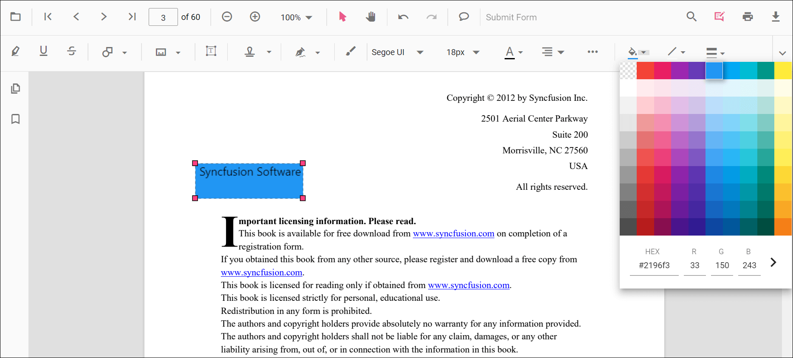
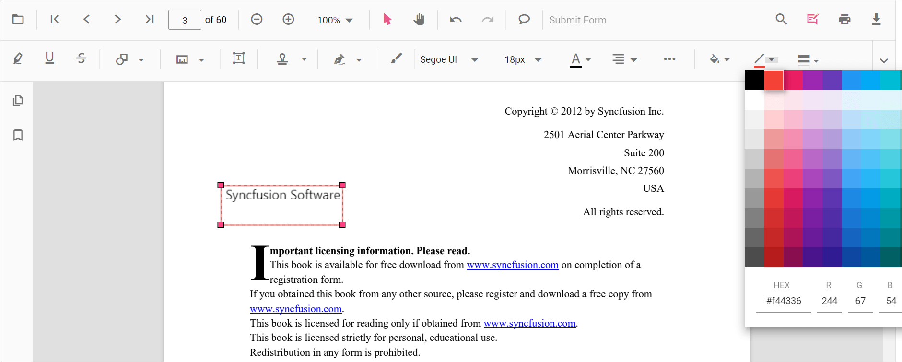
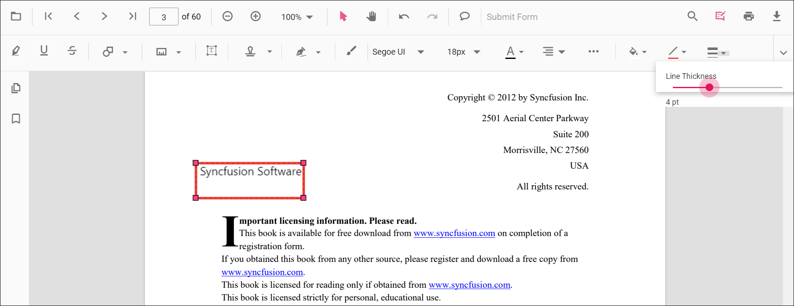
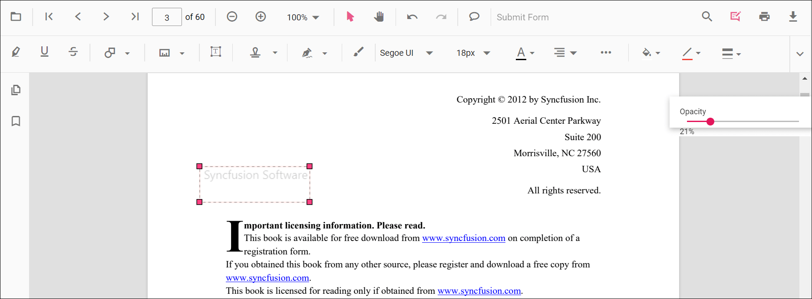

# Free Text Annotation in ASP.NET MVC PDF Viewer

Free Text annotations let users place editable text boxes on a PDF page to add comments, labels, or notes without changing the original document content.

## Enable Free Text in the Viewer

To enable Free Text annotations, inject the **PdfViewer** with the **Annotation** module.




    @Html.EJS().PdfViewer("pdfviewer").DocumentPath("https://cdn.syncfusion.com/content/pdf/pdf-succinctly.pdf").Render()




    @Html.EJS().PdfViewer("pdfviewer").ServiceUrl(VirtualPathUtility.ToAbsolute("~/PdfViewer/")).DocumentPath("https://cdn.syncfusion.com/content/pdf/pdf-succinctly.pdf").Render()




## Add Free Text

### Add Free Text Using the Toolbar
1. Open the **Annotation Toolbar**.
2. Click **Free Text** to enable Free Text mode.
3. Click on the page to place the text box and start typing.

N> When Pan mode is active, choosing Free Text switches the viewer into the appropriate selection/edit workflow for a smoother experience.

### Enable Free Text Mode

Programmatically switch to Free Text mode.




<button id="enableFreeText" onclick="enableFreeTextMode()">Enable Free Text Mode</button>

    @Html.EJS().PdfViewer("pdfviewer").DocumentPath("https://cdn.syncfusion.com/content/pdf/pdf-succinctly.pdf").Render()




<button id="enableFreeText" onclick="enableFreeTextMode()">Enable Free Text Mode</button>

    @Html.EJS().PdfViewer("pdfviewer").ServiceUrl(VirtualPathUtility.ToAbsolute("~/PdfViewer/")).DocumentPath("https://cdn.syncfusion.com/content/pdf/pdf-succinctly.pdf").Render()




#### Exit Free Text Mode




<button id="exitFreeText" onclick="exitFreeTextMode()">Exit Free Text Mode</button>

    @Html.EJS().PdfViewer("pdfviewer").DocumentPath("https://cdn.syncfusion.com/content/pdf/pdf-succinctly.pdf").Render()




<button id="exitFreeText" onclick="exitFreeTextMode()">Exit Free Text Mode</button>

    @Html.EJS().PdfViewer("pdfviewer").ServiceUrl(VirtualPathUtility.ToAbsolute("~/PdfViewer/")).DocumentPath("https://cdn.syncfusion.com/content/pdf/pdf-succinctly.pdf").Render()




### Add Free Text Programmatically

Use the **addAnnotation** method to create a text box at a given location with desired styles.




<button id="addFreeText" onclick="addFreeText()">Add Free Text Annotation programmatically</button>

    @Html.EJS().PdfViewer("pdfviewer").DocumentPath("https://cdn.syncfusion.com/content/pdf/pdf-succinctly.pdf").Render()




<button id="addFreeText" onclick="addFreeText()">Add Free Text Annotation programmatically</button>

    @Html.EJS().PdfViewer("pdfviewer").ServiceUrl(VirtualPathUtility.ToAbsolute("~/PdfViewer/")).DocumentPath("https://cdn.syncfusion.com/content/pdf/pdf-succinctly.pdf").Render()




## Customize Free Text Appearance

Configure default properties using the **freeTextSettings** property (for example, default **fill color**, **border color**, **font color**, **opacity**, and **auto-fit**).




    @Html.EJS().PdfViewer("pdfviewer").DocumentPath("https://cdn.syncfusion.com/content/pdf/pdf-succinctly.pdf").FreeTextSettings(new Syncfusion.EJ2.PdfViewer.PdfViewerFreeTextSettings { FillColor = "green", BorderColor = "blue", FontColor = "yellow", Opacity = 0.3, EnableAutoFit = true }).Render()




    @Html.EJS().PdfViewer("pdfviewer").ServiceUrl(VirtualPathUtility.ToAbsolute("~/PdfViewer/")).DocumentPath("https://cdn.syncfusion.com/content/pdf/pdf-succinctly.pdf").FreeTextSettings(new Syncfusion.EJ2.PdfViewer.PdfViewerFreeTextSettings { FillColor = "green", BorderColor = "blue", FontColor = "yellow", Opacity = 0.3, EnableAutoFit = true }).Render()




N> To tailor right-click options, see [**Customize Context Menu**](../../context-menu/custom-context-menu).

## Modify, Edit, Delete Free Text

- **Move/Resize**: Drag the box or use the resize handles.
- **Edit Text**: Click inside the box and type.
- **Delete**: Use the toolbar or context menu options. For deletion workflows and API details, see [**Delete Annotation**](../delete-annotation).

### Edit Free Text

#### Edit Free Text (UI)

Use the annotation toolbar to configure font family, size, color, alignment, styles, fill color, stroke color, border thickness, and opacity.

- Edit the **font family** using the Font Family tool.  

- Edit the **font size** using the Font Size tool.  

- Edit the **font color** using the Font Color tool.  

- Edit the **text alignment** using the Text Alignment tool.  

- Edit the **font styles** (bold, italic, underline) using the Font Style tool.  

- Edit the **fill color** using the Edit Color tool.  

- Edit the **stroke color** using the color palette in the Edit Stroke Color tool.  

- Edit the **border thickness** using the Edit Thickness tool.  

- Edit the **opacity** using the Edit Opacity tool.  

#### Edit Free Text Programmatically

Update bounds or text and call **editAnnotation()**.




<button id="editFreeText" onclick="editFreeText()">Edit Free Text Annotation programmatically</button>

    @Html.EJS().PdfViewer("pdfviewer").DocumentPath("https://cdn.syncfusion.com/content/pdf/pdf-succinctly.pdf").Render()




<button id="editFreeText" onclick="editFreeText()">Edit Free Text Annotation programmatically</button>

    @Html.EJS().PdfViewer("pdfviewer").ServiceUrl(VirtualPathUtility.ToAbsolute("~/PdfViewer/")).DocumentPath("https://cdn.syncfusion.com/content/pdf/pdf-succinctly.pdf").Render()




N> Free Text annotations do **not** modify the original PDF text; they overlay editable text boxes on top of the page content.

### Delete Free Text

Delete Free Text via UI (toolbar/context menu) or programmatically. For supported workflows and APIs, see [**Delete Annotation**](../delete-annotation).

## Set Default Properties During Initialization
Apply defaults for new text boxes using the **freeTextSettings** property. You can also enable **Auto-fit** so the box expands with content.




    @Html.EJS().PdfViewer("pdfviewer").DocumentPath("https://cdn.syncfusion.com/content/pdf/pdf-succinctly.pdf").FreeTextSettings(new Syncfusion.EJ2.PdfViewer.PdfViewerFreeTextSettings { FillColor = "green", BorderColor = "blue", FontColor = "yellow", EnableAutoFit = true }).Render()




    @Html.EJS().PdfViewer("pdfviewer").ServiceUrl(VirtualPathUtility.ToAbsolute("~/PdfViewer/")).DocumentPath("https://cdn.syncfusion.com/content/pdf/pdf-succinctly.pdf").FreeTextSettings(new Syncfusion.EJ2.PdfViewer.PdfViewerFreeTextSettings { FillColor = "green", BorderColor = "blue", FontColor = "yellow", EnableAutoFit = true }).Render()




## Free Text Annotation Events

Listen to add/modify/select/remove events for Free Text and handle them as needed. For the full list and parameters, see [**Annotation Events**](../annotation-event).

## Export and Import

Free Text annotations can be exported or imported just like other annotations. For supported formats and steps, see [**Export and Import annotations**](../export-import/export-annotation).

## See Also
- [Annotation Toolbar](../../toolbar-customization/annotation-toolbar)
- [Customize Context Menu](../../context-menu/custom-context-menu)
- [Comments Panel](../comments)
- [Annotation Events](../annotation-event)
- [Export and Import annotations](../export-import/export-annotation)
- [Delete Annotations](../delete-annotation)
