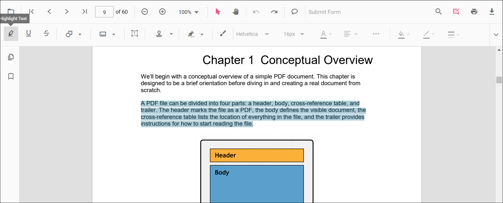
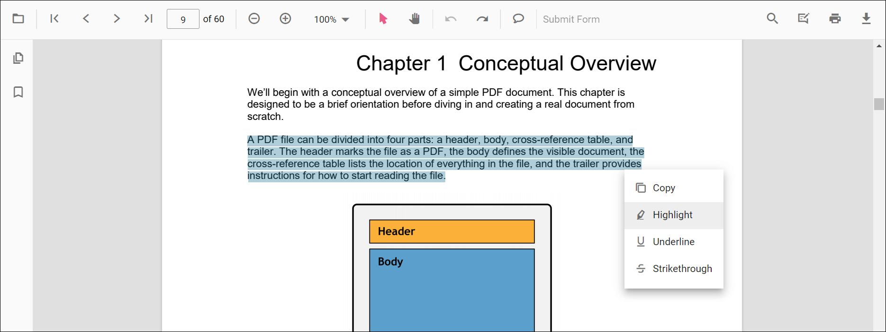

# Highlight Annotation in ASP.NET MVC PDF Viewer

This guide explains how to **enable**, **apply**, **customize**, and **manage** *Highlight* text markup annotations in the Syncfusion **ASP.NET MVC PDF Viewer**. You can highlight text using the toolbar or context menu, programmatically invoke highlight mode, customize default settings, handle events, and export the PDF with annotations.

## Enable Highlight in the Viewer

To enable Highlight annotations, inject the **PdfViewer** with the **Annotation** and **TextSelection** modules.

This minimal setup enables UI interactions like selection and highlighting.




    @Html.EJS().PdfViewer("pdfviewer").DocumentPath("https://cdn.syncfusion.com/content/pdf/pdf-succinctly.pdf").Render()




    @Html.EJS().PdfViewer("pdfviewer").ServiceUrl(VirtualPathUtility.ToAbsolute("~/PdfViewer/")).DocumentPath("https://cdn.syncfusion.com/content/pdf/pdf-succinctly.pdf").Render()




## Add Highlight Annotation

### Add Highlight Using the Toolbar

1. Select the text you want to highlight.
2. Click the **Highlight** icon in the annotation toolbar.
   - If **Pan Mode** is active, the viewer automatically switches to **Text Selection** mode.

### Apply Highlight Using the Context Menu

Right-click a selected text region → select **Highlight**.

To customize menu items, refer to [**Customize Context Menu**](../../context-menu/custom-context-menu) documentation.

### Enable Highlight Mode

Switch the viewer into highlight mode using **setAnnotationMode('Highlight')**.




<button id="enableHighlight" onclick="enableHighlight()">Enable Highlight Mode</button>

    @Html.EJS().PdfViewer("pdfviewer").DocumentPath("https://cdn.syncfusion.com/content/pdf/pdf-succinctly.pdf").Render()




<button id="enableHighlight" onclick="enableHighlight()">Enable Highlight Mode</button>

    @Html.EJS().PdfViewer("pdfviewer").ServiceUrl(VirtualPathUtility.ToAbsolute("~/PdfViewer/")).DocumentPath("https://cdn.syncfusion.com/content/pdf/pdf-succinctly.pdf").Render()




#### Exit Highlight Mode

Switch back to normal mode using:




<button id="exitHighlight" onclick="disableHighlightMode()">Exit Highlight Mode</button>

    @Html.EJS().PdfViewer("pdfviewer").DocumentPath("https://cdn.syncfusion.com/content/pdf/pdf-succinctly.pdf").Render()




<button id="exitHighlight" onclick="disableHighlightMode()">Exit Highlight Mode</button>

    @Html.EJS().PdfViewer("pdfviewer").ServiceUrl(VirtualPathUtility.ToAbsolute("~/PdfViewer/")).DocumentPath("https://cdn.syncfusion.com/content/pdf/pdf-succinctly.pdf").Render()




### Add Highlight Programmatically

Use **addAnnotation()** to insert highlight at a specific location.




<button id="addHighlight" onclick="addHighlight()">Add Highlight Annotation programmatically</button>

    @Html.EJS().PdfViewer("pdfviewer").DocumentPath("https://cdn.syncfusion.com/content/pdf/pdf-succinctly.pdf").Render()




<button id="addHighlight" onclick="addHighlight()">Add Highlight Annotation programmatically</button>

    @Html.EJS().PdfViewer("pdfviewer").ServiceUrl(VirtualPathUtility.ToAbsolute("~/PdfViewer/")).DocumentPath("https://cdn.syncfusion.com/content/pdf/pdf-succinctly.pdf").Render()




## Customize Highlight Appearance

Configure default highlight settings such as **color**, **opacity**, and **author** using **highlightSettings**.




    @Html.EJS().PdfViewer("pdfviewer").DocumentPath("https://cdn.syncfusion.com/content/pdf/pdf-succinctly.pdf").HighlightSettings(new Syncfusion.EJ2.PdfViewer.PdfViewerHighlightSettings { Author = "Guest User", Subject = "Important", Color = "#ffff00", Opacity = 0.9 }).Render()




    @Html.EJS().PdfViewer("pdfviewer").ServiceUrl(VirtualPathUtility.ToAbsolute("~/PdfViewer/")).DocumentPath("https://cdn.syncfusion.com/content/pdf/pdf-succinctly.pdf").HighlightSettings(new Syncfusion.EJ2.PdfViewer.PdfViewerHighlightSettings { Author = "Guest User", Subject = "Important", Color = "#ffff00", Opacity = 0.9 }).Render()




## Manage Highlight (Edit, Delete, Comment)

### Edit Highlight

#### Edit Highlight Appearance (UI)

Use the annotation toolbar:
- **Edit Color** tool  

- **Edit Opacity** slider  

#### Edit Highlight Programmatically

Modify an existing highlight programmatically using **editAnnotation()**.




<button id="editHighlight" onclick="editHighlight()">Edit Highlight Annotation programmatically</button>

    @Html.EJS().PdfViewer("pdfviewer").DocumentPath("https://cdn.syncfusion.com/content/pdf/pdf-succinctly.pdf").Render()




<button id="editHighlight" onclick="editHighlight()">Edit Highlight Annotation programmatically</button>

    @Html.EJS().PdfViewer("pdfviewer").ServiceUrl(VirtualPathUtility.ToAbsolute("~/PdfViewer/")).DocumentPath("https://cdn.syncfusion.com/content/pdf/pdf-succinctly.pdf").Render()




### Delete Highlight

The PDF Viewer supports deleting existing annotations through both the UI and API. For detailed behavior, supported deletion workflows, and API reference, see [Delete Annotation](../delete-annotation).

### Comments

Use the [Comments panel](../comments) to add, view, and reply to threaded discussions linked to highlight annotations. It provides a dedicated UI for reviewing feedback, tracking conversations, and collaborating on annotation-related notes within the PDF Viewer.

## Set properties while adding individual annotations

Set properties for individual annotation before creating the control using **highlightSettings**.




<button id="addHighlights" onclick="addHighlights()">Add multiple Highlights programmatically</button>

    @Html.EJS().PdfViewer("pdfviewer").DocumentPath("https://cdn.syncfusion.com/content/pdf/pdf-succinctly.pdf").Render()




<button id="addHighlights" onclick="addHighlights()">Add multiple Highlights programmatically</button>

    @Html.EJS().PdfViewer("pdfviewer").ServiceUrl(VirtualPathUtility.ToAbsolute("~/PdfViewer/")).DocumentPath("https://cdn.syncfusion.com/content/pdf/pdf-succinctly.pdf").Render()




## Disable TextMarkup Annotation

Disable text markup annotations (including highlight) using the **enableTextMarkupAnnotation** property.




    @Html.EJS().PdfViewer("pdfviewer").EnableTextMarkupAnnotation(false).DocumentPath("https://cdn.syncfusion.com/content/pdf/pdf-succinctly.pdf").Render()




    @Html.EJS().PdfViewer("pdfviewer").ServiceUrl(VirtualPathUtility.ToAbsolute("~/PdfViewer/")).EnableTextMarkupAnnotation(false).DocumentPath("https://cdn.syncfusion.com/content/pdf/pdf-succinctly.pdf").Render()




## Handle Highlight Events

The PDF viewer provides annotation life-cycle events that notify when highlight annotations are added, modified, selected, or removed. For the full list of available events and their descriptions, see [**Annotation Events**](../annotation-event).

## Export and Import

The PDF Viewer supports exporting and importing annotations, allowing you to save annotations as a separate file or load existing annotations back into the viewer. For full details on supported formats and steps to export or import annotations, see [Export and Import Annotation](../export-import/export-annotation).

## See Also

- [Annotation Toolbar](../../toolbar-customization/annotation-toolbar)
- [Customize Context Menu](../../context-menu/custom-context-menu)
- [Comments Panel](../comments)
- [Annotation Events](../annotation-event)
- [Export and Import annotations](../export-import/export-annotation)
- [Delete Annotations](../delete-annotation)
