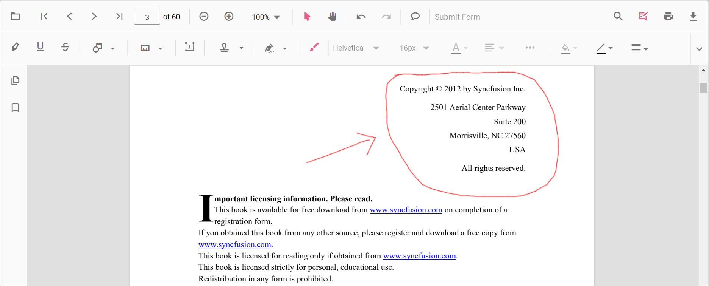
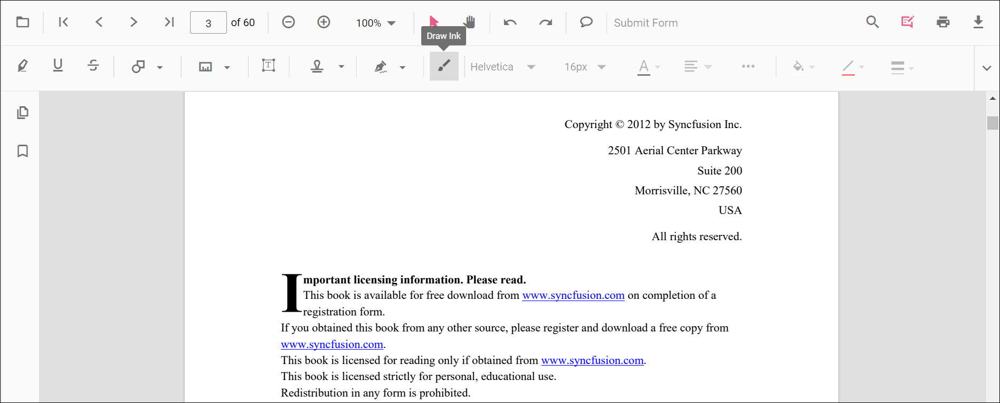
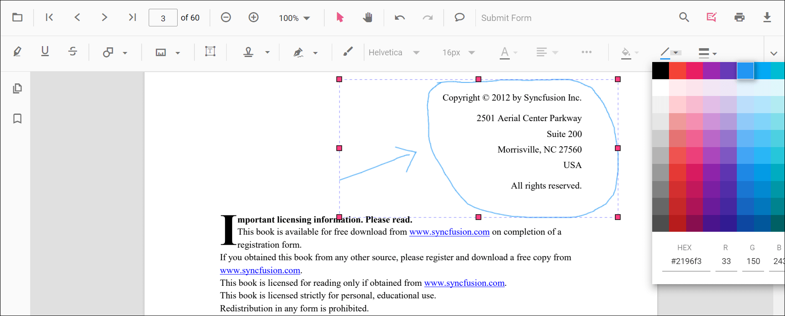
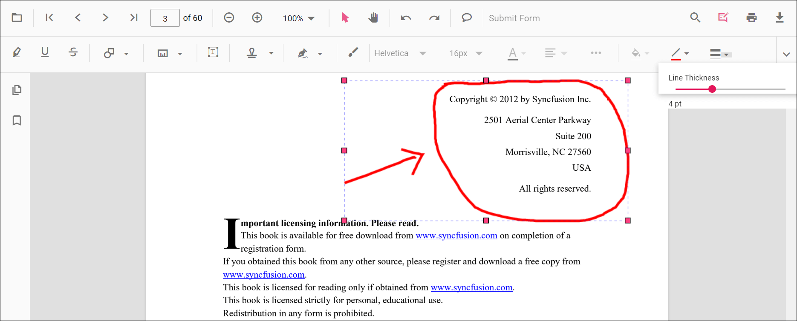
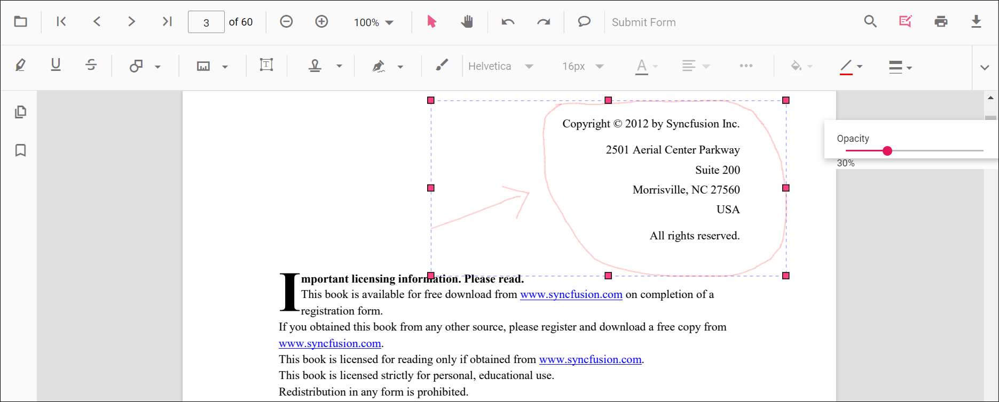

# Ink Annotation in ASP.NET MVC PDF Viewer

Ink annotations allow users to draw freehand strokes using mouse, pen, or touch input to mark content naturally.

## Enable Freehand Drawing (Ink)

To enable ink annotations, inject the **PdfViewer** with the **Annotation** module.




    @Html.EJS().PdfViewer("pdfviewer").DocumentPath("https://cdn.syncfusion.com/content/pdf/pdf-succinctly.pdf").Render()




    @Html.EJS().PdfViewer("pdfviewer").ServiceUrl(VirtualPathUtility.ToAbsolute("~/PdfViewer/")).DocumentPath("https://cdn.syncfusion.com/content/pdf/pdf-succinctly.pdf").Render()




## Add Ink annotation

### Draw Freehand Using the Toolbar
1. Open the **Annotation Toolbar**.
2. Click **Draw Ink**.
3. Draw freehand on the page.

### Enable Ink Mode
Switch the viewer into an ink annotation mode programmatically.




<button id="enableInk" onclick="enableInkMode()">Enable Ink Mode</button>

    @Html.EJS().PdfViewer("pdfviewer").DocumentPath("https://cdn.syncfusion.com/content/pdf/pdf-succinctly.pdf").Render()




<button id="enableInk" onclick="enableInkMode()">Enable Ink Mode</button>

    @Html.EJS().PdfViewer("pdfviewer").ServiceUrl(VirtualPathUtility.ToAbsolute("~/PdfViewer/")).DocumentPath("https://cdn.syncfusion.com/content/pdf/pdf-succinctly.pdf").Render()




#### Exit Ink Mode




<button id="exitInk" onclick="exitInkMode()">Exit Ink Mode</button>

    @Html.EJS().PdfViewer("pdfviewer").DocumentPath("https://cdn.syncfusion.com/content/pdf/pdf-succinctly.pdf").Render()




<button id="exitInk" onclick="exitInkMode()">Exit Ink Mode</button>

    @Html.EJS().PdfViewer("pdfviewer").ServiceUrl(VirtualPathUtility.ToAbsolute("~/PdfViewer/")).DocumentPath("https://cdn.syncfusion.com/content/pdf/pdf-succinctly.pdf").Render()




### Add Ink Programmatically
Use the **addAnnotation** method to create an ink stroke by providing a path (an array of move/line commands), bounds, and target page.




<button id="addInk" onclick="addInk()">Add Ink Annotation programmatically</button>

    @Html.EJS().PdfViewer("pdfviewer").DocumentPath("https://cdn.syncfusion.com/content/pdf/pdf-succinctly.pdf").Render()




<button id="addInk" onclick="addInk()">Add Ink Annotation programmatically</button>

    @Html.EJS().PdfViewer("pdfviewer").ServiceUrl(VirtualPathUtility.ToAbsolute("~/PdfViewer/")).DocumentPath("https://cdn.syncfusion.com/content/pdf/pdf-succinctly.pdf").Render()




## Customize Ink Appearance
You can customize **stroke color**, **thickness**, and **opacity** using the **inkAnnotationSettings** property.




    @Html.EJS().PdfViewer("pdfviewer").DocumentPath("https://cdn.syncfusion.com/content/pdf/pdf-succinctly.pdf").InkAnnotationSettings(new Syncfusion.EJ2.PdfViewer.PdfViewerInkAnnotationSettings { Author = "Guest", StrokeColor = "#0066ff", Thickness = 3, Opacity = 0.85 }).Render()




    @Html.EJS().PdfViewer("pdfviewer").ServiceUrl(VirtualPathUtility.ToAbsolute("~/PdfViewer/")).DocumentPath("https://cdn.syncfusion.com/content/pdf/pdf-succinctly.pdf").InkAnnotationSettings(new Syncfusion.EJ2.PdfViewer.PdfViewerInkAnnotationSettings { Author = "Guest", StrokeColor = "#0066ff", Thickness = 3, Opacity = 0.85 }).Render()




## Erase, Modify, or Delete Ink Strokes
- **Move**: Drag the annotation.
- **Resize**: Use selector handles.
- **Change appearance**: Use Edit Stroke Color, Thickness, and Opacity tools.
- **Delete**: Via toolbar or context menu.
- **Customize context menu**: See [Customize Context Menu](../../context-menu/custom-context-menu).

### Edit ink annotation in UI

Stroke color, thickness, and opacity can be edited using the Edit Stroke Color, Edit Thickness, and Edit Opacity tools in the annotation toolbar.

- Edit the **stroke color** using the color palette in the Edit Stroke Color tool.  

- Edit **thickness** using the range slider in the Edit Thickness tool.  

- Edit **opacity** using the range slider in the Edit Opacity tool.  

### Edit Ink Programmatically

Modify an existing ink programmatically using **editAnnotation()**.




<button id="editInk" onclick="editInk()">Edit Ink Annotation programmatically</button>

    @Html.EJS().PdfViewer("pdfviewer").DocumentPath("https://cdn.syncfusion.com/content/pdf/pdf-succinctly.pdf").Render()




<button id="editInk" onclick="editInk()">Edit Ink Annotation programmatically</button>

    @Html.EJS().PdfViewer("pdfviewer").ServiceUrl(VirtualPathUtility.ToAbsolute("~/PdfViewer/")).DocumentPath("https://cdn.syncfusion.com/content/pdf/pdf-succinctly.pdf").Render()




### Delete Ink

Delete Ink via UI (toolbar/context menu) or programmatically. For supported workflows and APIs, see [**Delete Annotation**](../delete-annotation).

## Ink Annotation Events

The PDF viewer provides annotation life-cycle events that notify when Ink annotations are added, modified, selected, or removed. For the full list of available events and their descriptions, see [**Annotation Events**](../annotation-event).

## Export and Import

Ink annotations can be exported or imported along with other annotations. See [Export and Import annotations](../export-import/export-annotation).

## See Also

- [Annotation Toolbar](../../toolbar-customization/annotation-toolbar)
- [Customize Context Menu](../../context-menu/custom-context-menu)
- [Annotation Events](../annotation-event)
- [Export and Import annotations](../export-import/export-annotation)
- [Delete Annotation](../delete-annotation)
