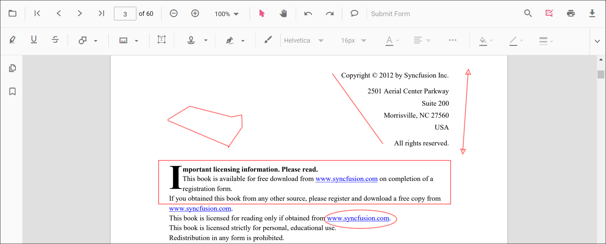

# Rectangle Annotation in ASP.NET MVC PDF Viewer

Rectangle annotations let users highlight regions, group content, or draw callout boxes on PDFs for reviews and markups. You can add rectangles from the toolbar, switch to rectangle mode programmatically, customize appearance, edit/delete them in the UI, and export them with the document.

## Enable Rectangle Annotation in the Viewer

To enable Rectangle annotations, inject the **PdfViewer** with the **Annotation** module.




    @Html.EJS().PdfViewer("pdfviewer").DocumentPath("https://cdn.syncfusion.com/content/pdf/pdf-succinctly.pdf").Render()




    @Html.EJS().PdfViewer("pdfviewer").ServiceUrl(VirtualPathUtility.ToAbsolute("~/PdfViewer/")).DocumentPath("https://cdn.syncfusion.com/content/pdf/pdf-succinctly.pdf").Render()




## Add Rectangle Annotation

### Add Rectangle Annotation Using the Toolbar

1. Open the **Annotation Toolbar**.
2. Select **Shapes** → **Rectangle**.
3. Click and drag on the PDF page to draw the rectangle.

N> When in Pan mode, selecting a shape tool automatically switches the viewer to selection mode for smooth interaction.

### Enable Rectangle Mode
Switch the viewer into Rectangle mode using **setAnnotationMode('Rectangle')**.




<button id="enableRectangle" onclick="enableRectangleMode()">Enable Rectangle Mode</button>

    @Html.EJS().PdfViewer("pdfviewer").DocumentPath("https://cdn.syncfusion.com/content/pdf/pdf-succinctly.pdf").Render()




<button id="enableRectangle" onclick="enableRectangleMode()">Enable Rectangle Mode</button>

    @Html.EJS().PdfViewer("pdfviewer").ServiceUrl(VirtualPathUtility.ToAbsolute("~/PdfViewer/")).DocumentPath("https://cdn.syncfusion.com/content/pdf/pdf-succinctly.pdf").Render()




#### Exit Rectangle Mode




<button id="exitRectangle" onclick="exitRectangleMode()">Exit Rectangle Mode</button>

    @Html.EJS().PdfViewer("pdfviewer").DocumentPath("https://cdn.syncfusion.com/content/pdf/pdf-succinctly.pdf").Render()




<button id="exitRectangle" onclick="exitRectangleMode()">Exit Rectangle Mode</button>

    @Html.EJS().PdfViewer("pdfviewer").ServiceUrl(VirtualPathUtility.ToAbsolute("~/PdfViewer/")).DocumentPath("https://cdn.syncfusion.com/content/pdf/pdf-succinctly.pdf").Render()




### Add Rectangle Programmatically
Use the **addAnnotation** method to draw a rectangle at a specific location.




<button id="addRectangle" onclick="addRectangle()">Add Rectangle Annotation programmatically</button>

    @Html.EJS().PdfViewer("pdfviewer").DocumentPath("https://cdn.syncfusion.com/content/pdf/pdf-succinctly.pdf").Render()




<button id="addRectangle" onclick="addRectangle()">Add Rectangle Annotation programmatically</button>

    @Html.EJS().PdfViewer("pdfviewer").ServiceUrl(VirtualPathUtility.ToAbsolute("~/PdfViewer/")).DocumentPath("https://cdn.syncfusion.com/content/pdf/pdf-succinctly.pdf").Render()




## Customize Rectangle Appearance
Configure default rectangle appearance (fill color, stroke color, thickness, opacity) using the **rectangleSettings** property.




    @Html.EJS().PdfViewer("pdfviewer").DocumentPath("https://cdn.syncfusion.com/content/pdf/pdf-succinctly.pdf").RectangleSettings(new Syncfusion.EJ2.PdfViewer.PdfViewerRectangleSettings { FillColor = "#ffff00", StrokeColor = "#ff6a00", Thickness = 2, Opacity = 0.9 }).Render()




    @Html.EJS().PdfViewer("pdfviewer").ServiceUrl(VirtualPathUtility.ToAbsolute("~/PdfViewer/")).DocumentPath("https://cdn.syncfusion.com/content/pdf/pdf-succinctly.pdf").RectangleSettings(new Syncfusion.EJ2.PdfViewer.PdfViewerRectangleSettings { FillColor = "#ffff00", StrokeColor = "#ff6a00", Thickness = 2, Opacity = 0.9 }).Render()




## Manage Rectangle (Edit, Move, Resize, Delete)

### Edit Rectangle

#### Edit Rectangle (UI)
- Select a rectangle to view resize handles.
- Drag any side/corner to resize; drag inside the shape to move it.
- Edit **fill**, **stroke**, **thickness**, and **opacity** using the annotation toolbar.

Use the annotation toolbar:
- **Edit fill Color** tool  

- **Edit stroke Color** tool  

- **Edit Opacity** slider  

- **Edit Thickness** slider  

#### Edit Rectangle Programmatically

Modify an existing Rectangle programmatically using **editAnnotation()**.




<button id="editRectangle" onclick="editRectangle()">Edit Rectangle Annotation programmatically</button>

    @Html.EJS().PdfViewer("pdfviewer").DocumentPath("https://cdn.syncfusion.com/content/pdf/pdf-succinctly.pdf").Render()




<button id="editRectangle" onclick="editRectangle()">Edit Rectangle Annotation programmatically</button>

    @Html.EJS().PdfViewer("pdfviewer").ServiceUrl(VirtualPathUtility.ToAbsolute("~/PdfViewer/")).DocumentPath("https://cdn.syncfusion.com/content/pdf/pdf-succinctly.pdf").Render()




### Delete Rectangle
The PDF Viewer supports deleting existing annotations through the UI and API. See [**Delete Annotation**](../delete-annotation) for full behavior and workflows.

### Comments
Use the [**Comments panel**](../comments) to add, view, and reply to threaded discussions linked to rectangle annotations. It provides a dedicated interface for collaboration and review within the PDF Viewer.

## Set properties while adding individual annotations
Set properties for individual rectangle annotations by passing values directly during **addAnnotation**.




<button id="addRectangles" onclick="addRectangles()">Add multiple Rectangle Annotations programmatically</button>

    @Html.EJS().PdfViewer("pdfviewer").DocumentPath("https://cdn.syncfusion.com/content/pdf/pdf-succinctly.pdf").Render()




<button id="addRectangles" onclick="addRectangles()">Add multiple Rectangle Annotations programmatically</button>

    @Html.EJS().PdfViewer("pdfviewer").ServiceUrl(VirtualPathUtility.ToAbsolute("~/PdfViewer/")).DocumentPath("https://cdn.syncfusion.com/content/pdf/pdf-succinctly.pdf").Render()




## Disable Rectangle Annotation
Disable shape annotations (Line, Arrow, Rectangle, Circle, Polygon) using the **enableShapeAnnotation** property.




    @Html.EJS().PdfViewer("pdfviewer").EnableShapeAnnotation(false).DocumentPath("https://cdn.syncfusion.com/content/pdf/pdf-succinctly.pdf").Render()




    @Html.EJS().PdfViewer("pdfviewer").ServiceUrl(VirtualPathUtility.ToAbsolute("~/PdfViewer/")).EnableShapeAnnotation(false).DocumentPath("https://cdn.syncfusion.com/content/pdf/pdf-succinctly.pdf").Render()




## Handle Rectangle Events

The PDF viewer provides annotation life-cycle events that notify when Rectangle annotations are added, modified, selected, or removed. For the full list of available events and their descriptions, see [**Annotation Events**](../annotation-event).

## Export and Import

The PDF Viewer supports exporting and importing annotations. For details on supported formats and workflows, see [**Export and Import annotations**](../export-import/export-annotation).

## See Also
- [Annotation Toolbar](../../toolbar-customization/annotation-toolbar)
- [Customize Context Menu](../../context-menu/custom-context-menu)
- [Comments Panel](../comments)
- [Annotation Events](../annotation-event)
- [Export and Import annotations](../export-import/export-annotation)
- [Delete Annotations](../delete-annotation)
