# Redaction Annotation in ASP.NET MVC PDF Viewer

Redaction annotations permanently remove sensitive content from a PDF. You can draw redaction marks over text or graphics, redact entire pages, customize overlay text and styling, and apply redaction to finalize.

## Add Redaction Annotation

### Add redaction annotations in UI
- Use the **Redaction** tool from the toolbar to draw over content to hide it.
- Redaction marks can show overlay text (for example, "Confidential") and can be styled.

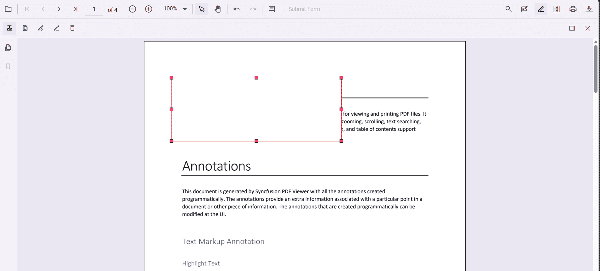

Redaction annotations are interactive:
- **Movable**  
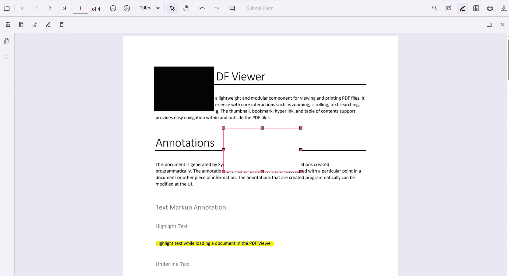
- **Resizable**  
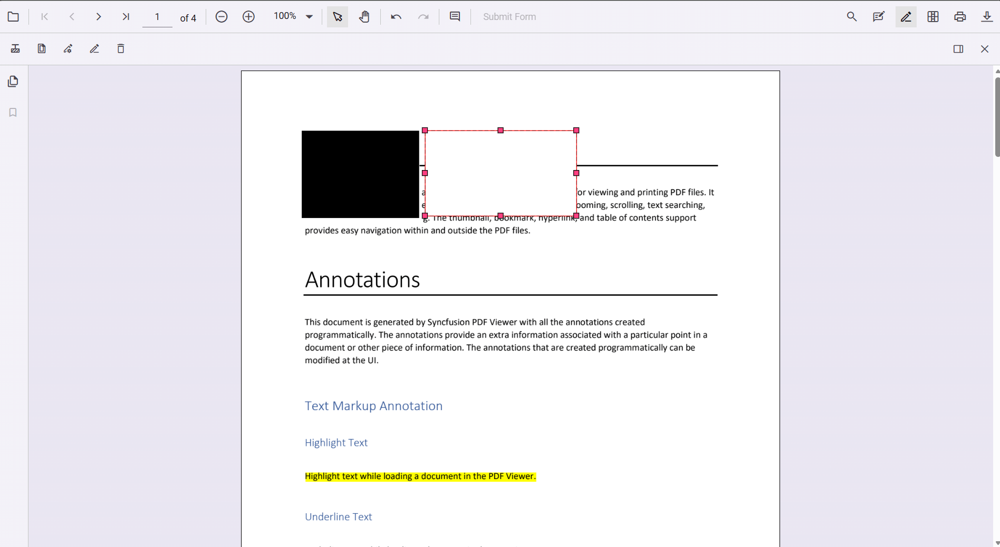

You can also add redaction annotations from the **context menu** by selecting content and choosing **Redact Annotation**.  
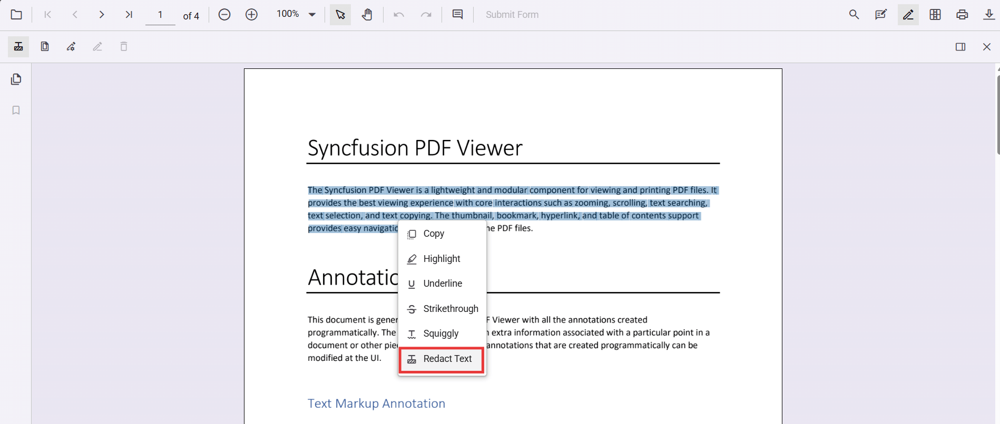

N> Ensure the **Redaction** tool is included in the toolbar. See [RedactionToolbar](../../Redaction/toolbar.md) for configuration.

### Add redaction annotations programmatically




<button id="addRedaction" onclick="addRedaction()">Add Redaction programmatically</button>

    @Html.EJS().PdfViewer("pdfviewer").DocumentPath("https://cdn.syncfusion.com/content/pdf/pdf-succinctly.pdf").Render()




<button id="addRedaction" onclick="addRedaction()">Add Redaction programmatically</button>

    @Html.EJS().PdfViewer("pdfviewer").ServiceUrl(VirtualPathUtility.ToAbsolute("~/PdfViewer/")).DocumentPath("https://cdn.syncfusion.com/content/pdf/pdf-succinctly.pdf").Render()




## Edit Redaction Annotations

### Edit redaction annotations in UI
Use the viewer to select, move, and resize Redaction annotations. Use the context menu for additional actions.

#### Edit the properties of redaction annotations in UI
Use the property panel or **context menu → Properties** to change overlay text, font, fill color, and more.  
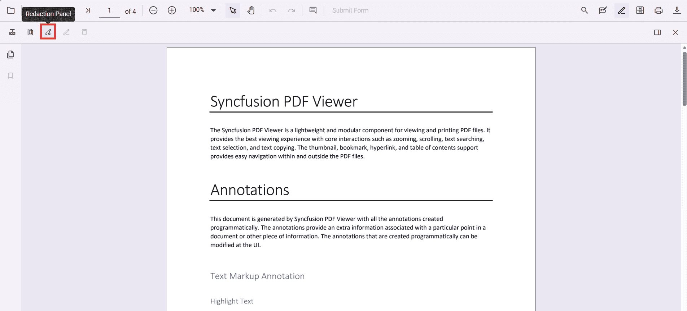  
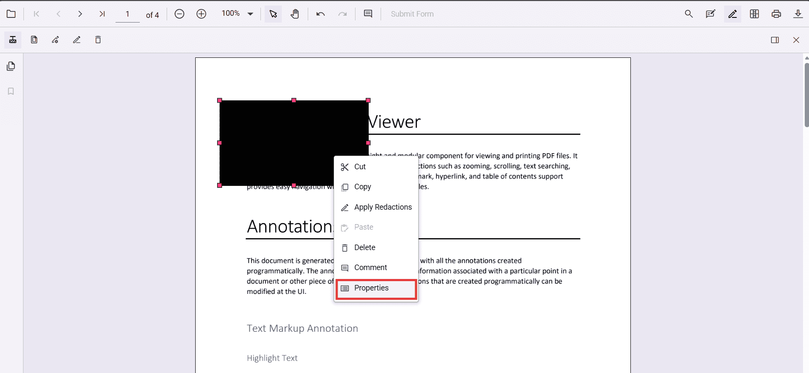

### Edit redaction annotations programmatically




<button id="editRedaction" onclick="editFirstRedaction()">Edit Redaction programmatically</button>

    @Html.EJS().PdfViewer("pdfviewer").DocumentPath("https://cdn.syncfusion.com/content/pdf/pdf-succinctly.pdf").Render()




<button id="editRedaction" onclick="editFirstRedaction()">Edit Redaction programmatically</button>

    @Html.EJS().PdfViewer("pdfviewer").ServiceUrl(VirtualPathUtility.ToAbsolute("~/PdfViewer/")).DocumentPath("https://cdn.syncfusion.com/content/pdf/pdf-succinctly.pdf").Render()




## Delete redaction annotations

### Delete in UI
- **Right-click → Delete**  
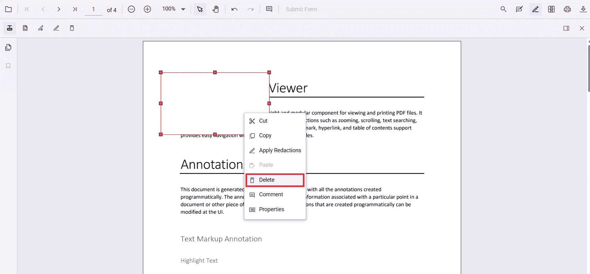
- Use the **Delete** button in the toolbar  
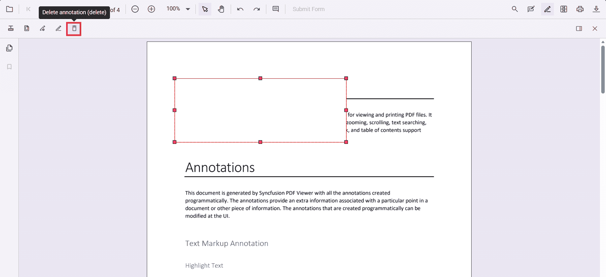
- Press **Delete** key

### Delete programmatically




<button id="deleteRedaction" onclick="deleteFirstRedaction()">Delete Redaction by ID programmatically</button>

    @Html.EJS().PdfViewer("pdfviewer").DocumentPath("https://cdn.syncfusion.com/content/pdf/pdf-succinctly.pdf").Render()




<button id="deleteRedaction" onclick="deleteFirstRedaction()">Delete Redaction by ID programmatically</button>

    @Html.EJS().PdfViewer("pdfviewer").ServiceUrl(VirtualPathUtility.ToAbsolute("~/PdfViewer/")).DocumentPath("https://cdn.syncfusion.com/content/pdf/pdf-succinctly.pdf").Render()




## Redact pages

### Redact pages in UI
Use the **Redact Pages** dialog to mark entire pages with options like **Current Page**, **Odd Pages Only**, **Even Pages Only**, and **Specific Pages**.  
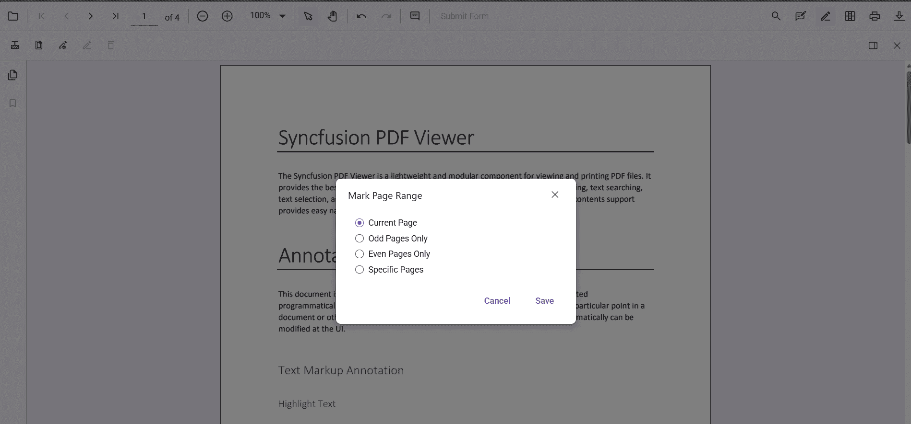

### Add page redactions programmatically




<button id="addPageRedactions" onclick="addPageRedactions()">Add page redactions programmatically</button>

    @Html.EJS().PdfViewer("pdfviewer").DocumentPath("https://cdn.syncfusion.com/content/pdf/pdf-succinctly.pdf").Render()




<button id="addPageRedactions" onclick="addPageRedactions()">Add page redactions programmatically</button>

    @Html.EJS().PdfViewer("pdfviewer").ServiceUrl(VirtualPathUtility.ToAbsolute("~/PdfViewer/")).DocumentPath("https://cdn.syncfusion.com/content/pdf/pdf-succinctly.pdf").Render()




## Apply redaction

### Apply redaction in UI
Click **Apply Redaction** to permanently remove marked content.  
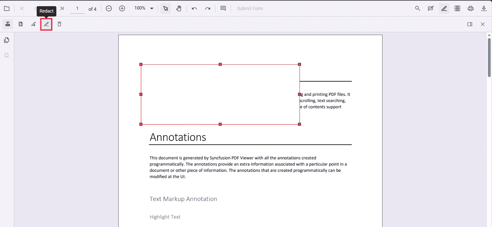  
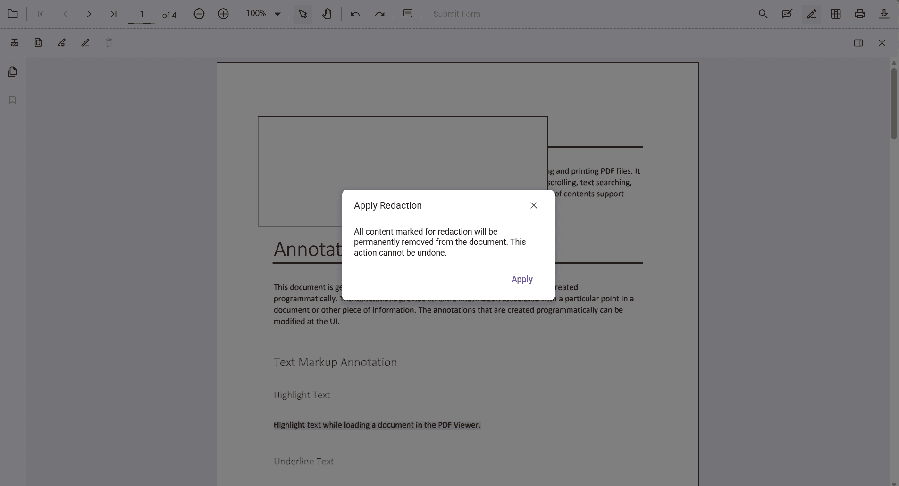

N> **Redaction is permanent and cannot be undone.**

### Apply redaction programmatically




<button id="applyRedaction" onclick="applyRedaction()">Apply Redaction programmatically</button>

    @Html.EJS().PdfViewer("pdfviewer").DocumentPath("https://cdn.syncfusion.com/content/pdf/pdf-succinctly.pdf").Render()




<button id="applyRedaction" onclick="applyRedaction()">Apply Redaction programmatically</button>

    @Html.EJS().PdfViewer("pdfviewer").ServiceUrl(VirtualPathUtility.ToAbsolute("~/PdfViewer/")).DocumentPath("https://cdn.syncfusion.com/content/pdf/pdf-succinctly.pdf").Render()




N> Applying redaction is **irreversible**.

## Default redaction settings during initialization

Configure defaults with the **redactionSettings** property.




    @Html.EJS().PdfViewer("pdfviewer").DocumentPath("https://cdn.syncfusion.com/content/pdf/pdf-succinctly.pdf").RedactionSettings(new Syncfusion.EJ2.PdfViewer.PdfViewerRedactionSettings { OverlayText = "Confidential", MarkerFillColor = "#000000" }).Render()




    @Html.EJS().PdfViewer("pdfviewer").ServiceUrl(VirtualPathUtility.ToAbsolute("~/PdfViewer/")).DocumentPath("https://cdn.syncfusion.com/content/pdf/pdf-succinctly.pdf").RedactionSettings(new Syncfusion.EJ2.PdfViewer.PdfViewerRedactionSettings { OverlayText = "Confidential", MarkerFillColor = "#000000" }).Render()




## See also
- [Annotation Overview](../overview)
- [Redaction Overview](../../Redaction/overview)
- [Annotation Toolbar](../../toolbar-customization/annotation-toolbar)
- [Create and Modify Annotation](../../annotation/create-modify-annotation)
- [Customize Annotation](../../annotation/customize-annotation)
- [Remove Annotation](../../annotation/delete-annotation)
- [Handwritten Signature](../../annotation/signature-annotation)
- [Export and Import Annotation](../../annotation/export-import/export-annotation)
- [Annotation in Mobile View](../../annotation/annotations-in-mobile-view)
