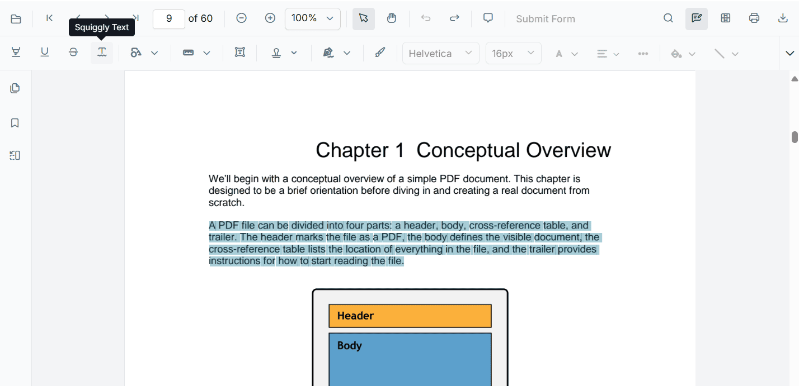
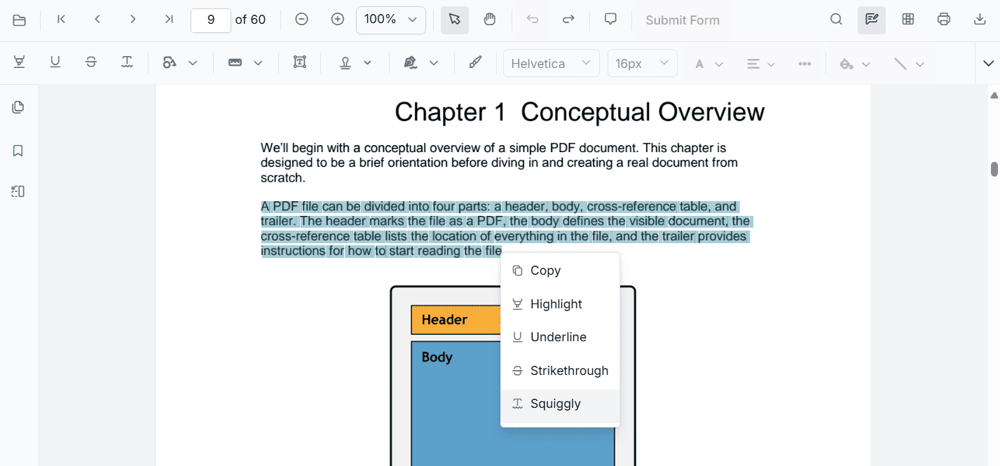

# Squiggly Annotation in ASP.NET MVC PDF Viewer

This guide explains how to **enable**, **apply**, **customize**, and **manage** *Squiggly* text markup annotations in the Syncfusion **ASP.NET MVC PDF Viewer**. You can add squiggly underlines from the toolbar or context menu, programmatically invoke squiggly mode, customize default settings, handle events, and export the PDF with annotations.

## Enable Squiggly in the Viewer
To enable Squiggly annotations, inject the **PdfViewer** with the **Annotation** and **TextSelection** modules.

This minimal setup enables UI interactions like selection and squiggly markup.




    @Html.EJS().PdfViewer("pdfviewer").DocumentPath("https://cdn.syncfusion.com/content/pdf/pdf-succinctly.pdf").Render()




    @Html.EJS().PdfViewer("pdfviewer").ServiceUrl(VirtualPathUtility.ToAbsolute("~/PdfViewer/")).DocumentPath("https://cdn.syncfusion.com/content/pdf/pdf-succinctly.pdf").Render()




## Add Squiggly Annotation

### Add Squiggly Using the Toolbar

1. Select the text you want to annotate.
2. Click the **Squiggly** icon in the annotation toolbar.
   - If **Pan Mode** is active, the viewer automatically switches to **Text Selection** mode.

### Add Squiggly Using the Context Menu

Right-click a selected text region → select **Squiggly**.

To customize menu items, refer to [**Customize Context Menu**](../../context-menu/custom-context-menu) documentation.

### Enable Squiggly Mode
Switch the viewer into squiggly mode using **setAnnotationMode('Squiggly')**.




<button id="enableSquiggly" onclick="enableSquiggly()">Enable Squiggly Mode</button>

    @Html.EJS().PdfViewer("pdfviewer").DocumentPath("https://cdn.syncfusion.com/content/pdf/pdf-succinctly.pdf").Render()




<button id="enableSquiggly" onclick="enableSquiggly()">Enable Squiggly Mode</button>

    @Html.EJS().PdfViewer("pdfviewer").ServiceUrl(VirtualPathUtility.ToAbsolute("~/PdfViewer/")).DocumentPath("https://cdn.syncfusion.com/content/pdf/pdf-succinctly.pdf").Render()




#### Exit Squiggly Mode
Switch back to normal mode using:




<button id="exitSquiggly" onclick="disableSquigglyMode()">Exit Squiggly Mode</button>

    @Html.EJS().PdfViewer("pdfviewer").DocumentPath("https://cdn.syncfusion.com/content/pdf/pdf-succinctly.pdf").Render()




<button id="exitSquiggly" onclick="disableSquigglyMode()">Exit Squiggly Mode</button>

    @Html.EJS().PdfViewer("pdfviewer").ServiceUrl(VirtualPathUtility.ToAbsolute("~/PdfViewer/")).DocumentPath("https://cdn.syncfusion.com/content/pdf/pdf-succinctly.pdf").Render()




### Add Squiggly Programmatically
Use **addAnnotation()** to insert a squiggly at a specific location.




<button id="addSquiggly" onclick="addSquiggly()">Add Squiggly Annotation programmatically</button>

    @Html.EJS().PdfViewer("pdfviewer").DocumentPath("https://cdn.syncfusion.com/content/pdf/pdf-succinctly.pdf").Render()




<button id="addSquiggly" onclick="addSquiggly()">Add Squiggly Annotation programmatically</button>

    @Html.EJS().PdfViewer("pdfviewer").ServiceUrl(VirtualPathUtility.ToAbsolute("~/PdfViewer/")).DocumentPath("https://cdn.syncfusion.com/content/pdf/pdf-succinctly.pdf").Render()




## Customize Squiggly Appearance
Configure default squiggly settings such as **color**, **opacity**, and **author** using **squigglySettings**.




    @Html.EJS().PdfViewer("pdfviewer").DocumentPath("https://cdn.syncfusion.com/content/pdf/pdf-succinctly.pdf").SquigglySettings(new Syncfusion.EJ2.PdfViewer.PdfViewerSquigglySettings { Author = "Guest User", Subject = "Corrections", Color = "#00ff00", Opacity = 0.9 }).Render()




    @Html.EJS().PdfViewer("pdfviewer").ServiceUrl(VirtualPathUtility.ToAbsolute("~/PdfViewer/")).DocumentPath("https://cdn.syncfusion.com/content/pdf/pdf-succinctly.pdf").SquigglySettings(new Syncfusion.EJ2.PdfViewer.PdfViewerSquigglySettings { Author = "Guest User", Subject = "Corrections", Color = "#00ff00", Opacity = 0.9 }).Render()




## Manage Squiggly (Edit, Delete, Comment)

### Edit Squiggly

#### Edit Squiggly Appearance (UI)

Use the annotation toolbar:
- **Edit Color** tool  

- **Edit Opacity** slider  

#### Edit Squiggly Programmatically
Modify an existing squiggly programmatically using **editAnnotation()**.




<button id="editSquiggly" onclick="editSquiggly()">Edit Squiggly Annotation programmatically</button>

    @Html.EJS().PdfViewer("pdfviewer").DocumentPath("https://cdn.syncfusion.com/content/pdf/pdf-succinctly.pdf").Render()




<button id="editSquiggly" onclick="editSquiggly()">Edit Squiggly Annotation programmatically</button>

    @Html.EJS().PdfViewer("pdfviewer").ServiceUrl(VirtualPathUtility.ToAbsolute("~/PdfViewer/")).DocumentPath("https://cdn.syncfusion.com/content/pdf/pdf-succinctly.pdf").Render()




### Delete Squiggly
The PDF Viewer supports deleting existing annotations through both the UI and API. For detailed behavior, supported deletion workflows, and API reference, see [**Delete Annotation**](../delete-annotation).

### Comments
Use the [**Comments panel**](../comments) to add, view, and reply to threaded discussions linked to squiggly annotations. It provides a dedicated UI for reviewing feedback, tracking conversations, and collaborating on annotation-related notes within the PDF Viewer.

## Set properties while adding individual annotations
Set properties for individual squiggly annotations at the time of creation using the **addAnnotation** method.




<button id="addSquigglies" onclick="addSquigglies()">Add multiple Squiggly Annotations programmatically</button>

    @Html.EJS().PdfViewer("pdfviewer").DocumentPath("https://cdn.syncfusion.com/content/pdf/pdf-succinctly.pdf").Render()




<button id="addSquigglies" onclick="addSquigglies()">Add multiple Squiggly Annotations programmatically</button>

    @Html.EJS().PdfViewer("pdfviewer").ServiceUrl(VirtualPathUtility.ToAbsolute("~/PdfViewer/")).DocumentPath("https://cdn.syncfusion.com/content/pdf/pdf-succinctly.pdf").Render()




## Disable Squiggly Annotation
Disable text markup annotations (including squiggly) using the **enableTextMarkupAnnotation** property.




    @Html.EJS().PdfViewer("pdfviewer").EnableTextMarkupAnnotation(false).DocumentPath("https://cdn.syncfusion.com/content/pdf/pdf-succinctly.pdf").Render()




    @Html.EJS().PdfViewer("pdfviewer").ServiceUrl(VirtualPathUtility.ToAbsolute("~/PdfViewer/")).EnableTextMarkupAnnotation(false).DocumentPath("https://cdn.syncfusion.com/content/pdf/pdf-succinctly.pdf").Render()




## Handle Squiggly Events
The PDF viewer provides annotation life-cycle events that notify when squiggly annotations are added, modified, selected, or removed. For the full list of available events and their descriptions, see [**Annotation Events**](../annotation-event).

## Export and Import
The PDF Viewer supports exporting and importing annotations. For details on supported formats and workflows, see [**Export and Import annotations**](../export-import/export-annotation).

## See Also
- [Annotation Toolbar](../../toolbar-customization/annotation-toolbar)
- [Customize Context Menu](../../context-menu/custom-context-menu)
- [Comments Panel](../comments)
- [Annotation Events](../annotation-event)
- [Export and Import annotations](../export-import/export-annotation)
- [Delete Annotations](../delete-annotation)
