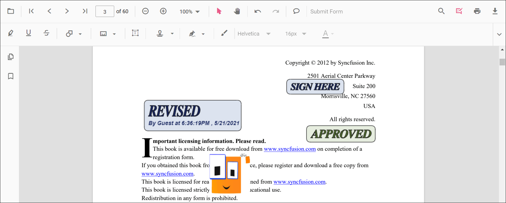
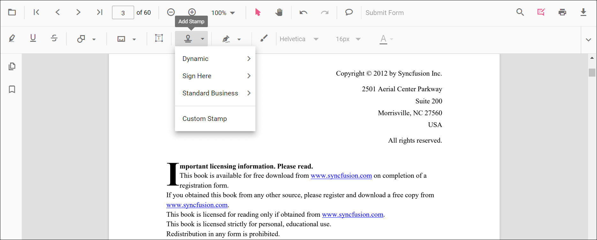
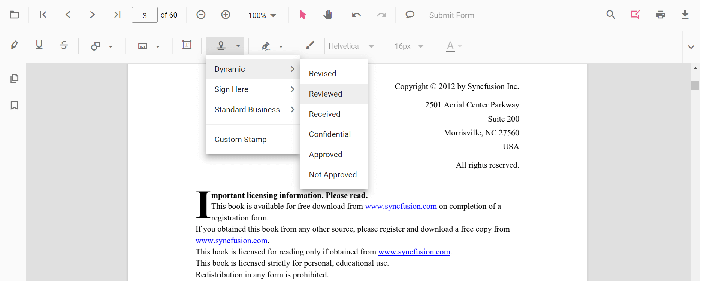
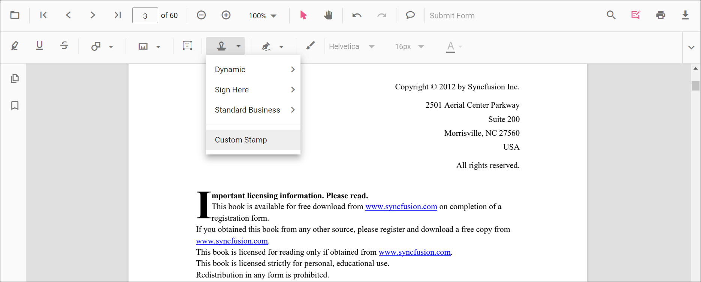
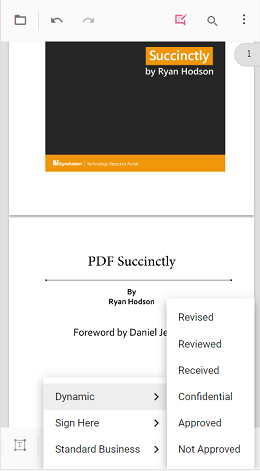

# Stamp Annotation in ASP.NET MVC PDF Viewer

Stamp annotations allow you to place predefined or custom stamps (such as **Dynamic**, **Sign Here**, **Standard Business**, **Text Stamp**, **Image Stamp**, or **Custom**) on a PDF to communicate review states, approvals, or instructions. You can add stamps from the toolbar, switch to specific stamp modes programmatically, customize defaults (e.g., opacity/author), edit or lock them, and export them with the document.

## Enable Stamp Annotation in the Viewer

To enable Stamp annotations, inject the **PdfViewer** with the **Annotation** module.




    @Html.EJS().PdfViewer("pdfviewer").DocumentPath("https://cdn.syncfusion.com/content/pdf/pdf-succinctly.pdf").Render()




    @Html.EJS().PdfViewer("pdfviewer").ServiceUrl(VirtualPathUtility.ToAbsolute("~/PdfViewer/")).DocumentPath("https://cdn.syncfusion.com/content/pdf/pdf-succinctly.pdf").Render()




## Add Stamp Annotation

### Add Stamp Using the Toolbar
1. Open the **Annotation Toolbar**.
2. Choose **Stamp** to open the stamp gallery.  

3. Select a stamp type (**Dynamic**, **Sign Here**, **Standard Business**, or **Custom**) and click on the page to place it.  

N> When Pan mode is active and a stamp tool is chosen, the viewer automatically switches to selection mode for a smoother interaction.

### Enable a Specific Stamp Mode
Switch the viewer into a specific stamp annotation mode programmatically.




<button id="enableDynamicStamp" onclick="enableDynamicStamp()">Enable Dynamic Stamp</button>
<button id="enableSignHereStamp" onclick="enableSignHereStamp()">Enable Sign Here Stamp</button>
<button id="enableStandardBusinessStamp" onclick="enableStandardBusinessStamp()">Enable Standard Business Stamp</button>

    @Html.EJS().PdfViewer("pdfviewer").DocumentPath("https://cdn.syncfusion.com/content/pdf/pdf-succinctly.pdf").Render()




<button id="enableDynamicStamp" onclick="enableDynamicStamp()">Enable Dynamic Stamp</button>
<button id="enableSignHereStamp" onclick="enableSignHereStamp()">Enable Sign Here Stamp</button>
<button id="enableStandardBusinessStamp" onclick="enableStandardBusinessStamp()">Enable Standard Business Stamp</button>

    @Html.EJS().PdfViewer("pdfviewer").ServiceUrl(VirtualPathUtility.ToAbsolute("~/PdfViewer/")).DocumentPath("https://cdn.syncfusion.com/content/pdf/pdf-succinctly.pdf").Render()




#### Exit Stamp Mode




<button id="exitStamp" onclick="exitStampMode()">Exit Stamp Mode</button>

    @Html.EJS().PdfViewer("pdfviewer").DocumentPath("https://cdn.syncfusion.com/content/pdf/pdf-succinctly.pdf").Render()




<button id="exitStamp" onclick="exitStampMode()">Exit Stamp Mode</button>

    @Html.EJS().PdfViewer("pdfviewer").ServiceUrl(VirtualPathUtility.ToAbsolute("~/PdfViewer/")).DocumentPath("https://cdn.syncfusion.com/content/pdf/pdf-succinctly.pdf").Render()




### Add Stamp Programmatically
Use the **addAnnotation** method to place stamps at specific coordinates.




<button id="addDynamicStamp" onclick="addDynamicStamp()">Add Dynamic Stamp programmatically</button>
<button id="addSignStamp" onclick="addSignStamp()">Add Sign Here Stamp programmatically</button>
<button id="addStandardBusinessStamp" onclick="addStandardBusinessStamp()">Add Standard Business Stamp programmatically</button>
<button id="addCustomStamp" onclick="addCustomStamp()">Add Custom Image Stamp programmatically</button>

    @Html.EJS().PdfViewer("pdfviewer").DocumentPath("https://cdn.syncfusion.com/content/pdf/pdf-succinctly.pdf").Render()




<button id="addDynamicStamp" onclick="addDynamicStamp()">Add Dynamic Stamp programmatically</button>
<button id="addSignStamp" onclick="addSignStamp()">Add Sign Here Stamp programmatically</button>
<button id="addStandardBusinessStamp" onclick="addStandardBusinessStamp()">Add Standard Business Stamp programmatically</button>
<button id="addCustomStamp" onclick="addCustomStamp()">Add Custom Image Stamp programmatically</button>

    @Html.EJS().PdfViewer("pdfviewer").ServiceUrl(VirtualPathUtility.ToAbsolute("~/PdfViewer/")).DocumentPath("https://cdn.syncfusion.com/content/pdf/pdf-succinctly.pdf").Render()




N> For **Image Stamp** via the UI, only **JPG/JPEG** image formats are supported.

## Add Text Stamp and Image Stamp

The Stamp tool includes both **Text Stamp** and **Image Stamp** options alongside the built-in dynamic and business stamps. These features belong to the same Stamp annotation category and are documented on this page instead of as separate pages.

### Add a text stamp in the UI

1. Open the **Annotation Toolbar**.
2. Click **Stamp** to open the stamp gallery.
3. Select **Text Stamp**.
4. In the **Create new text stamp** dialog, configure the title, subtitle, font, color, background, date/time format, and styling options such as bold, underline, and strikeout.

5. Click **Create** to place the stamp on the page.

### Add an image stamp in the UI

1. Open the **Annotation Toolbar**.
2. Click **Stamp** to open the stamp gallery.
3. Select **Image Stamp**.
4. Choose an image source or upload the required image.
5. Click the PDF page to place the image stamp.

## Customize Stamp Appearance
Configure default stamp properties such as **author**, **opacity**, and **minimum width/height** using the **stampSettings** property.




    @Html.EJS().PdfViewer("pdfviewer").DocumentPath("https://cdn.syncfusion.com/content/pdf/pdf-succinctly.pdf").StampSettings(new Syncfusion.EJ2.PdfViewer.PdfViewerStampSettings { Author = "Guest User", Opacity = 0.9, MinWidth = 50, MinHeight = 30 }).Render()




    @Html.EJS().PdfViewer("pdfviewer").ServiceUrl(VirtualPathUtility.ToAbsolute("~/PdfViewer/")).DocumentPath("https://cdn.syncfusion.com/content/pdf/pdf-succinctly.pdf").StampSettings(new Syncfusion.EJ2.PdfViewer.PdfViewerStampSettings { Author = "Guest User", Opacity = 0.9, MinWidth = 50, MinHeight = 30 }).Render()




## Manage Stamp Annotations (Edit, Delete, Lock)
- **Edit**: Select a stamp to move, resize, or update properties.
- **Delete**: Use the toolbar/context menu. See [**Delete Annotation**](../delete-annotation).
- **Lock**: Set `isLock: true` while adding the stamp to prevent modifications.

## Handle Stamp Events
The PDF viewer provides annotation life-cycle events that notify when stamp annotations are added, modified, selected, or removed. For the full list of available events and their descriptions, see [**Annotation Events**](../annotation-event).

## Export and Import
The PDF Viewer supports exporting and importing annotations. For details on supported formats and workflows, see [**Export and Import annotations**](../export-import/export-annotation).

## See Also
- [Annotation Toolbar](../../toolbar-customization/annotation-toolbar)
- [Customize Context Menu](../../context-menu/custom-context-menu)
- [Comments Panel](../comments)
- [Annotation Events](../annotation-event)
- [Export and Import annotations](../export-import/export-annotation)
- [Delete Annotations](../delete-annotation)
