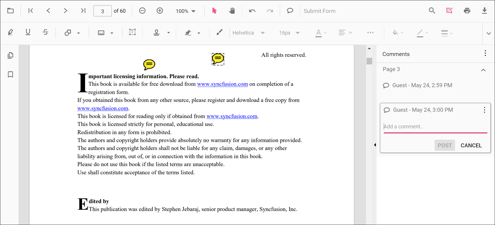
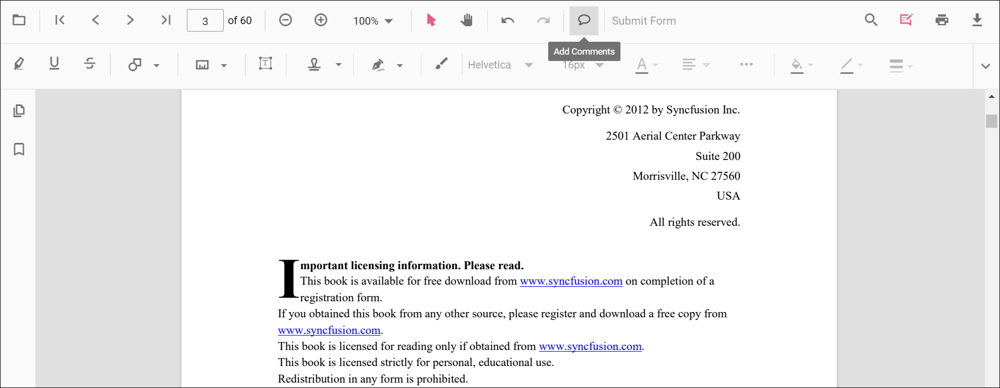
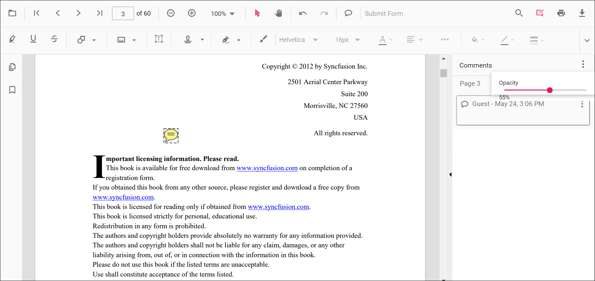

# Sticky Note Annotation in ASP.NET MVC PDF Viewer

Sticky Notes allow users to place comment markers on the PDF. When clicked, the note opens a popup containing comments, replies, and discussions. Use them to capture review feedback without altering the original content.

## Enable Sticky Notes Annotation
Inject the minimal modules required to work with Sticky Notes in the **ASP.NET MVC PDF Viewer**.




    @Html.EJS().PdfViewer("pdfviewer").DocumentPath("https://cdn.syncfusion.com/content/pdf/pdf-succinctly.pdf").Render()




    @Html.EJS().PdfViewer("pdfviewer").ServiceUrl(VirtualPathUtility.ToAbsolute("~/PdfViewer/")).DocumentPath("https://cdn.syncfusion.com/content/pdf/pdf-succinctly.pdf").Render()




N> The **Sticky Note** tool appears in the Annotation toolbar when annotation features are enabled.

## Add Sticky Notes

### Add Sticky Notes Using the Toolbar
1. Open the **Annotation Toolbar**.
2. Select the **Sticky Note** tool.
3. Click anywhere on the page to place the note; click the note to open its popup and start commenting.

N> Use the **Comments panel** to add replies or update status for the selected note.

### Add Sticky Notes Programmatically

Create a note at specific coordinates using **addAnnotation**.




<button id="addStickyNote" onclick="addStickyNote()">Add Sticky Note programmatically</button>

    @Html.EJS().PdfViewer("pdfviewer").DocumentPath("https://cdn.syncfusion.com/content/pdf/pdf-succinctly.pdf").Render()




<button id="addStickyNote" onclick="addStickyNote()">Add Sticky Note programmatically</button>

    @Html.EJS().PdfViewer("pdfviewer").ServiceUrl(VirtualPathUtility.ToAbsolute("~/PdfViewer/")).DocumentPath("https://cdn.syncfusion.com/content/pdf/pdf-succinctly.pdf").Render()




## Customize Sticky Note Appearance
Configure default properties using the **stickyNotesSettings** property (for example, default **author**, **opacity**).




    @Html.EJS().PdfViewer("pdfviewer").DocumentPath("https://cdn.syncfusion.com/content/pdf/pdf-succinctly.pdf").StickyNotesSettings(new Syncfusion.EJ2.PdfViewer.PdfViewerStickyNotesSettings { Author = "Guest User" }).Render()




    @Html.EJS().PdfViewer("pdfviewer").ServiceUrl(VirtualPathUtility.ToAbsolute("~/PdfViewer/")).DocumentPath("https://cdn.syncfusion.com/content/pdf/pdf-succinctly.pdf").StickyNotesSettings(new Syncfusion.EJ2.PdfViewer.PdfViewerStickyNotesSettings { Author = "Guest User" }).Render()




## Move, Edit, or Delete Sticky Notes

- **Move**: Drag the note icon to a new location.
- **Edit**: Click the note icon to open the popup; edit text, add replies, or change status in the **Comments panel**.

### Edit Sticky Notes Annotation

#### Edit Sticky Notes (UI)

- **Icon style**: Open **Right Click → Properties** on a note to choose a different note icon style (e.g., classic note icon).
- **Color**: Change the note color using the **Edit Color** tool in the annotation toolbar.
- **Opacity**: Adjust transparency using the **Edit Opacity** tool.  
  

N> To tailor right-click actions (Delete, Properties, etc.), see [**Customize Context Menu**](../../context-menu/custom-context-menu).

#### Edit Sticky Notes Programmatically
Update properties and call **editAnnotation()**.




<button id="editStickyNote" onclick="editStickyNote()">Edit Sticky Note programmatically</button>

    @Html.EJS().PdfViewer("pdfviewer").DocumentPath("https://cdn.syncfusion.com/content/pdf/pdf-succinctly.pdf").Render()




<button id="editStickyNote" onclick="editStickyNote()">Edit Sticky Note programmatically</button>

    @Html.EJS().PdfViewer("pdfviewer").ServiceUrl(VirtualPathUtility.ToAbsolute("~/PdfViewer/")).DocumentPath("https://cdn.syncfusion.com/content/pdf/pdf-succinctly.pdf").Render()




### Delete Sticky Notes Annotation

Delete Sticky Notes Annotation via UI (toolbar/context menu) or programmatically. For supported workflows and APIs, see [**Delete Annotation**](../delete-annotation).

## Set Default Properties During Initialization
Configure default properties for Sticky Notes using **stickyNotesSettings**.




    @Html.EJS().PdfViewer("pdfviewer").DocumentPath("https://cdn.syncfusion.com/content/pdf/pdf-succinctly.pdf").StickyNotesSettings(new Syncfusion.EJ2.PdfViewer.PdfViewerStickyNotesSettings { Author = "Guest User" }).Render()




    @Html.EJS().PdfViewer("pdfviewer").ServiceUrl(VirtualPathUtility.ToAbsolute("~/PdfViewer/")).DocumentPath("https://cdn.syncfusion.com/content/pdf/pdf-succinctly.pdf").StickyNotesSettings(new Syncfusion.EJ2.PdfViewer.PdfViewerStickyNotesSettings { Author = "Guest User" }).Render()




## Sticky Note Events

Listen to annotation life-cycle events and filter for sticky notes. See [**Annotation Events**](../annotation-event) for the full list and argument details.

## Export and Import
Sticky Notes are included when exporting or importing annotations. For supported formats and workflows, see [**Export and Import annotations**](../export-import/export-annotation).

## See Also
- [Annotation Toolbar](../../toolbar-customization/annotation-toolbar)
- [Customize Context Menu](../../context-menu/custom-context-menu)
- [Comments Panel](../comments)
- [Annotation Events](../annotation-event)
- [Export and Import annotations](../export-import/export-annotation)
- [Delete Annotations](../delete-annotation)
