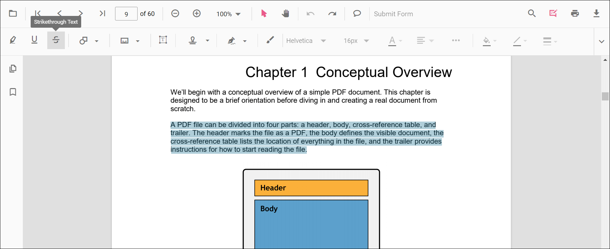
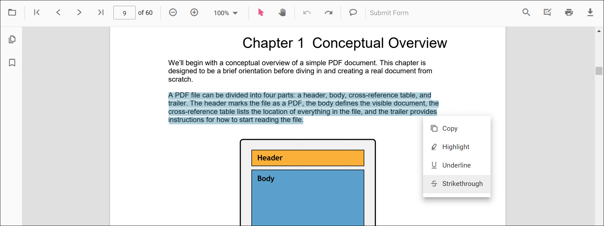

# Strikethrough Annotation in ASP.NET MVC PDF Viewer

This guide explains how to **enable**, **apply**, **customize**, and **manage** *Strikethrough* text markup annotations in the Syncfusion **ASP.NET MVC PDF Viewer**. You can apply strikethrough using the toolbar or context menu, programmatically invoke strikethrough mode, customize default settings, handle events, and export the PDF with annotations.

## Enable Strikethrough in the Viewer
To enable Strikethrough annotations, inject the **PdfViewer** with the **Annotation** and **TextSelection** modules.

This minimal setup enables UI interactions like selection and strikethrough.




    @Html.EJS().PdfViewer("pdfviewer").DocumentPath("https://cdn.syncfusion.com/content/pdf/pdf-succinctly.pdf").Render()




    @Html.EJS().PdfViewer("pdfviewer").ServiceUrl(VirtualPathUtility.ToAbsolute("~/PdfViewer/")).DocumentPath("https://cdn.syncfusion.com/content/pdf/pdf-succinctly.pdf").Render()




## Add Strikethrough Annotation

### Add Strikethrough Using the Toolbar
1. Select the text you want to strike through.
2. Click the **Strikethrough** icon in the annotation toolbar.
   - If **Pan Mode** is active, the viewer automatically switches to **Text Selection** mode.

### Add Strikethrough Using the Context Menu
Right-click a selected text region → select **Strikethrough**.

To customize menu items, refer to [**Customize Context Menu**](../../context-menu/custom-context-menu) documentation.

### Enable Strikethrough Mode
Switch the viewer into strikethrough mode using **setAnnotationMode('Strikethrough')**.




<button id="enableStrikethrough" onclick="enableStrikethrough()">Enable Strikethrough Mode</button>

    @Html.EJS().PdfViewer("pdfviewer").DocumentPath("https://cdn.syncfusion.com/content/pdf/pdf-succinctly.pdf").Render()




<button id="enableStrikethrough" onclick="enableStrikethrough()">Enable Strikethrough Mode</button>

    @Html.EJS().PdfViewer("pdfviewer").ServiceUrl(VirtualPathUtility.ToAbsolute("~/PdfViewer/")).DocumentPath("https://cdn.syncfusion.com/content/pdf/pdf-succinctly.pdf").Render()




#### Exit Strikethrough Mode
Switch back to normal mode using:




<button id="exitStrikethrough" onclick="disableStrikethroughMode()">Exit Strikethrough Mode</button>

    @Html.EJS().PdfViewer("pdfviewer").DocumentPath("https://cdn.syncfusion.com/content/pdf/pdf-succinctly.pdf").Render()




<button id="exitStrikethrough" onclick="disableStrikethroughMode()">Exit Strikethrough Mode</button>

    @Html.EJS().PdfViewer("pdfviewer").ServiceUrl(VirtualPathUtility.ToAbsolute("~/PdfViewer/")).DocumentPath("https://cdn.syncfusion.com/content/pdf/pdf-succinctly.pdf").Render()




### Add Strikethrough Programmatically
Use **addAnnotation()** to insert a strikethrough at a specific location.




<button id="addStrikethrough" onclick="addStrikethrough()">Add Strikethrough Annotation programmatically</button>

    @Html.EJS().PdfViewer("pdfviewer").DocumentPath("https://cdn.syncfusion.com/content/pdf/pdf-succinctly.pdf").Render()




<button id="addStrikethrough" onclick="addStrikethrough()">Add Strikethrough Annotation programmatically</button>

    @Html.EJS().PdfViewer("pdfviewer").ServiceUrl(VirtualPathUtility.ToAbsolute("~/PdfViewer/")).DocumentPath("https://cdn.syncfusion.com/content/pdf/pdf-succinctly.pdf").Render()




## Customize Strikethrough Appearance
Configure default strikethrough settings such as **color**, **opacity**, and **author** using **strikethroughSettings**.




    @Html.EJS().PdfViewer("pdfviewer").DocumentPath("https://cdn.syncfusion.com/content/pdf/pdf-succinctly.pdf").StrikethroughSettings(new Syncfusion.EJ2.PdfViewer.PdfViewerStrikethroughSettings { Author = "Guest User", Subject = "Not Important", Color = "#ff00ff", Opacity = 0.9 }).Render()




    @Html.EJS().PdfViewer("pdfviewer").ServiceUrl(VirtualPathUtility.ToAbsolute("~/PdfViewer/")).DocumentPath("https://cdn.syncfusion.com/content/pdf/pdf-succinctly.pdf").StrikethroughSettings(new Syncfusion.EJ2.PdfViewer.PdfViewerStrikethroughSettings { Author = "Guest User", Subject = "Not Important", Color = "#ff00ff", Opacity = 0.9 }).Render()




## Manage Strikethrough (Edit, Delete, Comment)

### Edit Strikethrough

#### Edit Strikethrough Appearance (UI)
Use the annotation toolbar:
- **Edit Color** tool  

- **Edit Opacity** slider  

#### Edit Strikethrough Programmatically
Modify an existing strikethrough programmatically using **editAnnotation()** and **annotationCollection**.




<button id="editStrikethrough" onclick="editStrikethrough()">Edit Strikethrough Annotation programmatically</button>

    @Html.EJS().PdfViewer("pdfviewer").DocumentPath("https://cdn.syncfusion.com/content/pdf/pdf-succinctly.pdf").Render()




<button id="editStrikethrough" onclick="editStrikethrough()">Edit Strikethrough Annotation programmatically</button>

    @Html.EJS().PdfViewer("pdfviewer").ServiceUrl(VirtualPathUtility.ToAbsolute("~/PdfViewer/")).DocumentPath("https://cdn.syncfusion.com/content/pdf/pdf-succinctly.pdf").Render()




### Delete Strikethrough
The PDF Viewer supports deleting existing annotations through both the UI and API. For detailed behavior, supported deletion workflows, and API reference, see [**Delete Annotation**](../delete-annotation).

### Comments
Use the [**Comments panel**](../comments) to add, view, and reply to threaded discussions linked to strikethrough annotations. It provides a dedicated UI for reviewing feedback, tracking conversations, and collaborating on annotation-related notes within the PDF Viewer.

## Set Properties While Adding Individual Annotation
Set properties for individual annotations when adding them programmatically by supplying fields on each **addAnnotation('Strikethrough', ...)** call.




<button id="addStrikethroughs" onclick="addStrikethroughs()">Add multiple Strikethrough Annotations programmatically</button>

    @Html.EJS().PdfViewer("pdfviewer").DocumentPath("https://cdn.syncfusion.com/content/pdf/pdf-succinctly.pdf").Render()




<button id="addStrikethroughs" onclick="addStrikethroughs()">Add multiple Strikethrough Annotations programmatically</button>

    @Html.EJS().PdfViewer("pdfviewer").ServiceUrl(VirtualPathUtility.ToAbsolute("~/PdfViewer/")).DocumentPath("https://cdn.syncfusion.com/content/pdf/pdf-succinctly.pdf").Render()




## Disable Strikethrough Annotation
Disable text markup annotations (including strikethrough) using the **enableTextMarkupAnnotation** property.




    @Html.EJS().PdfViewer("pdfviewer").EnableTextMarkupAnnotation(false).DocumentPath("https://cdn.syncfusion.com/content/pdf/pdf-succinctly.pdf").Render()




    @Html.EJS().PdfViewer("pdfviewer").ServiceUrl(VirtualPathUtility.ToAbsolute("~/PdfViewer/")).EnableTextMarkupAnnotation(false).DocumentPath("https://cdn.syncfusion.com/content/pdf/pdf-succinctly.pdf").Render()




## Handle Strikethrough Events

The PDF viewer provides annotation life-cycle events that notify when strikethrough annotations are added, modified, selected, or removed. For the full list of available events and their descriptions, see [**Annotation Events**](../annotation-event).

## Export and Import

The PDF Viewer supports exporting and importing annotations. For details on supported formats and workflows, see [**Export and Import annotations**](../export-import/export-annotation).

## See Also
- [Annotation Toolbar](../../toolbar-customization/annotation-toolbar)
- [Customize Context Menu](../../context-menu/custom-context-menu)
- [Comments Panel](../comments)
- [Annotation Events](../annotation-event)
- [Export and Import annotations](../export-import/export-annotation)
- [Delete Annotations](../delete-annotation)
